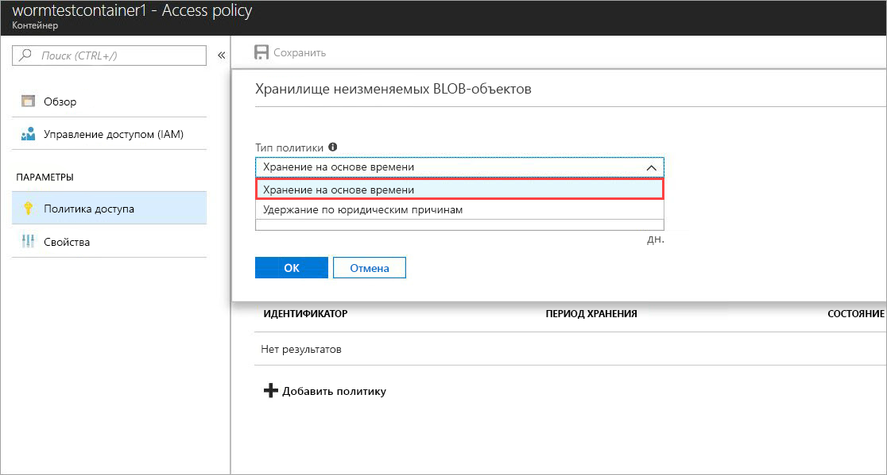
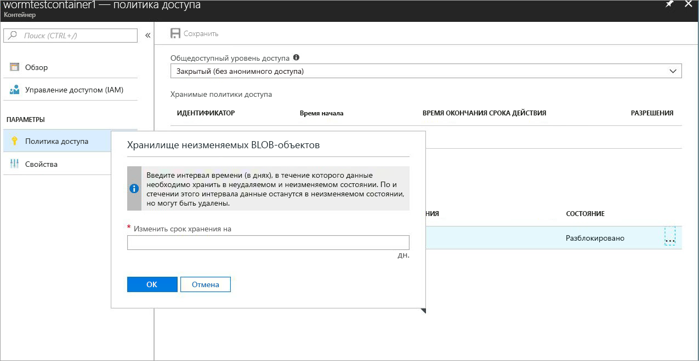
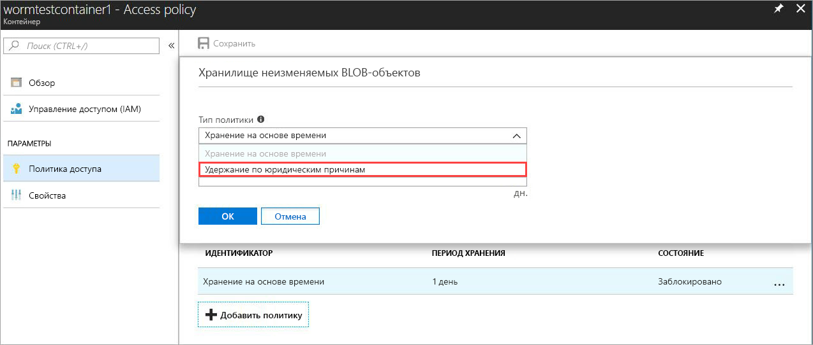

# <a name="store-business-critical-data-in-azure-blob-storage"></a>Хранение критически важных для бизнеса данных в хранилище BLOB-объектов Azure

Функция хранения данных в неизменяемом виде хранилища BLOB-объектов Azure дает пользователям возможность хранить критически важные для бизнеса данные в состоянии WORM. Это состояние делает их нестираемыми и неизменяемыми в течение определенного пользователем интервала времени. Большие двоичные объекты можно создать и прочитать, но не изменять или удалять в течение периода удержания.

## <a name="overview"></a>Обзор

Хранение данных в неизменяемом виде помогает финансовым учреждениям и связанным отраслям, в частности брокерско-дилерским организациям, безопасно хранить данные. Оно также может использоваться в любом сценарии для защиты критически важных данных от удаления.  

Распространенные приложения включают следующее.

- **Соответствие нормативным требованиям**: хранение данных в неизменяемом виде в хранилище BLOB-объектов Azure помогает организациям соответствовать SEC 17a-4(f), CFTC 1.31(d), FINRA и другим нормам.

- **Безопасное хранение документов**: хранилище BLOB-объектов гарантирует, что ни один пользователь не может изменить или удалить данные, включая пользователей с правами администратора учетной записи.

- **Юридическое удержание**: функция хранения данных в неизменяемом виде хранилища BLOB-объектов Azure позволяет пользователям хранить конфиденциальную информацию, критически важную для судебного или уголовного расследования, в защищенном от несанкционированного доступа состоянии в течение желаемого периода времени.

Функция хранения данных в неизменяемом виде обеспечивает следующие возможности:

- **Поддержка политики хранения на основе времени**: пользователи задают политики для хранения данных в течение указанного интервала времени.

- **Поддержка политики юридического удержания**: когда интервал хранения неизвестен, пользователи могут установить юридическое удержание для хранения данных до тех пор, пока юридическое удержание не будет снято.  Когда устанавливается юридическое удержание, большие двоичные объекты можно создавать и читать, но невозможно изменять или удалять. Каждое юридическое удержание связано с определяемым пользователем буквенно-цифровым тегом, который используется в качестве строки идентификатора (например, идентификатор дела).

- **Поддержка для всех уровней хранилища BLOB-объектов**: политики WORM не зависят от уровня хранилища BLOB-объектов Azure и применяются ко всем уровням: горячим, холодным и архивным. Это позволяет пользователям переносить данные на наиболее оптимизированный по стоимости уровень для своей рабочей нагрузки, сохраняя их неизменность.

- **Настройка уровня контейнера**: на уровне контейнера пользователи могут настроить временные политики периода удержания и теги юридического удержания. Пользователи могут создавать и блокировать временные политики удержания, расширять период хранения, устанавливать и очищать юридические удержания и т. д. с помощью простых настроек уровня контейнера. Эти политики применяются для всех имеющихся и новых больших двоичных объектов в контейнере.

- **Поддержка ведения журнала аудита**: каждый контейнер включает журнал аудита, содержащий до пяти временных команд хранения для заблокированных политик хранения на основе времени с максимум тремя журналами для расширений интервалов хранения. Для временного хранения журнал содержит идентификатор пользователя, тип команды, отметки времени и интервал периода удержания. Для юридического удержания журнал содержит идентификатор пользователя, тип команды, отметки времени и теги юридического удержания. Этот журнал удерживается в течение времени существования контейнера согласно директивам SEC 17a-4(f). В [журнале действий Azure](https://docs.microsoft.com/azure/monitoring-and-diagnostics/monitoring-overview-activity-logs) отображается более подробный журнал всех действий уровня управления. Пользователь постоянно несет ответственность за хранение этих журналов в соответствии с нормативами или другими требованиями.

Функция хранения данных в неизменяемом виде включена во всех общедоступных регионах Azure.

## <a name="how-it-works"></a>Принцип работы

Функция хранения данных в неизменяемом виде хранилища BLOB-объектов Azure поддерживает два типа WORM или неизменяемых политик: период удержания на основе времени и юридическое удержание. Подробные сведения о том, как создать эти неизменяемые политики, см. в разделе о [начале работы](#Getting-started).

Когда в контейнере применяется политика хранения на основе времени или юридическое удержание, все имеющиеся большие двоичные объекты будут переходить в неизменяемое состояние (защищенное от изменения и удаления). Все новые большие двоичные объекты, загруженные в контейнер, также будут переходить в неизменяемое состояние.

> [!IMPORTANT]
> Политика хранения на основе времени должна быть *заблокирована*, чтобы большой двоичный объект находился в неизменяемом состоянии (защищенном от изменения и удаления) для SEC 17a-4(f) и соответствовал другим нормативам. Рекомендуется блокировать политику в течение приемлемого времени, обычно на 24 часа. Не рекомендуется использовать *разблокированное* состояние для любых целей, кроме краткосрочных пробных процедур.

Когда политика хранения на основе времени применяется в контейнере, все большие двоичные объекты контейнера остаются в неизменяемом состоянии в течение *действующего* периода удержания. Период эффективного удержания для существующих BLOB-объектов равен разнице между временем их создания и интервалом удержания, определяемым пользователем.

Для новых BLOB-объектов период эффективного удержания равен интервалу удержания, определяемого пользователем. Так как пользователи могут расширять интервал удержания, функция хранения данных в неизменяемом виде будет использовать самое последнее его значение для вычисления периода эффективного удержания.

> [!TIP]
> Пример:
>
> Пользователь создает политику хранения на основе времени с пятилетним интервалом удержания.
>
> Имеющийся большой двоичный объект в этом контейнере, testblob1, был создан год назад. Период эффективного удержания для testblob1 составляет четыре года.
>
> А новый BLOB-объект, testblob2, передается в контейнер. Период эффективного удержания для этого нового большого двоичного объекта составляет пять лет.

### <a name="legal-holds"></a>Юридические удержания

Все имеющиеся и новые большие двоичные объекты, которые находятся в юридическом удержании, остаются в неизменяемом состоянии, пока юридическое удержание не будет снято. Дополнительные сведения о том, как настроить и снять юридические удержания, см. в разделе о [начале работы](#Getting-started).

Контейнер может иметь одновременно и юридическое удержание, и политику хранения на основе времени. Все большие двоичные объекты в этом контейнере остаются в неизменяемом состоянии, пока все юридические удержания не будут сняты, даже если период эффективного хранения истек. И наоборот, большой двоичный объект остается в неизменяемом состоянии до тех пор, пока не истечет период эффективного хранения, хотя все юридические удержания сняты.

В следующей таблице показаны типы операций с большими двоичными объектами, которые будут отключены в разных сценариях использования неизменяемых объектов. Дополнительные сведения см. в [документации по API службы BLOB-объектов Azure](https://docs.microsoft.com/rest/api/storageservices/blob-service-rest-api).

|Сценарий  |Состояние больших двоичных объектов  |Недопустимые операции с большими двоичными объектами  |
|---------|---------|---------|
|Эффективный интервал удержания большого двоичного объекта еще не истек, и (или) установлено юридическое удержание     |Неизменяемость: защита от удаления и от записи         |Удаление контейнера, удаление большого двоичного объекта, вставка большого двоичного объекта<sup>1</sup>, вставка блока<sup>1</sup>, вставка списка блоков<sup>1</sup>, задание метаданных больших двоичных объектов, вставка страницы, задание свойства большого двоичного объекта, создание моментального снимка большого двоичного объекта, инкрементное копирование больших двоичных объектов, добавление блока         |
|Срок действия интервала эффективного хранения большого двоичного объекта истек.     |Защита только от записи (разрешены операции удаления)         |Вставка большого двоичного объекта<sup>1</sup>, вставка блока<sup>1</sup>, вставка списка блоков<sup>1</sup>, установка метаданных большого двоичного объекта, вставка страницы, установка свойства большого двоичного объекта, создание моментального снимка большого двоичного объекта, инкрементное копирование больших двоичных объектов, добавление блока         |
|Все юридические удержания сняты, а в контейнере не задана политика хранения на основе времени     |Изменяемый         |None         |
|Политика WORM не создана (период удержания на основе времени или юридическое удержание)     |Изменяемый         |None         |

<sup>1</sup> Приложение может вызвать эту операцию, чтобы создать большой двоичный объект один раз. Все последующие операции над большим двоичным объектом запрещены.

> [!NOTE]
>
> Хранение данных в неизменяемом виде доступно только в учетных записях хранилища BLOB-объектов и общего назначения версии 2. Учетная запись должна создаваться с помощью [Azure Resource Manager](https://docs.microsoft.com/azure/azure-resource-manager/resource-group-overview).

## <a name="pricing"></a>Цены

За использование этой функции не взимается дополнительная плата. Неизменяемые данные оценивается так же, как обычные изменяемые данные. Информацию о ценах на хранилище BLOB-объектов Azure см. на [этой странице](https://azure.microsoft.com/pricing/details/storage/blobs/).


## <a name="getting-started"></a>Приступая к работе

Хранение данных в неизменяемом виде в хранилище BLOB-объектов Azure поддерживается в последних выпусках [портала Azure](http://portal.azure.com) и [Azure CLI](https://docs.microsoft.com/cli/azure/install-azure-cli?view=azure-cli-latest), а также в предварительной версии [Azure PowerShell](https://github.com/Azure/azure-powershell/releases/tag/Azure.Storage.v4.4.0-preview-May2018).

### <a name="azure-portal"></a>Портал Azure

1. Создайте новый контейнер или выберите существующий контейнер для хранения BLOB-объектов, которые должны храниться в неизменяемом состоянии.
 Контейнер должен находиться в учетной записи хранения общего назначения версии 2 или учетной записи хранилища BLOB-объектов.
2. В параметрах контейнера выберите **Политика доступа**. Затем в разделе **Хранилище неизменяемых BLOB-объектов** щелкните **Добавить политику**.

    

3. Чтобы включить временный период удержания, в раскрывающемся меню выберите **Хранение с учетом времени**.

    

4. Введите интервал в днях, требуемый для периода удержания (минимум один день).

    

    Как видно на снимке экрана, изначальное состояние политики разблокировано. Вы можете протестировать функцию с меньшим интервалом периода удержания и внести изменения в политику перед блокировкой. Блокировка необходима для обеспечения соответствия требованиям, например SEC 17a-4.

5. Заблокируйте политику. Щелкните правой кнопкой мыши многоточие (**...**). Появится следующее меню:

    

    Выберите **Политика блокировки** — состояние политики теперь отображается как заблокированное. После блокировки политику невозможно будет удалить и разрешено будет только продлевать период удержания.

6. Чтобы включить юридические удержания, нажмите кнопку **Добавить политику**. В раскрывающемся меню выберите **Удержание по юридическим причинам**.

    

7. Создайте юридическое удержание с одним или несколькими тегами.

    

8. Чтобы удалить удержание по юридическим причинам, просто удалите тег.

### <a name="azure-cli"></a>Инфраструктура CLI Azure

Эта возможность доступна в следующих группах команд: `az storage container immutability-policy` и `az storage container legal-hold`. Запустите в них `-h`, чтобы просмотреть команды.

### <a name="powershell"></a>PowerShell

[PowerShell версии 4.4.0-preview](https://github.com/Azure/azure-powershell/releases/tag/Azure.Storage.v4.4.0-preview-May20180) поддерживает возможность хранения данных в неизменяемом виде.
Чтобы включить эту функцию, сделайте следующее:

1. Установите последнюю версию PowerShellGet: `Install-Module PowerShellGet –Repository PSGallery –Force`.
2. Удалите все предыдущие версии Azure PowerShell.
3. Установите AzureRM: `Install-Module AzureRM –Repository PSGallery –AllowClobber`. Azure можно установить аналогично из этого репозитория.
4. Установите предварительную версию командлетов плоскости управления хранилища: `Install-Module -Name AzureRM.Storage -AllowPrerelease -Repository PSGallery -AllowClobber`.

В разделе [примера кода PowerShell](#sample-powershell-code) ниже показано использование функции.

## <a name="client-libraries"></a>Клиентские библиотеки

Следующие клиентские библиотеки поддерживают возможность хранения данных в неизменяемом виде в хранилище BLOB-объектов Azure:

- [Клиентская библиотека .NET (предварительная версия 7.2.0 и более поздние версии)](https://www.nuget.org/packages/Microsoft.Azure.Management.Storage/7.2.0-preview).
- [Клиентская библиотека Node.js (версии 4.0.0 и более поздние версии)](https://www.npmjs.com/package/azure-arm-storage).
- [Клиентская библиотека Python (версии 2.0.0, версия-кандидат 2 и более поздние версии)](https://pypi.org/project/azure-mgmt-storage/2.0.0rc2/).
- [Клиентская библиотека Java](https://github.com/Azure/azure-rest-api-specs/tree/master/specification/storage/resource-manager/Microsoft.Storage/preview/2018-03-01-preview)

## <a name="supported-values"></a>Поддерживаемые значения

- Минимальный интервал периода удержания составляет один день, максимальный — 400 лет.
- Для учетной записи хранения максимальное количество контейнеров с заблокированными неизменяемыми политиками — 1000.
- Для учетной записи хранения максимальное количество контейнеров с параметром юридического удержания составляет 1000.
- Для контейнера максимальное количество тегов юридического удержания составляет 10.
- Максимальная длина тега юридического удержания составляет 23, а минимальная — 3 буквенно-цифровых знака.
- Для контейнера допустимое количество расширений интервалов периода удержания для заблокированных неизменяемых политик составляет не более трех.
- Для контейнера с заблокированной неизменяемой политикой сохраняется максимум пять журналов политики хранения на основе времени и максимум 10 журналов политики юридического удержания на протяжении времени существования контейнера.

## <a name="faq"></a>Часто задаваемые вопросы

**Используется ли эта возможность только для блочных BLOB-объектов или ее можно использовать также для страничных и добавочных BLOB-объектов?**

Хранение данных в неизменяемом виде может использоваться с любым типом больших двоичных объектов, но мы рекомендуем использовать его главным образом для блочных BLOB-объектов. В отличие от блочных BLOB-объектов, страничные и добавочные BLOB-объекты необходимо создавать вне WORM-контейнера, а затем скопировать их в него. После того, как это будет сделано, не разрешаются больше никакие *добавления* в добавочный BLOB-объект или изменения в страничном BLOB-объекте.

**Всегда ли нужно создавать новую учетную запись хранения, чтобы использовать эту возможность?**

Хранение данных в неизменяемом виде можно использовать с любыми существующими или только что созданными учетными записями общего назначения версии 2 или хранилища BLOB-объектов. Эта возможность доступна только для хранилища BLOB-объектов.

**Что произойдет при попытке удалить контейнер с *заблокированной* политикой хранения на основе времени или юридическим удержанием?**

Операция "Удалить контейнер" не будет выполнена, если в контейнере существует хотя бы один большой двоичный объект с заблокированной политикой хранения на основе времени или юридическим удержанием. Операция "Удалить контейнер" выполнится, если не существует большого двоичного объекта с действующим интервалом периода удержания и нет юридических удержаний. Прежде чем удалить контейнер, необходимо сначала удалить большие двоичные объекты.

**Что произойдет при попытке удалить учетную запись хранения с WORM-контейнером, который имеет *заблокированную* политику хранения на основе времени или юридическое удержание?**

Удаление учетной записи хранилища не будет выполнено, если там присутствует хотя бы один WORM-контейнер с юридическим удержанием или BLOB-объект с действующим интервалом периода удержания.  Прежде чем удалить учетную запись хранения, необходимо сначала удалить все контейнеры WORM. Сведения об удалении контейнера см. в предыдущем вопросе.

**Можно ли перемещать данные по различным уровням BLOB-объектов (горячий, прохладный и холодный уровень доступа), когда он находится в неизменяемом состоянии?**

Да, можно использовать команду "Настройка уровня BLOB-объекта" для перемещения данных по его уровням, сохраняя данные в неизменяемом состоянии. Функция хранения данных в неизменяемом виде в хранилище поддерживается на горячем, холодном и архивном уровнях хранения больших двоичных объектов.

**Что произойдет, если не внести оплату, при том что срок интервала периода удержания еще не истек?**

В случае неоплаты будут применяться обычные правила хранения данных в соответствии с условиями, указанными в условиях вашего контракта с корпорацией Майкрософт.

**Предлагаете ли вы пробный или льготный период, чтобы просто попробовать эту функцию?**

Да. При создании политики хранения на основе времени она будет находиться в *разблокированном* состоянии. В этом состоянии можно вносить любые нужные изменения, например увеличение или уменьшение, и даже удаление политики. После блокировки политика навсегда остается в таком состоянии, что означает невозможность ее удаления. Кроме того, при блокировке политики интервал периода удержания не может быть уменьшен. Мы настоятельно рекомендуем использовать *разблокированное* состояние только для пробных целей и заблокировать политику в течение 24 часов, чтобы не подвергать риску соответствие требованиям SEC 17a-4(f) и другим нормам.

**Является ли эта возможность доступной для национальных и правительственных облаков?**

В настоящее время возможность хранения данных в неизменяемом виде в хранилище доступна только в общедоступных регионах Azure. Если вы заинтересованы в определенном региональном облаке, отправьте запрос по адресу электронной почты azurestoragefeedback@microsoft.com.

## <a name="sample-powershell-code"></a>Пример кода PowerShell

Пример сценария PowerShell ниже приводится для справки. Он создает учетную запись хранения и контейнер. Далее в нем показано, как задавать и снимать юридические удержания, создавать и блокировать политику хранения на основе времени (известную как неизменяемая политика), а также продлевать интервал хранения.

Настройка и тестирование учетной записи хранения Azure:

```powershell
$ResourceGroup = "<Enter your resource group>”
$StorageAccount = "<Enter your storage account name>"
$container = "<Enter your container name>"
$container2 = "<Enter another container name>”
$location = "<Enter the storage account location>"

# Log in to the Azure Resource Manager account
Login-AzureRMAccount
Register-AzureRmResourceProvider -ProviderNamespace "Microsoft.Storage"

# Create your Azure resource group
New-AzureRmResourceGroup -Name $ResourceGroup -Location $location

# Create your Azure storage account
New-AzureRmStorageAccount -ResourceGroupName $ResourceGroup -StorageAccountName `
    $StorageAccount -SkuName Standard_LRS -Location $location -Kind Storage

# Create a new container
New-AzureRmStorageContainer -ResourceGroupName $ResourceGroup `
    -StorageAccountName $StorageAccount -Name $container

# Create Container 2 with a storage account object
$accountObject = Get-AzureRmStorageAccount -ResourceGroupName $ResourceGroup `
    -StorageAccountName $StorageAccount
New-AzureRmStorageContainer -StorageAccount $accountObject -Name $container2

# Get a container
Get-AzureRmStorageContainer -ResourceGroupName $ResourceGroup `
    -StorageAccountName $StorageAccount -Name $container

# Get a container with an account object
$containerObject = Get-AzureRmStorageContainer -StorageAccount $accountObject -Name $container

# List containers
Get-AzureRmStorageContainer -ResourceGroupName $ResourceGroup `
    -StorageAccountName $StorageAccount

# Remove a container (add -Force to dismiss the prompt)
Remove-AzureRmStorageContainer -ResourceGroupName $ResourceGroup `
    -StorageAccountName $StorageAccount -Name $container2

# Remove a container with an account object
Remove-AzureRmStorageContainer -StorageAccount $accountObject -Name $container2

# Remove a container with a container object
$containerObject2 = Get-AzureRmStorageContainer -StorageAccount $accountObject -Name $container2
Remove-AzureRmStorageContainer -InputObject $containerObject2
```

Установка и удаление юридических удержаний:

```powershell
# Set a legal hold
Add-AzureRmStorageContainerLegalHold -ResourceGroupName $ResourceGroup `
    -StorageAccountName $StorageAccount -Name $container -Tag <tag1>,<tag2>,...

# with an account object
Add-AzureRmStorageContainerLegalHold -StorageAccount $accountObject -Name $container -Tag <tag3>

# with a container object
Add-AzureRmStorageContainerLegalHold -Container $containerObject -Tag <tag4>,<tag5>,...

# Clear a legal hold
Remove-AzureRmStorageContainerLegalHold -ResourceGroupName $ResourceGroup `
    -StorageAccountName $StorageAccount -Name $container -Tag <tag2>

# with an account object
Remove-AzureRmStorageContainerLegalHold -StorageAccount $accountObject -Name $container -Tag <tag3>,<tag5>

# with a container object
Remove-AzureRmStorageContainerLegalHold -Container $containerObject -Tag <tag4>
```

Создание или обновление политик неизменяемости:
```powershell
# with an account name or container name
Set-AzureRmStorageContainerImmutabilityPolicy -ResourceGroupName $ResourceGroup `
    -StorageAccountName $StorageAccount -ContainerName $container -ImmutabilityPeriod 10

# with an account object
Set-AzureRmStorageContainerImmutabilityPolicy -StorageAccount $accountObject `
    -ContainerName $container -ImmutabilityPeriod 1 -Etag $policy.Etag

# with a container object
$policy = Set-AzureRmStorageContainerImmutabilityPolicy -Container `
    $containerObject -ImmutabilityPeriod 7

# with an immutability policy object
Set-AzureRmStorageContainerImmutabilityPolicy -ImmutabilityPolicy $policy -ImmutabilityPeriod 5
```

Извлечение политик неизменяемости:
```powershell
# Get an immutability policy
Get-AzureRmStorageContainerImmutabilityPolicy -ResourceGroupName $ResourceGroup `
    -StorageAccountName $StorageAccount -ContainerName $container

# with an account object
Get-AzureRmStorageContainerImmutabilityPolicy -StorageAccount $accountObject `
    -ContainerName $container

# with a container object
Get-AzureRmStorageContainerImmutabilityPolicy -Container $containerObject
```

Блокировка политик неизменяемости (добавление Force для отклонения запроса):
```powershell
# with an immutability policy object
$policy = Get-AzureRmStorageContainerImmutabilityPolicy -ResourceGroupName `
    $ResourceGroup -StorageAccountName $StorageAccount -ContainerName $container
$policy = Lock-AzureRmStorageContainerImmutabilityPolicy -ImmutabilityPolicy $policy -force

# with an account name or container name
$policy = Lock-AzureRmStorageContainerImmutabilityPolicy -ResourceGroupName `
    $ResourceGroup -StorageAccountName $StorageAccount -ContainerName $container `
    -Etag $policy.Etag

# with an account object
$policy = Lock-AzureRmStorageContainerImmutabilityPolicy -StorageAccount `
    $accountObject -ContainerName $container -Etag $policy.Etag

# with a container object
$policy = Lock-AzureRmStorageContainerImmutabilityPolicy -Container `
    $containerObject -Etag $policy.Etag -force
```

Расширение политик неизменяемости:
```powershell

# with an immutability policy object
$policy = Get-AzureRmStorageContainerImmutabilityPolicy -ResourceGroupName `
    $ResourceGroup -StorageAccountName $StorageAccount -ContainerName $container

$policy = Set-AzureRmStorageContainerImmutabilityPolicy -ImmutabilityPolicy `
    $policy -ImmutabilityPeriod 11 -ExtendPolicy

# with an account name or container name
$policy = Set-AzureRmStorageContainerImmutabilityPolicy -ResourceGroupName `
    $ResourceGroup -StorageAccountName $StorageAccount -ContainerName $container `
    -ImmutabilityPeriod 11 -Etag $policy.Etag -ExtendPolicy

# with an account object
$policy = Set-AzureRmStorageContainerImmutabilityPolicy -StorageAccount `
    $accountObject -ContainerName $container -ImmutabilityPeriod 12 -Etag `
    $policy.Etag -ExtendPolicy

# with a container object
$policy = Set-AzureRmStorageContainerImmutabilityPolicy -Container `
    $containerObject -ImmutabilityPeriod 13 -Etag $policy.Etag -ExtendPolicy
```

Удаление политики неизменяемости (добавление Force для отклонения запроса):
```powershell
# with an immutability policy object
$policy = Get-AzureRmStorageContainerImmutabilityPolicy -ResourceGroupName `
    $ResourceGroup -StorageAccountName $StorageAccount -ContainerName $container
Remove-AzureRmStorageContainerImmutabilityPolicy -ImmutabilityPolicy $policy

# with an account name or container name
Remove-AzureRmStorageContainerImmutabilityPolicy -ResourceGroupName `
    $ResourceGroup -StorageAccountName $StorageAccount -ContainerName $container `
    -Etag $policy.Etag

# with an account object
Remove-AzureRmStorageContainerImmutabilityPolicy -StorageAccount $accountObject `
    -ContainerName $container -Etag $policy.Etag

# with a container object
Remove-AzureRmStorageContainerImmutabilityPolicy -Container $containerObject `
    -Etag $policy.Etag

```
