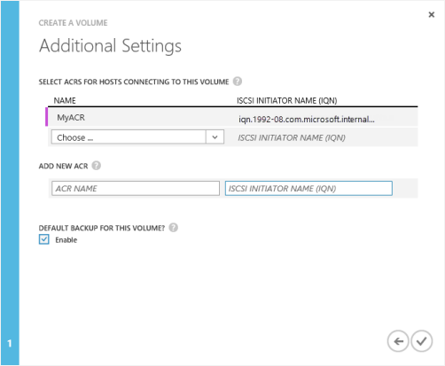
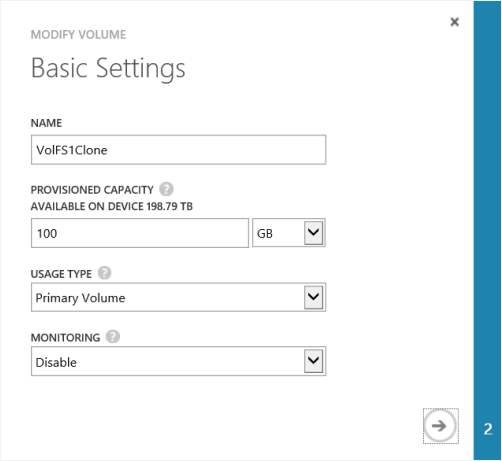

<properties
   pageTitle="Управление томами StorSimple"
   description="Здесь объясняется, как добавлять и изменять тома StorSimple, осуществлять их мониторинг, а также отключать их при необходимости."
   services="storsimple"
   documentationCenter="NA"
   authors="SharS"
   manager="adinah"
   editor="tysonn" /> <tags 
   ms.service="storsimple"
   ms.devlang="NA"
   ms.topic="article"
   ms.tgt_pltfrm="NA"
   ms.workload="TBD"
   ms.date="04/13/2015"
   ms.author="v-sharos" />

# Управление томами StorSimple

## Обзор

В этом учебнике объясняется, как использовать службу диспетчера StorSimple для создания томов и управления ими на устройстве StorSimple и виртуальном устройстве StorSimple.

Служба диспетчера StorSimple — это расширение портала управления Azure, которое позволяет управлять решениями StorSimple с помощью единого веб-интерфейса. Помимо управления томами, службу диспетчера StorSimple можно использовать для создания служб StorSimple, просмотра устройств, предупреждений, политик резервного копирования и каталога резервных копий, а также управления ими.

> [AZURE.NOTE]Azure StorSimple может создавать только тонко подготавливаемые тома. В системе Azure StorSimple вы не можете создавать полностью или частично выделяемые тома.
>
> Тонкая подготовка представляет собой технологию виртуализации, при использовании которой кажется, что доступное пространство для хранения превышает объем физических ресурсов. Вместо заблаговременного резервирования достаточного пространства для хранения Azure StorSimple использует тонкую подготовку, чтобы выделить ровно столько пространства, сколько нужно, чтобы удовлетворить текущие потребности. Эластичный характер облачного хранилища упрощает реализацию такого подхода, поскольку Azure StorSimple может увеличивать или уменьшать объем облачного хранилища в соответствии с меняющимися требованиями.

## Страница «Тома»

Страница **Тома** позволяет управлять томами хранилища, которые выделены на устройстве Microsoft Azure StorSimple для инициаторов (серверов). Здесь отображается список томов на устройстве StorSimple.

 

Том обладает рядом атрибутов.

- **Имя** — уникальное описательное имя, которое помогает идентифицировать том. Это имя также используется в отчетах по результатам мониторинга при фильтрации по определенному тому.

- **Состояние** — том может быть включен или отключен. Если том отключен, он не виден инициаторам (серверам), которым разрешен доступ для использования этого тома.

- **Емкость** — указывает, насколько велик том с точки зрения инициатора (сервера). Емкость определяется общим объемом данных, которые могут быть сохранены инициатором (сервером). При тонком выделении томов выполняется дедупликация данных. Это означает, что на устройстве физический объем в хранилище или в облаке выделяется не предварительно, а в соответствии с емкостью настроенного тома. Емкость тома выделяется и используется по мере необходимости.

- **Доступ** — определяет инициаторы (серверы), которым разрешен доступ к этому тому. Инициаторы, которые не являются элементами записи контроля доступа (ACR), связанной с томом, не увидят этого тома.

- **Мониторинг** — указывает, выполняется ли мониторинг тома. Мониторинг тома будет включен по умолчанию при его создании. Мониторинг будет, однако, отключен при клонировании тома. Чтобы включить мониторинг для тома, следуйте инструкциям в разделе «Мониторинг тома».

Ниже перечислены наиболее распространенные задачи, связанные с томом

- Добавление тома 
- Изменение тома 
- Удаление тома 
- Отключение тома 
- Мониторинг тома 

## Добавление тома

[Создание тома](storsimple-deployment-walkthrough.md#step-6:-create-a-volume) происходит во время развертывания решения StorSimple. Добавление тома происходит аналогичным образом.

### Добавление тома

1. На странице **Устройства** выберите устройство, дважды щелкните его и перейдите на вкладку **Контейнеры томов**.

2. Выберите контейнер томов и щелкните стрелку в соответствующей строке, чтобы получить доступ к томам, связанным с контейнером.

3. В нижней части страницы нажмите кнопку **Добавить**. Откроется мастер добавления тома.

     

4. В окне мастера добавления тома в разделе **Основные параметры** сделайте следующее.

  1. Укажите имя тома в поле **Имя**.
  2. Укажите **Выделяемый объем** для тома в ГБ или ТБ. Емкость для физического устройства должна составлять от 1 ГБ до 64 ТБ. Максимальная емкость, которую можно выделить для тома на виртуальном устройстве StorSimple — 30 ТБ.
  3. В раскрывающемся списке выберите **Тип использования** тома. Выберите **Архивный том**, если том будет использоваться для работы с редко используемыми архивными данными. В случае других вариантов использования выберите **Первичный том**.
  5. Щелкните значок с изображением стрелки , чтобы перейти на страницу **Дополнительные параметры**.

     
   
5. В разделе **Дополнительные параметры** добавьте новую запись контроля доступа:
  
  1. Выберите запись контроля доступа в раскрывающемся списке. Кроме того, можно добавить новую запись ACR. Записи ACR определяют, какие узлы могут получать доступ к томам, сопоставляя IQN узлов с томами, перечисленными в записи.
  2. В разделе **Резервная копия по умолчанию для этого тома** рекомендуется включить резервное копирование по умолчанию, установив флажок **Включить**.
   3. Щелкните значок с изображением флажка , чтобы создать том с указанными параметрами.

Теперь ваш новый том готов к использованию.

## Изменение тома

Измените том, если необходимо развернуть его или изменить узлы, у которых есть доступ к нему.

> [AZURE.IMPORTANT]При изменении размера тома на устройстве также необходимо изменить размер тома на узле. При изменении тома на узле см. инструкции для операционной системы узла.

### Изменение тома

1. На странице **Устройства** выберите устройство, дважды щелкните его и перейдите на вкладку **Контейнер томов**. На этой странице расположена таблица со всеми контейнерами томов, которые связаны с этим устройством.

2. Выберите контейнер томов и щелкните его, чтобы отобразить список всех томов в контейнере.

3. На странице **Тома** выберите том и щелкните **Изменить**.

4. В мастере «Изменение тома» в разделе **Основные параметры** можно сделать вот что.

  - Изменить значения в полях **Имя** и **Тип приложения**.
  - Увеличить значение в поле **Подготовленная емкость**. **Подготовленная емкость** можно только увеличить. Нельзя сжать том после его создания.

    > [AZURE.NOTE]Контейнер томов нельзя изменить после назначения его тому.

5. В разделе **Дополнительные параметры** можно сделать вот что.

  - Изменить записи ACR при условии, что том отключен. Если том включен, сначала необходимо отключить его. Прежде чем изменять записи ACR, см. инструкции в разделе [Отключение тома](#take-a-volume-offline).
  - Изменяйте список записей ACR только после отключения тома.
 
    > [AZURE.NOTE]Параметр **Включить резервное копирование по умолчанию** для тома изменить нельзя.

6. Сохраните изменения, щелкнув значок с изображением флажка .

## Отключение тома

Если том необходимо изменить или удалить, его нужно отключить. Если том отключен, он недоступен для чтения и записи. Отключать том следует на узле и на устройстве. Вот как можно отключить том.

### Отключение тома

1. Перед отключением тома убедитесь, что он не используется.

2. Сначала отключите том на узле. Это устранит потенциальный риск повреждения данных в томе. Конкретные указания см. в инструкциях для вашей операционной системы.

3. После перевода узла в автономный режим, отключите том на устройстве, сделав следующее:

  1. На странице **Устройства** выберите устройство, дважды щелкните его и перейдите на вкладку **Контейнеры томов**. На вкладке **Контейнеры томов** в таблице перечислены все контейнеры томов, которые связаны с этим устройством.
  2. Выберите контейнер томов и щелкните его, чтобы отобразить список всех томов в контейнере.
  3. Выберите том и щелкните **Отключить**.
  4. При появлении запроса на подтверждение, нажмите кнопку **Да**. Теперь том должен быть отключен.

    После отключения тома станет доступен параметр **Включить**.

> [AZURE.NOTE]Команда **Отключить** отправляет на устройство запрос на отключение тома. Если узлы по-прежнему используют том, это приведет к разрыву подключений, но не предотвратит отключение тома.

## Удаление тома

> [AZURE.IMPORTANT]Том можно удалить только в том случае, если он отключен.

Вот как можно удалить том.

### Удаление тома

1. На странице **Устройства** выберите устройство, дважды щелкните его и перейдите на вкладку **Контейнеры томов**.

2. Выберите контейнер томов с томом, который требуется удалить. Щелкните контейнер томов, чтобы перейти к странице **Тома**.

3. Все тома, связанные с этим контейнером, отображаются в таблице. Проверьте состояние тома, который требуется удалить. Если требуется удалить том, который не отключен, сначала отключите его, а затем выполните указания в разделе [Отключение тома](#Take-a-volume-offline).

4. После отключения тома нажмите кнопку **Удалить** в нижней части страницы.

5. При появлении запроса на подтверждение, нажмите кнопку **Да**. Том будет удален и на странице **Тома** будет отображаться обновленный список томов в контейнере.

## Мониторинг тома

Мониторинг тома позволяет собирать данные, связанные с операциями ввода-вывода для тома. Мониторинг по умолчанию включен для первых 32 создаваемых томов. Мониторинг дополнительных томов по умолчанию отключен. Мониторинг клонированных томов также отключен по умолчанию.

Вот как можно включить или отключить мониторинг для тома.

### Включение или отключение мониторинга тома

1. На странице **Устройства** выберите устройство, дважды щелкните его и перейдите на вкладку **Контейнеры томов**.

2. Выберите контейнер томов, в котором находится том, затем щелкните контейнер томов, чтобы перейти к странице **Тома**.

3. Все тома, связанные с этим контейнером, перечислены в таблице. Щелкните и выберите том или клон тома.

4. В нижней части страницы щелкните **Изменить**.

5. В мастере «Изменение тома» в разделе **Основные параметры** выберите **Включить** или **Отключить** в раскрывающемся списке **Мониторинг**.

    

## Дальнейшие действия

Информация о [Клонировании тома StorSimple](storsimple-clone-volume.md).

<!--HONumber=52-->
