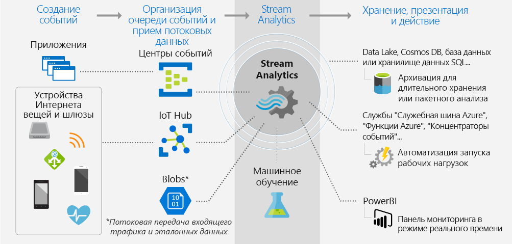
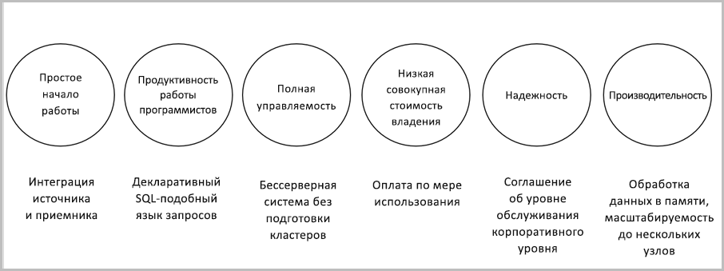

# Знакомство с Azure Stream Analytics

Azure Stream Analytics — это модуль обработки событий, который позволяет проверять большие потоки данных из устройств. Данные могут поступать из устройств, датчиков, веб-сайтов, каналов социальных сетей, приложений и других источников. Эта служба также поддерживает извлечение информации из потоков данных, определение шаблонов и связей. Эти шаблоны можно использовать для активации других подчиненных действий, таких как создание оповещений, отправка информации в средства создания отчетов или хранение данных для последующего использования.

Ниже приведены некоторые примеры использования Azure Stream Analytics: 

* интеграция данных датчика Интернета вещей и аналитика в реальном времени на основе телеметрии устройства;
* анализ веб-журналов и сведений о посещении сайта;
* геопространственная аналитика для управления транспортной системой и автономными транспортными средствами;
* удаленный мониторинг и прогнозное обслуживание высокоценных ресурсов;
* аналитика данных точки продаж в режиме реального времени для контроля запасов и обнаружения аномалий.

## Как работает Stream Analytics?

Azure Stream Analytics запускается с источником данных потоковой передачи, которые принимает концентратор событий Azure или Центр Интернета вещей и которые могут передаваться из хранилища данных, например хранилища BLOB-объектов Azure. Чтобы изучить потоки, создайте задание Stream Analytics, указывающее источник входных данных, выполняющий потоковую передачу. Задание также указывает запрос преобразования, который определяет, как выполнять поиск данных, шаблонов или связей. Запрос преобразования использует язык SQL-запросов для простого выполнения фильтрации, сортировки, вычисления и объединения потоковых данных за определенный период времени. Для задания можно настроить параметры упорядочения событий и продолжительность временных окон при выполнении операций вычисления.

После завершения анализа входящих данных укажите место вывода для преобразованных данных. Вы можете контролировать, что делать в ответ на информацию, которую вы проанализировали. Например, можно выполнять такие действия:

* отправлять данные в контролируемую очередь для запуска оповещений или подчиненных пользовательских рабочих потоков;
* отправлять данные на панель мониторинга Power BI для визуализации в режиме реального времени;
* хранить данные в других службах хранилища Azure, чтобы обучать модель машинного обучения на основе данных журнала или выполнять пакетную аналитику.

На следующем рисунке показан конвейер Stream Analytics. Задание Stream Analytics может использовать все входные и выходные данные или выбранный набор. На рисунке показано, как данные отправляются в Stream Analytics, анализируются и направляются для выполнения других действий, например хранения или отображения:

## Основные возможности и преимущества

Служба Azure Stream Analytics должна быть простой в использовании, гибкой, надежной и масштабируемой до любого размера задания. Она доступна в нескольких регионах Azure. На рисунке ниже показаны ключевые возможности Azure Stream Analytics.

## Простое начало работы

С Azure Stream Analytics легко начать работу. Для подключения к нескольким источникам, приемникам и создания конвейера требуется всего несколько щелчков. Stream Analytics можно подключить к [Центрам событий Azure](https://docs.microsoft.com/azure/event-hubs/) и [Центру Интернета вещей](https://docs.microsoft.com/azure/iot-hub/) для приема потоковых данных. Ее также можно подключить к службе [Хранилище BLOB-объектов Azure](https://docs.microsoft.com/azure/storage/storage-introduction), чтобы принимать данные журнала. Stream Analytics может объединять данные из концентраторов событий с другими источниками данных и модулями обработки. Входные данные задания также могут содержать эталонные данные, которые являются статическими или медленно меняющимися. Для выполнения операций поиска к эталонным датам можно подсоединить потоковые данные.

Stream Analytics может направлять выходные данные задания к нескольким системам хранения, таким как [хранилище BLOB-объектов](https://docs.microsoft.com/azure/storage/storage-introduction), [база данных SQL Azure](https://docs.microsoft.com/azure/sql-database/), [Azure Data Lake Store](https://docs.microsoft.com/azure/data-lake-store/) или [Azure Cosmos DB](https://docs.microsoft.com/azure/cosmos-db/introduction). После сохранения можно выполнить пакетную аналитику с Azure HDInsight или отправить выходные данные в другую службу, например, в концентраторы событий для потребления или в [Power BI](https://docs.microsoft.com/power-bi/) для визуализации в режиме реального времени с помощью API потоковой передачи Power BI.

## Продуктивность работы программиста

Azure Stream Analytics использует простой язык запросов на основе SQL, который был дополнен мощными временными ограничениями для анализа перемещаемых данных. Для определения преобразований задания используется простой, декларативный [язык запросов Stream Analytics](https://msdn.microsoft.com/library/azure/dn834998.aspx), который позволяет создавать сложные временные запросы и аналитику с использованием простых конструкций SQL. Язык запросов Stream Analytics соответствует языку SQL. Знания языка SQL достаточно, чтобы приступить к созданию заданий. Также задания можно создавать с помощью инструментов разработчика, таких как Azure PowerShell, [средства Stream Analytics Visual Studio](stream-analytics-tools-for-visual-studio-install.md), или шаблонов Azure Resource Manager. С помощью инструментов разработчика можно создавать запросы на преобразование автономно и использовать [конвейер непрерывной интеграции и поставки](stream-analytics-tools-for-visual-studio-cicd.md) для отправки заданий в Azure. 

Язык запросов Stream Analytics предлагает широкий набор функций для анализа и обработки данных потоковой передачи. Этот язык запросов поддерживает простое управление данными, функции статического вычисления и сложные геопространственные функции. На портале можно редактировать запросы и тестировать их с использованием примера данных, который извлекается из потока в реальном времени.

Вы можете расширить возможности языка запросов. Для этого нужно определить или вызвать дополнительные функции. Вызовы функций можно определить в службе "Машинное обучение Azure", чтобы воспользоваться преимуществами решений этой службы и интегрировать определяемые пользователем функции или статистические выражения JavaScript для выполнения сложных вычислений как часть запроса Stream Analytics.

## Полная управляемость 

Azure Stream Analytics является полностью управляемым независимым от сервера предложением (PaaS) в Azure. Это означает, что не нужно подготавливать все оборудование или управлять кластерами для запуска заданий. Azure Stream Analytics полностью управляет заданием, настраивая сложные вычислительные кластеры в облаке и производительность, необходимую для выполнения задания. Благодаря интеграции с Центрами событий Azure и Центром Интернета вещей Azure задачи могут принимать за секунду миллионы событий от подключенных устройств, посещений ресурсов, файлов журналов и т. п. С помощью функции секционирования концентраторов событий вы можете разделять вычисления на логические шаги, каждый из которых может быть дополнительно разделен для повышения масштабируемости.

## Запуск в облаке на интеллектуальной границе

Azure Stream Analytics можно запускать в облаке для выполнения крупномасштабной аналитики или на интеллектуальной границе — для аналитики со сверхнизкой задержкой.
Azure Stream Analytics использует тот же язык запросов в облаке и на интеллектуальных границах, что позволяет разработчикам создавать настоящие гибридные архитектуры для обработки потоков.

## Низкая совокупная стоимость владения

Облачная служба Stream Analytics оптимизирована для затрат. Первоначальные затраты отсутствуют, вы платите только за [использованные единицы потоковой передачи](stream-analytics-streaming-unit-consumption.md) и объем обработанных данных. Не требуется никаких обязательств или подготовки кластеров. Задания потоковой передачи можно масштабировать с учетом бизнес-требований. 

## Критически важная доступность
Служба Azure Stream Analytics доступна в нескольких регионах по всему миру и предназначена для запуска критически важных рабочих нагрузок, обеспечивая надежность, безопасность и соответствие требованиям.
### Надежность
Azure Stream Analytics гарантирует обработку событий только один раз и по крайней мере одну доставку событий. Таким образом, события не теряются. Такая обработка гарантируется для выбранного набора выходных данных, как описано в статье о [гарантиях доставки событий](https://docs.microsoft.com/en-us/stream-analytics-query/event-delivery-guarantees-azure-stream-analytics). Azure Stream Analytics имеет встроенные возможности восстановления в случае сбоя доставки события. Кроме того, Stream Analytics предоставляет встроенные контрольные точки для поддержания состояния задания и воспроизводимые результаты.

Являясь управляемой службой, Stream Analytics гарантирует доступность 99,9 % для обработки событий в небольших количествах. Дополнительные сведения см. на странице [Соглашение об уровне обслуживания для Stream Analytics](https://azure.microsoft.com/support/legal/sla/stream-analytics/v1_0/). 

### Безопасность
С точки зрения безопасности Azure Stream Analytics выполняет шифрование всех входящих и исходящих подключений и поддерживает TLS 1.2. Встроенные контрольные точки также шифруются. Stream Analytics не хранит входящие данные, так как все задачи обработки выполняются в памяти. 

### Соответствие нормативным требованиям
Azure Stream Analytics отвечает требованиям многих сертификатов соответствия, как описано на странице [Overview of Microsoft Azure compliance](https://gallery.technet.microsoft.com/Overview-of-Azure-c1be3942) (Общие сведения о соответствии Azure). 

## Производительность

Stream Analytics может обрабатывать миллионы событий в секунду и предоставлять результаты с низкой задержкой.
Это позволяет выполнять вертикальное и горизонтальное масштабирование для обработки больших сложных событий и событий в реальном времени в приложениях. Stream Analytics поддерживает определенный уровень производительность путем секционирования, что позволяет параллельно выполнять и обрабатывать сложные запросы на нескольких узлах потоковой передачи.
Azure Stream Analytics создан на основе [Trill](https://github.com/Microsoft/Trill). Эта служба является высокопроизводительным аналитическим модулем потоковой передачи, выполняемой в памяти, который разработан в сотрудничестве с Microsoft Research. 

## Дополнительная информация

Теперь у вас есть общие сведения об Azure Stream Analytics. Теперь вы можете вникнуть в детали и создать свое первое задание Stream Analytics:

* [Руководство по созданию задания Stream Analytics с помощью портала Azure](stream-analytics-quick-create-portal.md)
* [Руководство по созданию задания Stream Analytics с помощью Azure PowerShell](stream-analytics-quick-create-powershell.md)
* [Краткое руководство. Создание задания Stream Analytics с использованием инструментов Azure Stream Analytics для Visual Studio](stream-analytics-quick-create-vs.md).

