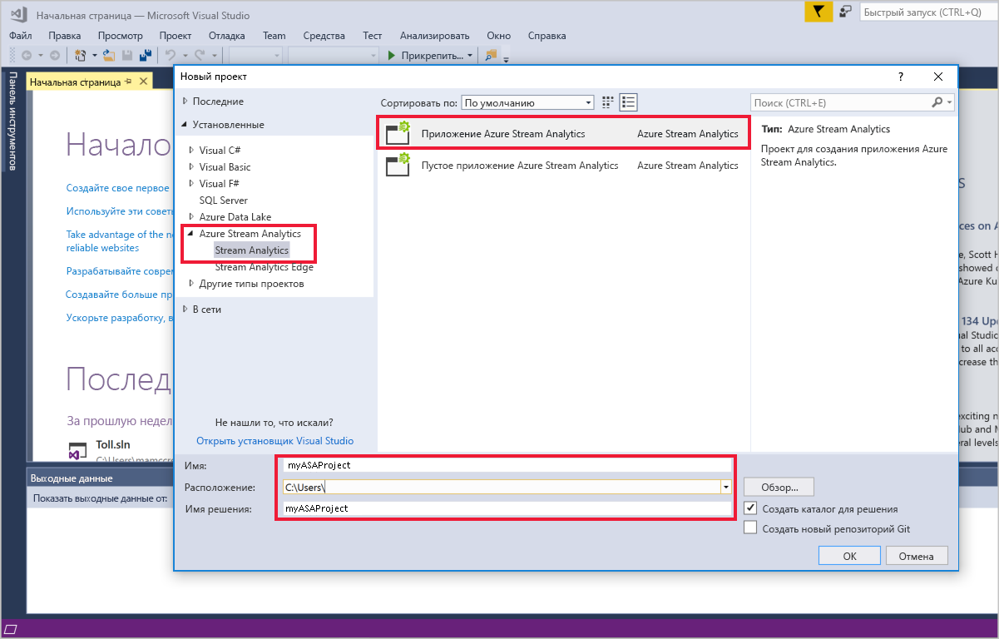
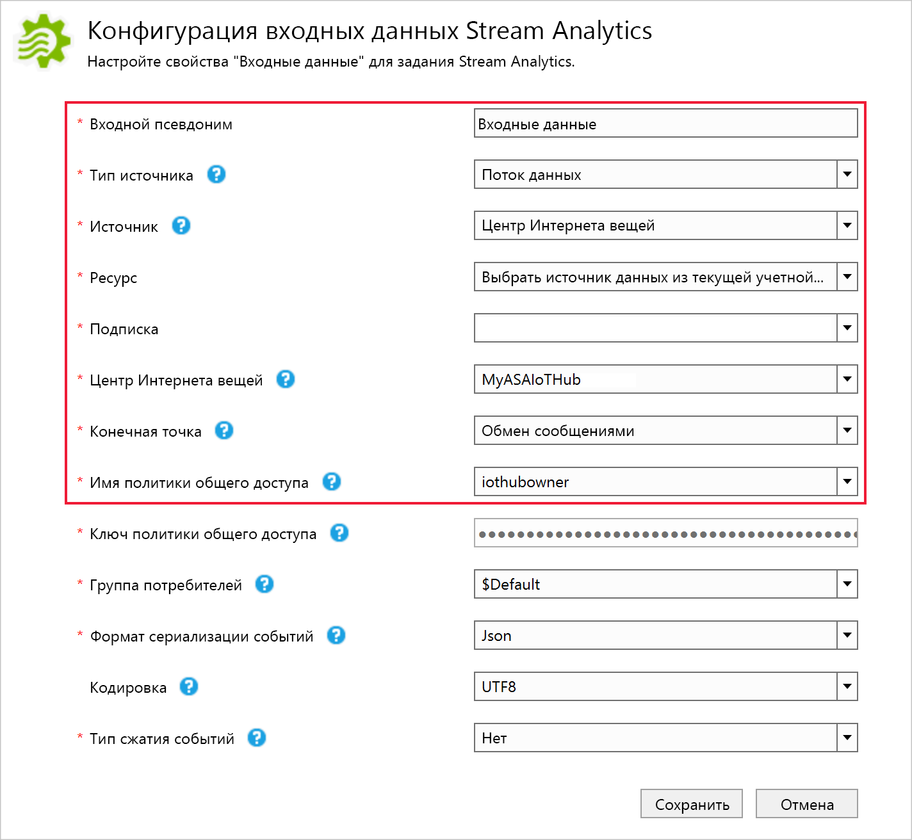
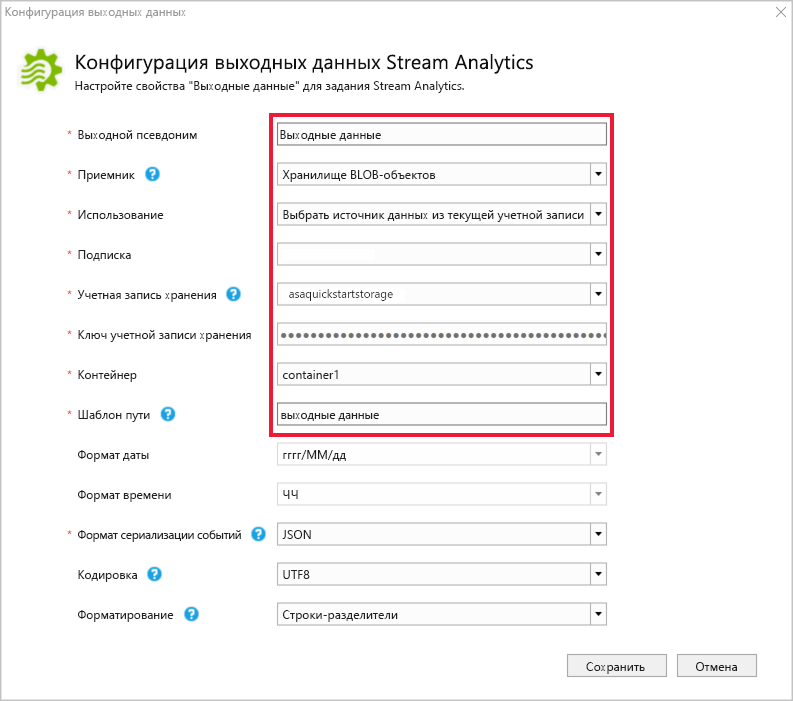
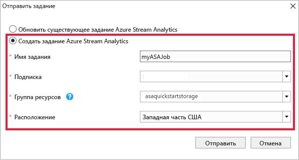
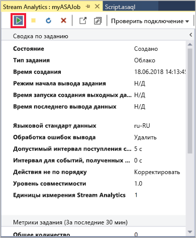
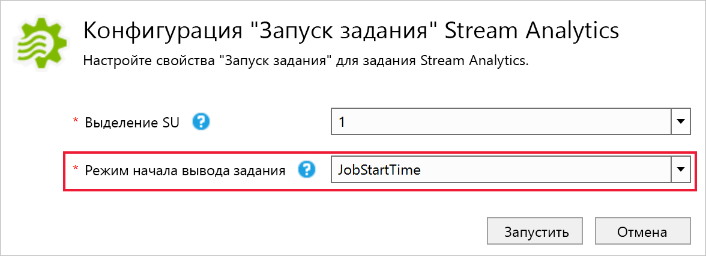
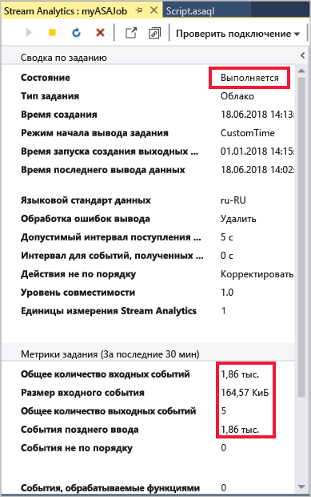

# <a name="quickstart-create-a-stream-analytics-job-by-using-the-azure-stream-analytics-tools-for-visual-studio"></a>Краткое руководство. Создание задания Stream Analytics с использованием инструментов Azure Stream Analytics для Visual Studio

В этом кратком руководстве описано, как создать и запустить задание Stream Analytics используя инструменты Azure Stream Analytics для Visual Studio. Пример задания считывает данные потоковой передачи в хранилище BLOB-объектов Azure. Файл входных данных, используемый в этом кратком руководстве, содержит статические данные только для демонстрации. В реальной ситуации используйте потоковые входные данные для задания Stream Analytics. В этом кратком руководстве описывается задание, которое вычисляет среднюю температуру, когда она превышает 100°, и записывает полученный результат события в новый файл.

## <a name="before-you-begin"></a>Перед началом работы

* Если у вас еще нет подписки Azure, создайте [бесплатную учетную запись Azure](https://azure.microsoft.com/free/).

* Войдите на [портале Azure](https://portal.azure.com/).

* Установите Visual Studio 2017, Visual Studio 2015 или Visual Studio 2013 с обновлением 4. Поддерживаются выпуски Enterprise (Ultimate/Premium), Professional и Community. Выпуск Express не поддерживается.

* Следуйте [инструкциям по установке](https://docs.microsoft.com/azure/stream-analytics/stream-analytics-tools-for-visual-studio-install), чтобы установить средства Stream Analytics для Visual Studio.

## <a name="prepare-the-input-data"></a>Подготовка входных данных

Прежде чем определить задание Stream Analytics, необходимо подготовить данные, которые настроены как входные данные задания. Для подготовки входных данных, необходимых для задания, выполните следующие шаги:

1. Загрузите [пример данных датчика](https://raw.githubusercontent.com/Azure/azure-stream-analytics/master/Samples/GettingStarted/HelloWorldASA-InputStream.json) с сайта GitHub. Пример данных содержит данные датчика в следующем формате JSON:  

   ```json
   {
     "time": "2018-01-26T21:18:52.0000000",
     "dspl": "sensorC",
     "temp": 87,
     "hmdt": 44
   }
   ```
2. Войдите на [портале Azure](https://portal.azure.com/).

3. В верхнем левом углу окна портала Azure выберите **Создать ресурс** > **Хранилище** > **Учетная запись хранения**. На странице задания учетной записи хранения для параметра **Имя** введите значение "asaquickstartstorage", для параметра **Расположение** — "Западная часть США", для параметра **Группа ресурсов** — "asaquickstart-resourcegroup" (для повышения производительности разместите учетную запись хранения в той же группе ресурсов, что и задание потоковой передачи). Для остальных параметров можно оставить значения по умолчанию.  

   

4. На странице **Все ресурсы** найдите учетную запись хранения, созданную на предыдущем шаге. Откройте страницу **Обзор**, а затем щелкните плитку **Большие двоичные объекты**.  

5. На странице **Служба BLOB-объектов** выберите **Контейнер**, предоставьте **Имя** для контейнера, такое как *container1*, затем нажмите кнопку **ОК**.  

   

6. Перейдите к контейнеру, созданному на предыдущем шаге. Выберите **Отправить** и отправьте данные датчика, полученные на первом шаге.  

   

## <a name="create-a-stream-analytics-project"></a>Создание проекта Stream Analytics

1. Запустите Visual Studio.

2. Выберите **Файл > Новый проект**.  

3. Из списка шаблонов слева выберите **Stream Analytics** и щелкните **Azure Stream Analytics Application** (Приложение Azure Stream Analytics).  

4. Введите в проекте**Имя**, **Расположение** и **Имя решения**, а затем нажмите кнопку **ОК**.

   

## <a name="choose-the-required-subscription"></a>Выбор требуемой подписки

1. В Visual Studio в меню **Вид** выберите **Обозреватель серверов**.

2. Щелкните правой кнопкой мыши **Azure**, выберите **Подключиться к подписке Microsoft Azure** и войдите в систему с помощью учетной записи Azure.

## <a name="define-input"></a>Определение ввода

1. В **Обозревателе решений** разверните узел **Входные данные** и дважды щелкните **Input.json**.

2. Заполните область **Stream Analytics Input Configuration** следующими значениями.

   |**Параметр**  |**Рекомендуемое значение**  |**Описание**   |
   |---------|---------|---------|
   |Псевдоним входных данных  |  Входные данные   |  Введите имя для определения входных данных задания.   |
   |Тип источника   |  Поток данных |  Выберите подходящий источник ввода: поток данных или эталонные данные.   |
   |Источник  |  Хранилище BLOB-объектов |  Выберите соответствующий источник ввода.   |
   |Ресурс  | Выберите источник данных из текущей учетной записи | Выберите ввод данных вручную или существующую учетную запись.   |
   |Подписка  |  \<Ваша подписка\>   | Выберите подписку Azure, в которой создана учетная запись хранения. Учетная запись хранения может находиться в той же или в другой подписке. В этом примере предполагается, что вы создали учетную запись хранения в одной и той же подписке.   |
   |Учетная запись хранения  |  asaquickstartstorage   |  Выберите или введите имя учетной записи хранения. Имена учетных записей автоматически обнаруживаются, если они создаются в одной и той же подписке.   |
   |Контейнер  |  container1   |  Выберите существующий контейнер, созданный в вашей учетной записи хранения.   |
   
3. Оставьте значения по умолчанию для других параметров и нажмите кнопку **Сохранить**, чтобы сохранить параметры.  

   

## <a name="define-output"></a>Определение выходных данных

1. В **обозревателе решений** разверните узел **Выходные данные** и дважды щелкните **Output.json**.

2. Заполните область **Stream Analytics Output Configuration** следующими значениями.

   |**Параметр**  |**Рекомендуемое значение**  |**Описание**   |
   |---------|---------|---------|
   |Псевдоним выходных данных  |  Выходные данные   |  Введите имя для определения выходных данных задания.   |
   |Приемник   |  Хранилище BLOB-объектов |  Выберите соответствующий приемник.    |
   |Ресурс  |  Укажите параметры источника данных вручную |  Выберите ввод данных вручную или существующую учетную запись.   |
   |Подписка  |  \<Ваша подписка\>   | Выберите подписку Azure, в которой создана учетная запись хранения. Учетная запись хранения может находиться в той же или в другой подписке. В этом примере предполагается, что вы создали учетную запись хранения в одной и той же подписке.   |
   |Учетная запись хранения  |  asaquickstartstorage   |  Выберите или введите имя учетной записи хранения. Имена учетных записей автоматически обнаруживаются, если они создаются в одной и той же подписке.   |
   |Контейнер  |  container1   |  Выберите существующий контейнер, созданный в вашей учетной записи хранения.   |
   |Шаблон пути  |  output   |  Введите путь к файлу, который будет создан в контейнере.   |
   
3. Оставьте значения по умолчанию для других параметров и нажмите кнопку **Сохранить**, чтобы сохранить параметры.  

   

## <a name="define-the-transformation-query"></a>Определение запроса преобразования

1. Откройте файл **Script.asaql** в **обозревателе решений** в Visual Studio.

2. Добавьте следующий запрос:

   ```sql
   SELECT 
   System.Timestamp AS OutputTime,
   dspl AS SensorName,
   Avg(temp) AS AvgTemperature
   INTO
     Output
   FROM
     Input TIMESTAMP BY time
   GROUP BY TumblingWindow(second,30),dspl
   HAVING Avg(temp)>100
   ```

## <a name="submit-a-stream-analytics-query-to-azure"></a>Отправка запроса Stream Analytics в Azure

1. В **редакторе запросов** щелкните **Отправить в Azure** в редакторе сценариев.

2. Выберите **Создать задание Azure Stream Analytics** и введите **Имя задания**. Выберите **Подписка**, **Группа ресурсов** и **Расположение**, которое использовалось в начале этого краткого руководства.

   

## <a name="start-the-stream-analytics-job-and-check-output"></a>Запуск задания Stream Analytics и просмотр выходных данных

1. Когда задание создано, автоматически откроется представление задания. Чтобы запустить задание, нажмите кнопку с зеленой стрелкой.

   

2. Измените дату в поле **Настраиваемое время** на `2018-01-01` и выберите **Запустить**.

   

3. Обратите внимание, что состояние задания изменилось на **Выполняется** и поступают события ввода и вывода. Это может занять несколько минут.

   

4. Чтобы просмотреть результаты, в меню **Представление** выберите **Cloud Explorer**и перейдите к учетной записи хранилища в группе ресурсов. В разделе **Контейнеры больших двоичных объектов** дважды щелкните **container1**, а затем путь к файлу **вывода данных**.

   

## <a name="clean-up-resources"></a>Очистка ресурсов

Ставшие ненужными группу ресурсов, задание потоковой передачи и все связанные ресурсы можно удалить. При удалении задания будет прекращена тарификация за единицы потоковой передачи, потребляемые заданием. Если вы планируете использовать это задание в будущем, вы можете остановить и перезапустить его позже. Если вы не собираетесь использовать это задание дальше, удалите все ресурсы, созданные в ходе работы с этим руководством, выполнив следующие шаги:

1. В меню слева на портале Azure выберите **Группы ресурсов**, а затем выберите имя созданного ресурса.  

2. На странице группы ресурсов выберите **Удалить**, в текстовом поле введите имя ресурса для удаления и щелкните **Удалить**.

## <a name="next-steps"></a>Дополнительная информация

В этом кратком руководстве вы развернули простое задание Stream Analytics. Дополнительные сведения о настройке других источников входных данных и обнаружении в режиме реального времени см. в следующей статье:

> [!div class="nextstepaction"]
> [Приступая к работе с Azure Stream Analytics: выявление мошенничества в режиме реального времени](stream-analytics-real-time-fraud-detection.md)
