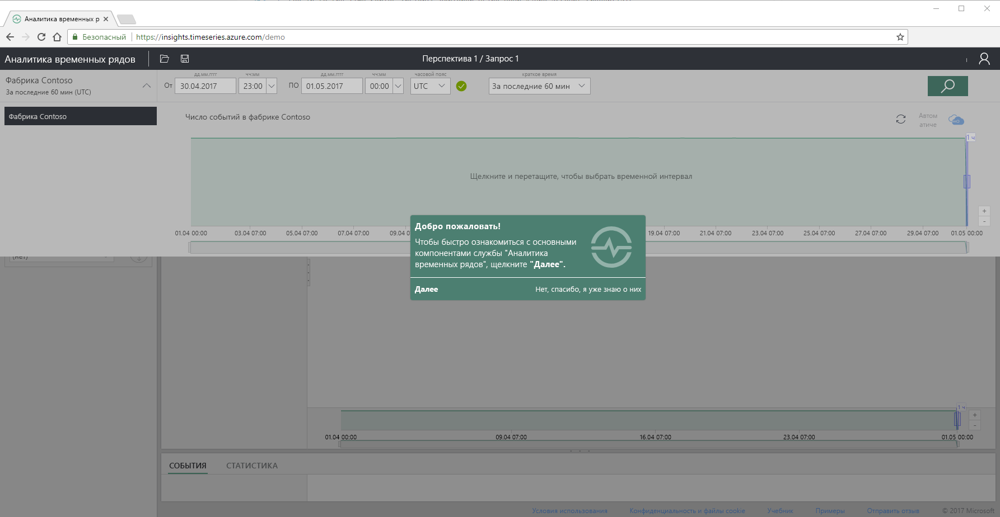
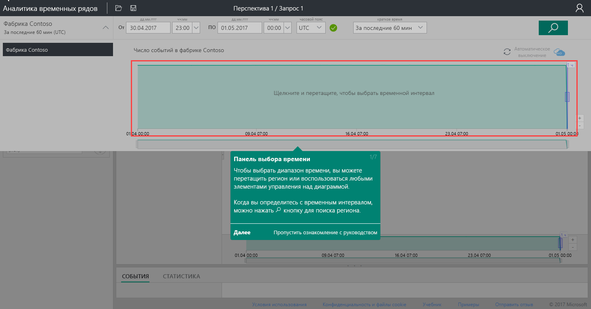
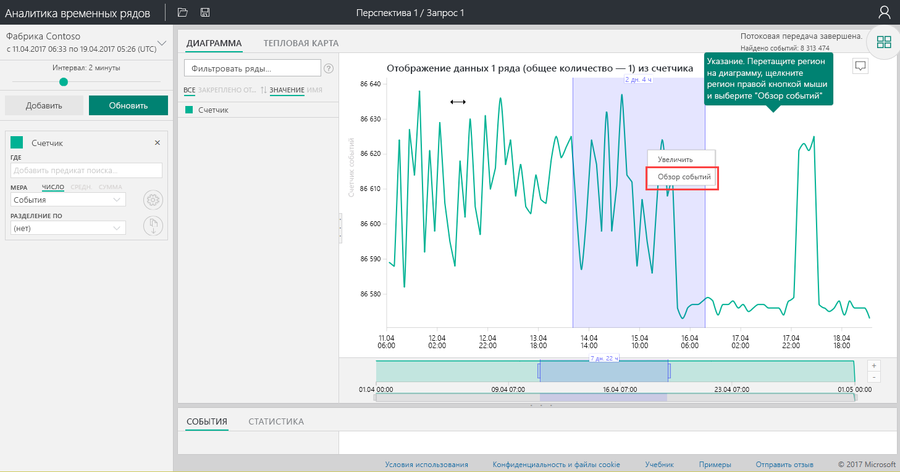
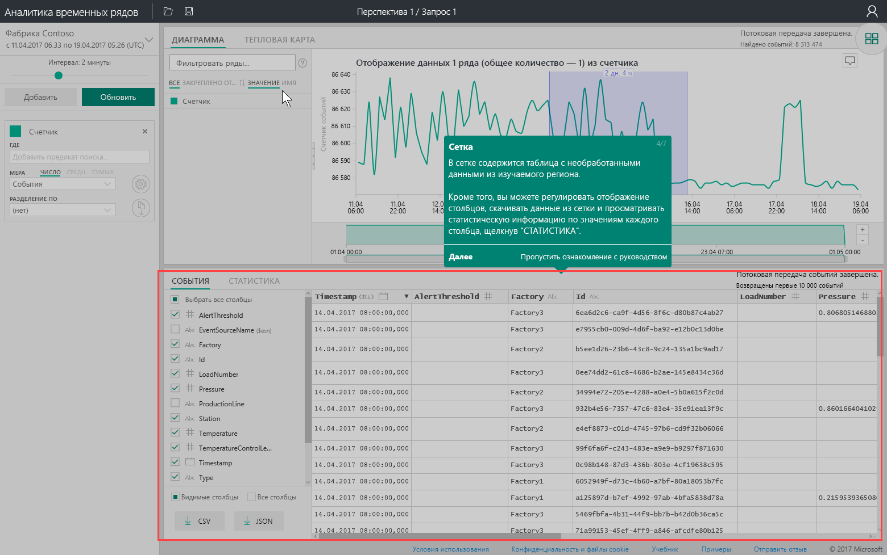
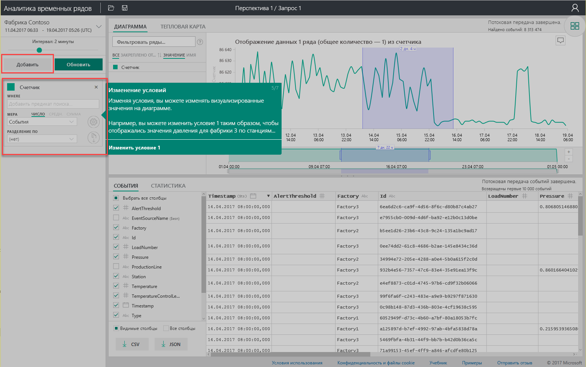
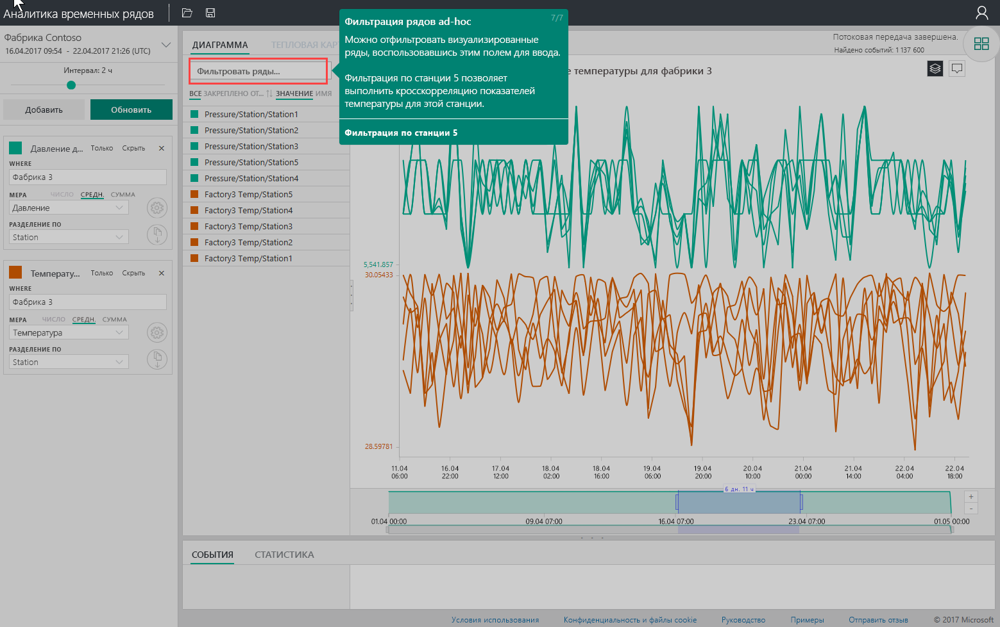

# Краткое руководство. Знакомство со службой "Аналитика временных рядов Azure"
Это краткое руководство покажет вам, как начать работу с обозревателем службы "Аналитика временных рядов Azure" в бесплатной демонстрационной среде. Вы узнаете, как использовать веб-браузер для визуализации больших объемов данных Интернета вещей, и ознакомитесь с ключевыми возможностями обозревателя службы "Аналитика временных рядов Azure". 

"Аналитика временных рядов Azure" — это полностью управляемая служба аналитики, хранения и визуализации, которая позволяет легко просматривать и анализировать миллиарды событий Интернета вещей одновременно. Это дает вам глобальное представление о данных, позволяя быстро проверить решение Интернета вещей и избежать дорогостоящих простоев для критически важных устройств. Это стало возможным благодаря обнаружению скрытых тенденций, выявлению аномалий и анализу их первопричин практически в реальном времени.  Если вы создаете приложение, которому требуется хранить или запрашивать данные временных рядов, для его разработки можно использовать интерфейсы REST API службы "Аналитика временных рядов".

Если у вас еще нет подписки Azure, создайте [бесплатную учетную запись](https://azure.microsoft.com/free/?ref=microsoft.com&utm_source=microsoft.com&utm_medium=docs&utm_campaign=visualstudio) Azure, прежде чем начинать работу.

## Изучение обозревателя службы "Аналитика временных рядов" в демонстрационной среде

1. В браузере перейдите по адресу [https://insights.timeseries.azure.com/demo](https://insights.timeseries.azure.com/demo). 

2. Если появится соответствующий запрос, войдите в обозреватель службы "Аналитика временных рядов", используя данные учетной записи Azure. 
 
3. Откроется страница знакомства со службой "Аналитика временных рядов". Нажмите кнопку **Далее**, чтобы начать знакомство.

   

4. Откроется **панель выбора времени**. На этой панели можно выбрать интервал времени для визуализации.

   

5. Щелкните и перетащите указатель мыши в области, а затем нажмите кнопку **Поиск**.
 
    

   Служба "Аналитика временных рядов" отображает визуализацию диаграммы для указанного интервала времени. С диаграммой можно выполнять различные действия — фильтрацию, закрепление, сортировку и наложение. 

   Чтобы вернуться к **панели выбора времени**, щелкните стрелку вниз, как показано здесь:

   

6. Нажмите кнопку **Добавить** на **панели условий**, чтобы добавить новое условие поиска.

   

7. В диаграмме можно выбрать область, щелкнуть ее правой кнопкой мыши и выбрать **Explore Events** (Исследовать события).
 
   

   Отобразится сетка необработанных данных по исследуемой области:

   

8. Измените условия, чтобы изменить значения в диаграмме, и добавьте еще одно условие для перекрестной корреляции разных типов значений:

   

9. Введите условие фильтра в поле **Фильтр рядов** для произвольной фильтрации рядов. Для начала введите **Station5**, чтобы выполнить перекрестную корреляцию температуры и давления для соответствующей станции.
 
   

После завершения работы с кратким руководством можно поэкспериментировать с примером набора данных, создавая различные визуализации. 

### Дополнительная информация
Теперь вы готовы создать собственную среду службы "Аналитика временных рядов":
> [!div class="nextstepaction"]
> [Планирование среды службы "Аналитика временных рядов"](time-series-insights-environment-planning.md)
