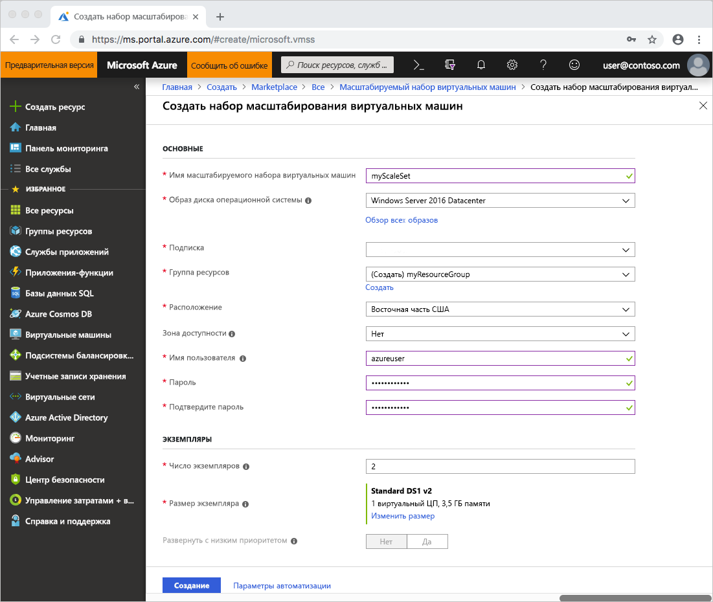
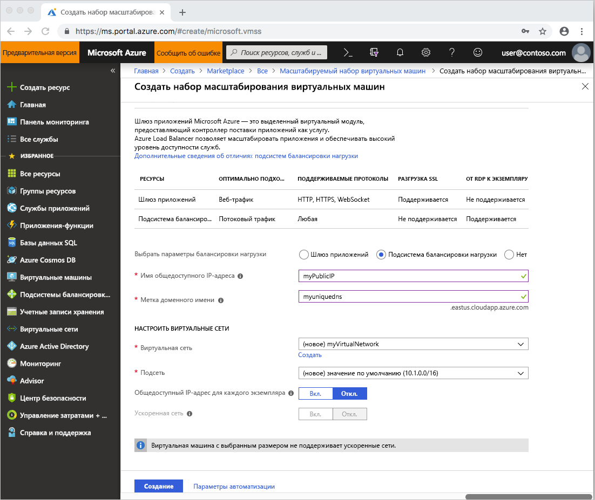

# Краткое руководство. Создание масштабируемого набора виртуальных машин на портале Azure
Масштабируемый набор виртуальных машин обеспечивает развертывание и администрирование набора идентичных автомасштабируемых виртуальных машин. Вы можете вручную изменить число виртуальных машин в масштабируемом наборе или определить правила для автоматического масштабирования в зависимости от использования ЦП, объема памяти или сетевого трафика. После этого Azure Load Balancer будет распределять трафик между экземплярам виртуальных машин в масштабируемом наборе. С помощью этого краткого руководства вы создали масштабируемый набор виртуальных машин с помощью портала Azure.

Если у вас еще нет подписки Azure, [создайте бесплатную учетную запись Azure](https://azure.microsoft.com/free/?WT.mc_id=A261C142F), прежде чем начинать работу.

## Вход в Azure
Войдите на портал Azure по адресу https://portal.azure.com.

## Создание масштабируемого набора виртуальных машин
Масштабируемый набор можно развернуть с помощью образа Windows Server или Linux, например RHEL, CentOS, Ubuntu или SLES.

1. Щелкните **Создать ресурс** в верхнем левом углу окна портала Azure.
2. Найдите *масштабируемый набор*, выберите **Набор масштабирования виртуальной машины**, а затем **Создать**.
3. Введите имя масштабируемого набора, например *myScaleSet*.
4. Выберите нужный тип ОС, например *Windows Server 2016 Datacenter*.
5. Введите имя нужной группы ресурсов, например *myResourceGroup*, и ее расположение, например *Восток США*.
6. Введите нужное имя пользователя и выберите тип аутентификации.
   - **Пароль** должен содержать от 12 до 123 знаков и включать по меньшей мере три из следующих знаков: одна строчная буква, одна прописная буква, одна цифра и один специальный знак. Дополнительные сведения см. в разделе [Какие требования к имени пользователя при создании виртуальной машины?](../virtual-machines/windows/faq.md#what-are-the-username-requirements-when-creating-a-vm).
   - При выборе образа диска ОС Linux можно вместо него выбрать **открытый ключ SSH**. Только укажите свой открытый ключ, например *~/.ssh/id_rsa.pub*. Для [создания и использования ключей SSH](../virtual-machines/linux/mac-create-ssh-keys.md) можно применять Azure Cloud Shell на портале.

     
1. Выберите вариант балансировки нагрузки, например *Подсистема балансировки нагрузки*, в разделе **Выбрать параметры балансировки нагрузки**. Введите остальные сведения о выбранном варианте балансировки нагрузки. Например, для варианта *Подсистема балансировки нагрузки* необходимо ввести **имя общедоступного IP-адреса** и **метку доменного имени**.
1. Введите сведения о виртуальной сети в разделе **Настройка виртуальных сетей**. Например, можно создать новую виртуальную сеть, *myVirtualNetwork*, и новую подсеть *по умолчанию*.
1. Чтобы подтвердить параметры масштабируемого набора, выберите **Создать**.
    

## Подключение к виртуальной машине в наборе масштабирования
При создании масштабируемого набора на портале создается подсистема балансировки нагрузки. Правила преобразования сетевых адресов (NAT) используются для распределения трафика между экземплярами масштабируемого набора для удаленных подключений, таких как RDP или SSH.

Для просмотра этих правил NAT и сведений о подключении для экземпляров масштабируемого набора сделайте следующее:

1. Выберите группу ресурсов, созданную на предыдущем шаге, такую как *myResourceGroup*.
2. Из списка ресурсов выберите свою **подсистему балансировки нагрузки**, такую как *myScaleSetLab*.
3. Выберите из меню в левой части окна **Правила NAT для входящего трафика**.

    

С помощью этих правил преобразования сетевых адресов можно подключиться к каждой виртуальной машине в наборе масштабирования. Для каждого экземпляра виртуальной машины указан конечный IP-адрес и номер порта TCP. Например, если IP-адрес назначения — *104.42.1.19*, а TCP-порт — *50001*, произойдет подключение к экземпляру виртуальной машины, как показано ниже.

- Для масштабируемого набора Windows произойдет подключение к экземпляру виртуальной машины по протоколу удаленного рабочего стола по адресу `104.42.1.19:50001`
- Для масштабируемого набора Linux произойдет подключение к экземпляру виртуальной машины с помощью SSH по адресу `ssh azureuser@104.42.1.19 -p 50001`

При появлении запроса введите учетные данные, указанные на предыдущем шаге при создании масштабируемого набора. Экземпляры масштабируемого набора — это обычные виртуальные машины, с которыми можно взаимодействовать в обычном режиме. Дополнительные сведения о способах развертывания и выполнения приложений в экземплярах масштабируемого набора см. в статье [Развертывание приложения в масштабируемых наборах виртуальных машин](virtual-machine-scale-sets-deploy-app.md).

## Очистка ресурсов
Удалите ставшие ненужными группу ресурсов, масштабируемый набор и все связанные ресурсы. Чтобы сделать это, выберите группу ресурсов для виртуальной машины и нажмите кнопку **Удалить**.

## Дополнительная информация
С помощью этого краткого руководства вы создали базовый масштабируемый набор с помощью портала Azure. Чтобы получить дополнительные сведения, продолжите роботу с руководством по созданию масштабируемых наборов виртуальных машин Azure и управлению ими.

> [!div class="nextstepaction"]
> [Создание масштабируемых наборов виртуальных машин Azure и управление ими](tutorial-create-and-manage-powershell.md)
