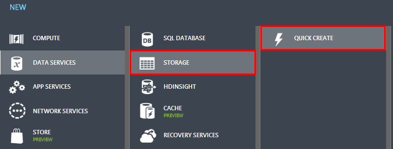
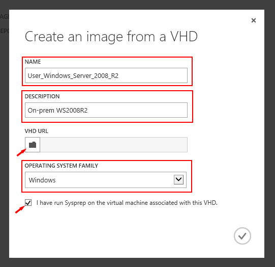

<properties pageTitle="Создание и передача виртуального жесткого диска Windows Server в Azure" description="Узнайте, как создать и передать виртуальный жесткий диск с операционной системой Windows Server в Azure." services="virtual-machines" documentationCenter="" authors="KBDAzure" manager="timlt" editor="tysonn"/>

<tags ms.service="virtual-machines" ms.workload="infrastructure-services" ms.tgt_pltfrm="vm-windows" ms.devlang="na" ms.topic="article" ms.date="01/19/2015" ms.author="kathydav"/>

#Создание и передача виртуального жесткого диска Windows Server в Azure#

В этой статье показано, как передать виртуальный жесткий диск с операционной системой, чтобы использовать его в качестве образа для создания виртуальных машин. Дополнительную информацию об образах и дисках в Microsoft Azure см. в разделе [Диски и образы в Azure](http://msdn.microsoft.com/ru-ru/library/windowsazure/jj672979.aspx).

> [AZURE.NOTE] При создании виртуальной машины на основе образа можно настроить параметры операционной системы, чтобы оптимизировать выполняемые приложения. Заданная конфигурация сохраняется на диске для этой виртуальной машины и не влияет на ее образ. Инструкции приведены в статье [Как создать настраиваемую виртуальную машину](http://www.windowsazure.com/ru-ru/documentation/articles/virtual-machines-windows-tutorial/).

##Предварительные требования##
В данной статье предполагается, что у вас есть следующее:

1. **Подписка на Azure**. Если у вас ее нет, вы можете создать бесплатную пробную учетную запись всего за несколько минут. Дополнительную информацию см. в статье [Создание учетной записи Azure](http://www.windowsazure.com/ru-ru/develop/php/tutorials/create-a-windows-azure-account/).  

2. **Microsoft Azure PowerShell**. У вас уже установлен и настроен на использование подписки модуль Microsoft Azure PowerShell. Чтобы скачать этот модуль, см. статью [Ресурсы Microsoft Azure для загрузки](http://www.windowsazure.com/ru-ru/downloads/). Учебник по установке и настройке модуля можно найти [здесь](http://www.windowsazure.com/ru-ru/documentation/articles/install-configure-powershell/). Передайте VHD, используя командлет [Add-AzureVHD](http://msdn.microsoft.com/ru-ru/library/azure/dn495173.aspx).

3. **Поддерживаемая операционная система Windows в VHD-файле**. Вы установили поддерживаемую операционную систему Windows Server на виртуальный жесткий диск. Существует несколько средств для создания VHD-файлов. Для создания виртуальной машины и установки операционной системы можно использовать решение для виртуализации, например Hyper-V. Инструкции об этом см. в статье [Установка роли Hyper-V и настройка виртуальной машины](http://technet.microsoft.com/ru-ru/library/hh846766.aspx).

> [AZURE.NOTE] Формат VHDX не поддерживается в Microsoft Azure. Вы можете преобразовать диск в формат VHD с помощью диспетчера Hyper-V или [командлета Convert-VHD](http://technet.microsoft.com/ru-ru/library/hh848454.aspx). Учебник об этом вы найдете [здесь](http://blogs.msdn.com/b/virtual_pc_guy/archive/2012/10/03/using-powershell-to-convert-a-vhd-to-a-vhdx.aspx).
 
 Поддерживаются следующие версии Windows Server:

  <TABLE BORDER="1" WIDTH="600">
  <TR BGCOLOR="#E9E7E7">
    <TH>ОС</TH>
    <TH>SKU</TH>
    <TH>Пакет обновления</TH>
    <TH>Архитектура</TH>
  </TR>
  <TR>
    <TD>Windows Server 2012 R2</TD>
    <TD>Все выпуски</TD>
    <TD>Недоступно</TD>
    <TD>x64</TD>
  </TR>
  <TR>
    <TD>Windows Server 2012</TD>
    <TD>Все выпуски</TD>
    <TD>Недоступно</TD>
    <TD>x64</TD>
  </TR>
  <TR>
    <TD>Windows Server 2008 R2</TD>
    <TD>Все выпуски</TD>
    <TD>SP1</TD>
    <TD>x64</TD>
  </TR>
  </TABLE>

Эта задача включает следующие шаги:

- [Шаг 1. Подготовка образа для передачи] []
- [Шаг 2. Создание учетной записи хранения в Azure] []
- [Шаг 3. Подготовка подключения к Azure] []
- [Шаг 4. Передача VHD-файла] []

## Шаг 1. подготовка образа для передачи ##

Перед передачей образа в Azure его необходимо обобщить с помощью команды Sysprep. Дополнительную информацию об использовании Sysprep см. в разделе [Как использовать Sysprep: Введение](http://technet.microsoft.com/ru-ru/library/bb457073.aspx).

В виртуальной машине, в которую была установлена операционная система, сделайте следующее:

1. Войдите в операционную систему.

2. Откройте окно командной строки с правами администратора. Измените каталог на **%windir%\system32\sysprep** и выполните команду  `sysprep.exe`.

	

3.	Откроется диалоговое окно **Программа подготовки системы**.

	

4.  В окне **Программа подготовки системы** выберите **Запуск при первом включении компьютера (OOBE)** и убедитесь, что установлен флажок "Обобщить".

5.  В разделе **Параметры завершения работы** выберите **Завершение работы**.

6.  Нажмите кнопку **ОК**. 

## Шаг 2. создание учетной записи хранения в Azure ##

Для загрузки файла VHD, который можно использовать в Azure для создания виртуальной машины, потребуется учетная запись хранения в Azure. Для создания учетной записи хранения можно использовать портал управления Azure.

1. Войдите на портал управления Azure.

2. На панели команд нажмите **Создать**.

3. Последовательно выберите **Службы данных** > **Хранилище** > **Быстрое создание**.

	

4. Заполните поля, как показано ниже:
	
	- В поле **URL-адрес** введите имя поддомена, которое нужно использовать в URL-адресе для учетной записи хранения. Записи могут содержать от 3 до 24 строчных букв и цифр. Это имя становится именем узла в URL, который используется для адресации ресурсов BLOB-объекта, очереди и таблицы для подписки.
			
	- Выберите **территориальную группу** для учетной записи хранения. Указав территориальную группу, можно выполнить совместное размещение облачных служб и хранилища в одном центре обработки данных.
		 
	- Укажите, следует ли использовать **георепликацию** для учетной записи хранения. По умолчанию георепликация включена. Этот параметр позволяет бесплатно выполнять репликацию данных в дополнительное расположение. Таким образом хранилище переключится на это расположение в случае аварийного отказа основного расположения. Дополнительное местоположение назначается автоматически и не может быть изменено. Если в соответствии с законодательными требованиями или организационной политикой требуется более жесткий контроль расположения облачного хранилища, георепликацию можно отключить. Однако следует помнить, что если вы опять включите георепликацию, с вас будет взята однократная плата за репликацию существующих данных в дополнительное местоположение. Службы хранения без георепликации предлагаются со скидкой. Дополнительную информацию об управлении георепликацией учетных записей хранения см. здесь: [Создание или удаление учетной записи хранения, а также управление нею](../storage-create-storage-account/#replication-options).

	

5. Щелкните **Создать учетную запись хранения**. Учетная запись появится в списке раздела **Хранилище**.

	

6. Теперь создайте контейнер для переданных виртуальных жестких дисков. Выберите "Имя учетной записи хранения", а затем щелкните **Контейнеры**.

	

7. Выберите элемент **Создать контейнер**.

	

8. Введите **имя** контейнера и выберите тип **политики доступа**.

	

	> [AZURE.NOTE] По умолчанию доступ к контейнеру предоставляется только владельцу учетной записи. Чтобы разрешить общий доступ на чтение для больших двоичных объектов в контейнере, но не к свойствам и метаданным контейнера, используйте параметр "Общедоступный BLOB-объект". Чтобы разрешить полный общий доступ на чтение для контейнера и больших двоичных объектов, используйте параметр "Общедоступный контейнер".

## Шаг 3. подготовка подключения к Microsoft Azure ##

Перед загрузкой файла VHD необходимо установить безопасное соединение между компьютером и вашей подпиской в Azure. Это можно сделать, используя метод Microsoft Azure Active Directory или метод сертификатов.

<h3>Использование Microsoft Azure AD</h3>

1. Откройте консоль Azure PowerShell, как описано в разделе [Практическое руководство. Установка Microsoft Azure PowerShell](#Install).

2. Введите следующую команду:  
	`Add-AzureAccount`
	
	После выполнения команды откроется окно входа, и вы сможете войти, используя свою рабочую или школьную учетную запись.

	

3. Azure выполняет проверку подлинности и сохраняет учетные данные, а затем закрывает окно.

<h3>Использование сертификата</h3> 

1. Откройте консоль Azure PowerShell. 

2.	Введите: 
	`Get-AzurePublishSettingsFile`.

3. В открывшемся окне браузера появится запрос на загрузку PUBLISHSETTINGS-файла. Он содержит информацию и сертификат для подписки Microsoft Azure.

	

3. Сохраните PUBLISHSETTINGS-файл. 

4. Введите: 
	`Import-AzurePublishSettingsFile <PathToFile>`

	Где "`<PathToFile>`" - это полный путь к файлу .publishsettings. 

	Дополнительную информацию см. в разделе [Начало работы с командлетами Microsoft Azure](http://msdn.microsoft.com/ru-ru/library/windowsazure/jj554332.aspx) 
	
	Дополнительную информацию об установке и настройке PowerShell см. в статье [Установка и настройка Microsoft Azure PowerShell](http://www.windowsazure.com/ru-ru/documentation/articles/install-configure-powershell/) 

## Шаг 4. передача VHD-файла ##

При загрузке VHD-файла его можно поместить в любом месте внутри хранилища больших двоичных объектов. В приведенных ниже примерах команд **BlobStorageURL** - это URL-адрес для учетной записи хранения, созданный при выполнении шага 2, **YourImagesFolder** - это контейнер внутри хранилища BLOB-объектов, где будут храниться образы. **VHDName** - метка, отображающаяся на портале управления для идентификации виртуального жесткого диска. **PathToVHDFile** - имя VHD-файла и полный путь к нему. 

1. В окне Azure PowerShell, использованном при выполнении предыдущего шага, введите:

	`Add-AzureVhd -Destination "<BlobStorageURL>/<YourImagesFolder>/<VHDName>.vhd" -LocalFilePath <PathToVHDFile>`
	
	

	Дополнительные сведения о командлете Add-AzureVhd см. в статье [Add-AzureVhd](http://msdn.microsoft.com/ru-ru/library/dn495173.aspx).

##Шаг 5. Добавьте образ в список пользовательских образов ##
После загрузки файла VHD его можно добавить в качестве образа в список пользовательских образов, связанных с подпиской.

1. На портале управления в разделе **Все элементы** выберите элемент **Виртуальные машины**.

2. В разделе "Виртуальные машины" выберите элемент **Образы**.

3. А затем выберите элемент **Создать образ**.

	

4. В окне **Создание образа на основе VHD** выполните следующее:
 	

	- Укажите **имя**.
	- Укажите **описание**.
	- Чтобы указать **URL-адрес VHD-файла**, нажмите кнопку папки для открытия следующего окна:
 
	

	- Укажите учетную запись хранения с VHD-файлом, а затем выберите элемент **Открыть**. После этого опять откроется окно **Создание образа на основе VHD**.
	- Вернувшись к нему, выберите элемент "Семейство операционных систем".
	- Отметьте пункт **Я выполнил Sysprep на виртуальной машине, связанной с этим VHD**, чтобы подтвердить обобщение операционной системы при выполнении шага 1, а затем нажмите **ОК**. 

	

5. **НЕОБЯЗАТЕЛЬНО.** Чтобы добавить VHD в качестве образа, вместо портала управления можно также использовать командлет Add-AzureVMImage.	В консоли Azure PowerShell введите:

	`Add-AzureVMImage -ImageName <Your Image's Name> -MediaLocation <location of the VHD> -OS <Type of the OS on the VHD>`
	
	

6. После выполнения указанных выше шагов отобразится новый образ, когда вы откроете вкладку **Образы**. 

	

	Теперь при создании виртуальной машины вы сможете воспользоваться этим новым образом. Чтобы отобразить его, выберите **Мои образы**. Инструкции об этом см. в статье [Создание виртуальной машины под управлением Windows Server](http://www.windowsazure.com/ru-ru/documentation/articles/virtual-machines-windows-tutorial/).

	

	> [AZURE.TIP] Если при попытке создать виртуальную машину возникнет сообщение об ошибке "Размер виртуальной памяти VHD https://XXXXX... - YYYY байтов. Размер должен измеряться целым числом (в МБ)", это означает, что размер виртуальной памяти вашего VHD не составляет целое число в мегабайтах, и поэтому его размер нефиксированный. Попытайтесь добавить образ, используя командлет Add-AzureVMImage PowerShell вместо портала управления (см. шаг 5 выше). Командлеты Azure обеспечивают соответствие VHD требованиям Azure.
	
## Дальнейшие действия ##
 

После создания виртуальной машины попробуйте создать виртуальную машину SQL Server. Указания см. в статье [Подготовка виртуальной машины SQL Server в Microsoft Azure](http://www.windowsazure.com/ru-ru/documentation/articles/virtual-machines-provision-sql-server/). 

[Шаг 1. Подготовка образа для передачи]: #prepimage
[Шаг 2. Создание учетной записи хранения в Azure]: #createstorage
[Шаг 3. Подготовка подключения к Azure]: #prepAzure
[Шаг 4. Передача VHD-файла]: #upload

<!--HONumber=42-->
