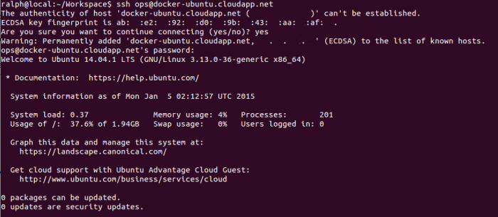

<properties 
	pageTitle="Быстрое использование Docker с образом виртуальной машины Ubuntu-Docker" 
	description="Здесь описано использование Docker на сервере Ubuntu непосредственно из коллекции образов Azure, занимающее всего несколько минут" 
	services="virtual-machines" 
	documentationCenter="" 
	authors="squillace" 
	manager="timlt" 
	editor="tysonn"/>

<tags 
	ms.service="virtual-machines" 
	ms.devlang="na" 
	ms.topic="article" 
	ms.tgt_pltfrm="vm-linux" 
	ms.workload="infrastructure" 
	ms.date="02/02/2015" 
	ms.author="rasquill"/>

<!--The next line, with one pound sign at the beginning, is the page title--> 
# Как быстро приступить к работе с Docker в Azure Marketplace 

Самый быстрый способ приступить к работе с [Docker] заключается в том, чтобы перейти в Azure Marketplace и создать виртуальную машину с помощью шаблона образа **Docker on Ubuntu Server**, созданного [Canonical] при сотрудничестве с [MSOpenTech]. При этом создается виртуальная машина Ubuntu Server и автоматически устанавливается [расширение виртуальных машин Docker](http://azure.microsoft.com/documentation/articles/virtual-machines-docker-vm-extension/) вместе с **последней** версией ядра Docker, которая предварительно установлена и запущена в Azure.  

Вы можете немедленно подключиться к виртуальной машине через SSH и начать работу с Docker напрямую, без выполнения каких-либо других действий. 

> [AZURE.NOTE]Виртуальная машина, созданная с помощью шаблона Azure Marketplace, не имеет удаленного API Docker для управления удаленным клиентом Docker. Чтобы включить удаленное управление узлом Docker в этой виртуальной машине, см. раздел [Запуск Docker с использованием HTTPS](https://docs.docker.com/articles/https/) или выполните действия из раздела [Использование расширения виртуальных машин Docker на портале Azure](http://azure.microsoft.com/documentation/articles/virtual-machines-docker-with-portal/) или [Использование расширения виртуальных машин Docker из azure-cli](http://azure.microsoft.com/documentation/articles/virtual-machines-docker-with-xplat-cli/). По желанию можно выполнить сборку [клиента Docker Windows](https://github.com/ahmetalpbalkan/Docker.DotNet) с сайта Github и применить описанную процедуру (либо просто взять его из [nuget](https://www.nuget.org/packages/Docker.DotNet/)). 

Содержание раздела

- [Вход на портал]
- [Создание виртуальной машины с использованием образа Docker от Canonical и MSOpenTech]
- [Подключение через SSH и готовность к работе]

## <a id='logon'>Вход на портал</a>

Эта часть не представляет никаких сложностей, если у вас есть учетная запись Azure. [Кроме того, вы можете легко получить такую учетную запись совершенно бесплатно](http://azure.microsoft.com/pricing/free-trial/)!

## <a id='createvm'>Создание виртуальной машины с использованием образа Docker от Canonical и MSOpenTech</a>

1. После входа в систему нажмите кнопку **Создать** в нижнем левом углу, чтобы создать новый образ виртуальной машины. Подходящий образ может сразу же отобразиться на баннере:

> 

2. Если этого не происходит, найдите его в коллекции образов: 

> 

3. Укажите имя пользователя и пароль для экземпляра или файл **PEM**, чтобы включить SSH с использованием сертификата. (На приведенном ниже изображении показан процесс задания имени пользователя и пароля.) Нажмите кнопку **Создать** в нижней части окна.

> 

4. Дождитесь завершения выполнения, это не должно занять много времени.

> 

## <a id='havingfun'>Подключение через SSH и готовность к работе</a>

Теперь начинается самое интересное. Вы можете немедленно подключиться к виртуальной машине с помощью SSH:

> 

и начать выполнять команды Docker, не забывая о том, что стандартная конфигурация на этой виртуальной машине Azure требует наличия **`sudo`**:

> 

<!--Every topic should have next steps and links to the next logical set of content to keep the customer engaged-->
## Дальнейшие действия

Вам остается лишь начать пользоваться [Docker]! 

<!--Anchors-->
[Вход на портал]: #logon
[Создание виртуальной машины с использованием образа Docker от Canonical и MSOpenTech]: #createvm
[Подключение через SSH и готовность к работе]: #havingfun
[Дальнейшие действия]: #next-steps

[Docker]: https://www.docker.com/
[BusyBox]: http://en.wikipedia.org/wiki/BusyBox
[Вспомогательный образ Docker]: https://docs.docker.com/articles/baseimages/#creating-a-simple-base-image-using-scratch
[Canonical]: http://www.canonical.com/
[MSOpenTech]: http://msopentech.com/

<!--HONumber=47-->
