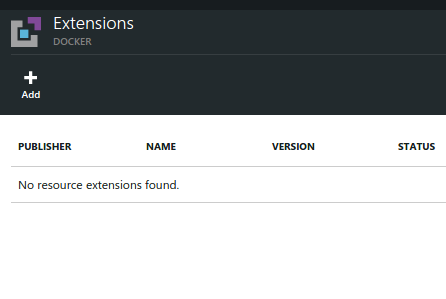
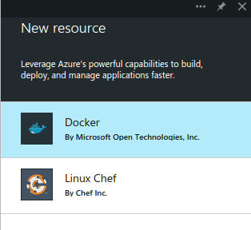
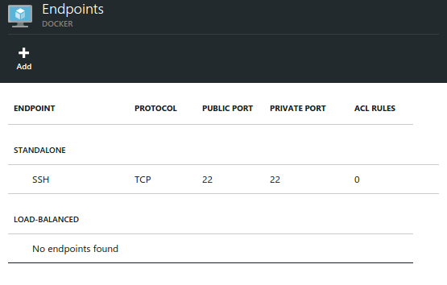
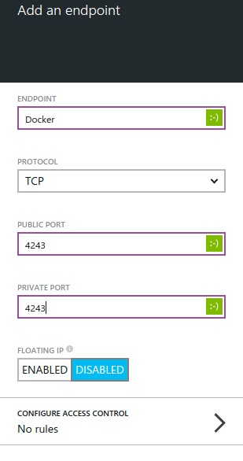

<properties
	pageTitle="Использование расширения виртуальных машин Docker для Linux на Azure"
	description="Описание механизма Docker и расширений Виртуальных машин Azure, а также программного создания виртуальных машин в Azure как узлов Docker с помощью интерфейса командной строки azure-cli."
	services="virtual-machines"
	documentationCenter=""
	authors="squillace"
	manager="timlt"
	editor="tysonn"/>

<tags
	ms.service="virtual-machines"
	ms.devlang="multiple"
	ms.topic="article"
	ms.tgt_pltfrm="vm-linux"
	ms.workload="infrastructure-services"
	ms.date="05/25/2015"
	ms.author="rasquill"/>


# Использование расширения виртуальных машин Docker на портале Azure

[Docker](https://www.docker.com/) — один из самых популярных подходов к виртуализации, использующий [контейнеры Linux](http://en.wikipedia.org/wiki/LXC) вместо виртуальных машин как способ изоляции данных и вычислений при использовании общих ресурсов. Вы можете использовать расширение виртуальных машин Docker, управляемое [агентом Linux для Azure], чтобы создать виртуальную машину Docker, в которой будет размещено любое количество контейнеров с приложениями в Azure.

> [AZURE.NOTE]В этом разделе описывается создание виртуальной машины Docker на портале Azure. Информацию о создании виртуальной машины Docker с помощью командной строки см. в статье [Использование расширения виртуальных машин Docker в интерфейсе командной строки Azure (CLI Azure)]. Обзорное обсуждение контейнеров и их преимуществ см. на [доске по Docker](http://channel9.msdn.com/Blogs/Regular-IT-Guy/Docker-High-Level-Whiteboard).

## Создание новой виртуальной машины в коллекции образов
На первом этапе необходима виртуальная машина Azure на основе образа Linux, который поддерживает расширение виртуальных машин Docker. Пример образа сервера из коллекции образов — Ubuntu 14.04 LTS, пример образа клиента — Ubuntu 14.04. На портале в нижнем левом углу нажмите кнопку **+ Создать**, чтобы создать новый экземпляр виртуальной машины, и выберите образ Ubuntu 14.04 LTS из доступных вариантов или из полной коллекции образов, как показано ниже.

> [AZURE.NOTE]В настоящее время расширение виртуальных машин Docker поддерживается только в образах Ubuntu 14.04 LTS, созданных позже июля 2014 г.


## Создание сертификатов Docker

После создания виртуальной машины убедитесь, что Docker установлен на клиентском компьютере. (Подробную информацию см. в разделе [Инструкции по установке Docker](https://docs.docker.com/installation/#installation).)

Создайте файлы сертификата и ключа для соединения Docker (см. раздел [Работа Docker с https]) и поместите их в каталог **`~/.docker`** на клиентском компьютере.

> [AZURE.NOTE]В настоящее время для расширения виртуальных машин Docker на портале необходимы учетные данные с кодировкой base64.

В командной строке используйте **`base64`** или другой предпочитаемый инструмент кодирования для создания разделов с кодировкой base64. Пример для простого набора файлов сертификатов и ключей:

```
 ~/.docker$ l
 ca-key.pem  ca.pem  cert.pem  key.pem  server-cert.pem  server-key.pem
 ~/.docker$ base64 ca.pem > ca64.pem
 ~/.docker$ base64 server-cert.pem > server-cert64.pem
 ~/.docker$ base64 server-key.pem > server-key64.pem
 ~/.docker$ l
 ca64.pem    ca.pem    key.pem            server-cert.pem   server-key.pem
 ca-key.pem  cert.pem  server-cert64.pem  server-key64.pem
```

## Добавление расширения виртуальных машин Docker
Для добавления расширения виртуальных машин Docker найдите созданный экземпляр виртуальной машины и щелкните **Расширения**, чтобы открыть расширения виртуальных машин (см. ниже).
> [AZURE.NOTE]Эта функциональность поддерживается только на портале предварительной версии: https://portal.azure.com/.


### Добавление расширения
Щелкните **+ Добавить**, чтобы просмотреть расширения, которые можно добавить к этой виртуальной машине.


### Выбор расширения виртуальных машин Docker
Выберите расширение виртуальных машин Docker, которое обеспечит описание Docker и важные ссылки, и нажмите кнопку **Создать** внизу, чтобы начать процедуру установки.




### Добавление файлов сертификатов и ключей.

В полях формы введите версии сертификата ЦС, сертификата сервера и ключа сервера в кодировке base64, как показано на следующем графике.


> [AZURE.NOTE]Обратите внимание, что значение 4243 заполнено по умолчанию (как показано на предыдущем рисунке). Здесь можно указать любую конечную точку, однако на следующем этапе потребуется открыть соответствующую конечную точку. Изменяя значение по умолчанию, на следующем этапе откройте соответствующую конечную точку.

## Добавление конечной точки соединения Docker
При просмотре виртуальной машины в созданной группе ресурсов щелкните **Конечные точки**, чтобы просмотреть конечные точки на виртуальной машине.



Щелкните **+ Добавить** для добавления еще одной конечной точки и, в случае по умолчанию, введите имя конечной точки (в этом примере **docker**) и значение 4243 для частного и общедоступного портов. Не изменяйте значение протокола **TCP** и щелкните **OK** для создания конечной точки.




## Тестирование клиента Docker и узла Docker в Azure
Нажмите и скопируйте имя домена виртуальной машины и в командной строке клиентского компьютера введите `docker --tls -H tcp://`*dockerextension*`.cloudapp.net:4243 info` (замените *dockerextension* дочерним доменом виртуальной машины).

Результат должен выглядеть следующим образом:

```
$ docker --tls -H tcp://dockerextension.cloudapp.net:4243 info
Containers: 0
Images: 0
Storage Driver: devicemapper
 Pool Name: docker-8:1-131214-pool
 Pool Blocksize: 65.54 kB
 Data file: /var/lib/docker/devicemapper/devicemapper/data
 Metadata file: /var/lib/docker/devicemapper/devicemapper/metadata
 Data Space Used: 305.7 MB
 Data Space Total: 107.4 GB
 Metadata Space Used: 729.1 kB
 Metadata Space Total: 2.147 GB
 Library Version: 1.02.82-git (2013-10-04)
Execution Driver: native-0.2
Kernel Version: 3.13.0-36-generic
WARNING: No swap limit support
```

После завершения описанных выше действий вы получаете полнофункциональный узел Docker, выполняемый в виртуальной машине Azure и настроенный на удаленное подключение с других клиентов.

<!--Every topic should have next steps and links to the next logical set of content to keep the customer engaged-->
## Дальнейшие действия

Переходите к [Руководству пользователя Docker] и использованию виртуальной машины Docker. Если нужно автоматизировать создание узлов Docker на виртуальных машинах Azure через интерфейс командной строки, см. статью [Использование расширения виртуальных машин Docker в интерфейсе командной строки Azure (CLI Azure)].

<!--Anchors-->
[Create a new VM from the Image Gallery]: #createvm
[Create Docker Certificates]: #dockercerts
[Add the Docker VM Extension]: #adddockerextension
[Test Docker Client and Azure Docker Host]: #testclientandserver
[Next steps]: #next-steps

<!--Image references-->
[StartingPoint]: ./media/StartingPoint.png
[StartingPoint]: ./media/StartingPoint.png
[StartingPoint]: ./media/StartingPoint.png
[StartingPoint]: ./media/StartingPoint.png
[StartingPoint]: ./media/StartingPoint.png
[StartingPoint]: ./media/StartingPoint.png
[StartingPoint]: ./media/StartingPoint.png
[StartingPoint]: ./media/StartingPoint.png
[6]: ./media/markdown-template-for-new-articles/pretty49.png
[7]: ./media/markdown-template-for-new-articles/channel-9.png


<!--Link references-->
[Использование расширения виртуальных машин Docker в интерфейсе командной строки Azure (CLI Azure)]: http://azure.microsoft.com/documentation/articles/virtual-machines-docker-with-xplat-cli/
[агентом Linux для Azure]: virtual-machines-linux-agent-user-guide.md
[Link 3 to another azure.microsoft.com documentation topic]: storage-whatis-account.md

[Работа Docker с https]: http://docs.docker.com/articles/https/
[Руководству пользователя Docker]: https://docs.docker.com/userguide/

<!---HONumber=58-->