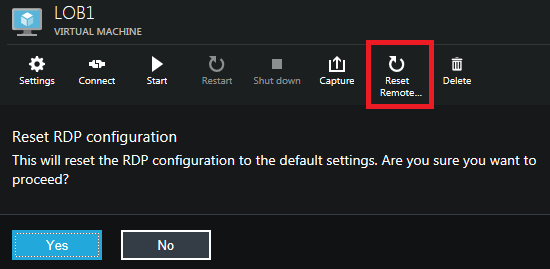
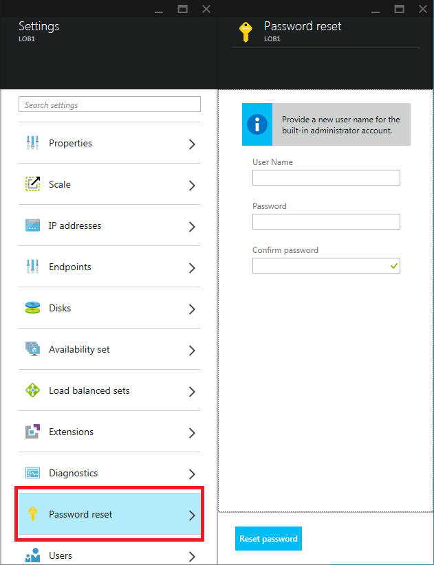

<properties 
	pageTitle="Сброс пароля или службы удаленных рабочих столов для виртуальных машин Windows" 
	description="Быстрый сброс пароля локального администратора или службы удаленных рабочих столов для виртуальных машин Windows с помощью портала предварительной версии Azure и команд PowerShell." 
	services="virtual-machines" 
	documentationCenter="" 
	authors="JoeDavies-MSFT" 
	manager="timlt" 
	editor=""/>

<tags 
	ms.service="virtual-machines" 
	ms.workload="infrastructure-services" 
	ms.tgt_pltfrm="na" 
	ms.devlang="na" 
	ms.topic="article" 
	ms.date="05/07/2015" 
	ms.author="josephd"/>

# Сброс пароля или службы удаленных рабочих столов для виртуальных машин Windows

Если вы не можете подключиться к виртуальной машине Windows, так как забыли пароль или у вас возникла проблема с конфигурацией службы удаленных рабочих столов, воспользуйтесь порталом предварительной версии Azure или расширением VMAccess, чтобы сбросить пароль локального администратора или конфигурацию службы удаленных рабочих столов.

## Портал предварительной версии Azure

Чтобы выполнить сброс службы удаленных рабочих столов на [портале предварительной версии Azure](https://portal.azure.com), щелкните **Browse** (Обзор) > **Virtual Machines** (Виртуальные машины) > *ваша виртуальная машина Linux* > **Reset Remote Access** (Сброс удаленного доступа). Ниже приведен пример.

Чтобы сбросить имя и пароль учетной записи локального администратора на [портале предварительной версии Azure](https://portal.azure.com), щелкните **Browse** (Обзор) > **Virtual Machines** (Виртуальные машины) > *ваша виртуальная машина Linux * > **All settings** (Все параметры) > **Password reset** (Сброс пароля). Ниже приведен пример.

 
## Расширение VMAccess Extension и PowerShell

Для этого потребуются следующие компоненты.

- Модуль Azure PowerShell версии не ниже 0.8.5. Номер установленной версии Azure PowerShell можно уточнить с помощью команды **Get-Module azure | format-table version** Инструкции и ссылку на последнюю версию см. в статье [Установка и настройка Azure PowerShell](http://go.microsoft.com/fwlink/p/?linkid=320552&clcid=0x409). 
- Новый пароль учетной записи локального администратора. Он не требуется, если вы хотите сбросить конфигурацию службы удаленных рабочих столов. 
- Агент ВМ. 

Для использования расширения VMAccess его не обязательно нужно устанавливать. Если на виртуальной машине установлен агент виртуальной машины, расширение загружается автоматически при запуске команды Azure PowerShell, использующей командлет **Set-AzureVMExtension**.
 
Сначала убедитесь, что агент ВМ уже установлен. Укажите имя облачной службы и имя виртуальной машины, а затем выполните следующие команды в командной строке Azure PowerShell уровня администратора. Замените все содержимое внутри кавычек, включая символы < and >.

	$CSName = "<cloud service name>"
	$VMName = "<virtual machine name>"
	$vm = Get-AzureVM -ServiceName $CSName -Name $VMName 
	write-host $vm.VM.ProvisionGuestAgent

Если вы не знаете имя облачной службы и виртуальной машины, запустите командлет **Get-AzureVM**, чтобы отобразить эти сведения для всех виртуальных машин в вашей текущей подписке.

Если команда **write-host** отображает значение **True**, агент ВМ установлен. Если она отображает значение **False**, соответствующие инструкции и ссылку для скачивания можно найти в записи блога Azure [Агент виртуальной машины и расширения — часть 2](http://go.microsoft.com/fwlink/p/?linkid=403947&clcid=0x409).

В случае создания виртуальной машины с помощью портала управления Azure выполните следующую дополнительную команду:

	$vm.GetInstance().ProvisionGuestAgent = $true

Эта команда будет предотвращать возникновение ошибки о том, что перед настройкой расширения виртуальных машин IaaS требуется включить гостевой агент подготовки в объекте виртуальной машины, при выполнении команды Set-AzureVMExtension в следующих разделах.

Теперь можно выполнить следующие задачи:

- сброс пароля учетной записи локального администратора;
- Сброс конфигурации службы удаленных рабочих столов

## Сброс пароля учетной записи локального администратора

Введите имя существующей учетной записи локального администратора и новый пароль, а затем выполните следующие команды.

	$cred=Get-Credential –Message "Type the name of the current local administrator account and the new password."	
	Set-AzureVMAccessExtension –vm $vm -UserName $cred.GetNetworkCredential().Username -Password $cred.GetNetworkCredential().Password  | Update-AzureVM

- Если вы укажете новое имя для учетной записи, расширение VMAccess переименует учетную запись локального администратора, назначит пароль этой учетной записи и закроет удаленный рабочий стол.
- Если учетная запись локального администратора отключена, расширение VMAccess включит ее.
 
Эти команды также сбрасывают конфигурацию службы удаленных рабочих столов.

## Сброс конфигурации службы удаленных рабочих столов

Чтобы сбросить конфигурацию службы удаленных рабочих столов, выполните следующую команду.

	Set-AzureVMAccessExtension –vm $vm | Update-AzureVM

Расширение VMAccess запустит эти две команды в виртуальной машине:

- **netsh advfirewall firewall set rule group="Remote Desktop" new enable=Yes**

	Эта команда включает встроенную группу брандмауэра Windows, которая разрешает входящий трафик удаленного рабочего стола через TCP-порт 3389.

- **Set-ItemProperty -Path 'HKLM:\System\CurrentControlSet\Control\Terminal Server' -name "fDenyTSConnections" -Value 0**

	Эта команда задает значение реестра fDenyTSConnections равным 0, включая подключения удаленного рабочего стола.

Если это не решило проблему доступа к удаленному рабочему столу, запустите [пакет диагностики Azure IaaS (Windows)](https://home.diagnostics.support.microsoft.com/SelfHelp?knowledgebaseArticleFilter=2976864).

1.	Чтобы создать сеанс диагностики, щелкните ссылку **Пакет диагностики Microsoft Azure IaaS (Windows)** на этой странице.
2.	На странице **Какие из указанных проблем возникают в вашей виртуальной машине Azure?** выберите пункт **Подключение к порту удаленного рабочего стола в виртуальной машине Azure (требуется перезагрузка)**. 

Дополнительные сведения см. в статье базы знаний [Пакет диагностики Microsoft Azure IaaS (Windows)](http://support.microsoft.com/kb/2976864).

Если вам не удалось запустить пакет диагностики Azure IaaS (Windows) или его запуск не решил проблему, ознакомьтесь со статьей [Устранение неполадок с подключением к удаленному рабочему столу виртуальной машины Windows в службе Azure](virtual-machines-troubleshoot-remote-desktop-connections.md).

## Дополнительные ресурсы

[Расширения и компоненты виртуальных машин Azure](http://msdn.microsoft.com/library/azure/dn606311.aspx)

[Подключение к виртуальной машине Azure с помощью RDP или SSH](http://msdn.microsoft.com/library/azure/dn535788.aspx)

<!---HONumber=58-->