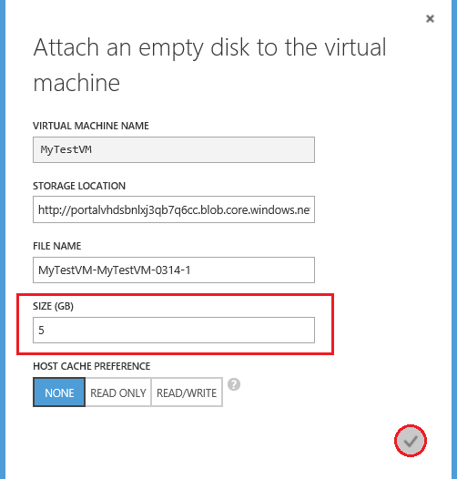

<properties 
	pageTitle="Создание виртуальной машины под управлением Windows в Azure" 
	description="Узнайте, как создать виртуальную машину под управлением Windows в Azure, а затем выполнить вход в систему и подключить диск данных." 
	services="virtual-machines" 
	documentationCenter="" 
	authors="KBDAzure" 
	manager="timlt" 
	editor="tysonn"/>

<tags 
	ms.service="virtual-machines" 
	ms.workload="infrastructure-services" 
	ms.tgt_pltfrm="vm-windows" 
	ms.devlang="na" 
	ms.topic="article" 
	ms.date="01/20/2015" 
	ms.author="kathydav"/>

# Создание виртуальной машины под управлением Windows #

<a href="/ru-ru/documentation/articles/virtual-machines-windows-tutorial/" title="Azure Portal" class="current">Портал Azure</a><a href="/ru-ru/documentation/articles/virtual-machines-windows-tutorial-azure-preview/" title="Azure Preview Portal">Портал предварительной версии Azure</a>

В этом учебнике показано, насколько просто создавать виртуальные машины Azure (ВМ) под управлением Windows. В нем используется образ Windows Server, но это только один из множества образов, доступных в Azure. Это операционных системы Windows, операционные системы на основе Linux и образы с установленными приложениями. Доступные для выбора образы зависят от вашей подписки. Например, подписчикам MSDN могут быть доступны образы рабочих столов.

> [AZURE.NOTE] Чтобы пользоваться этим учебником, не нужен опыт работы с виртуальными машинами Azure, но нужна учетная запись Azure. Вы можете создать бесплатную пробную учетную запись всего за несколько минут. Дополнительные сведения см. в разделе [Создание учетной записи Azure](http://azure.microsoft.com/develop/php/tutorials/create-a-windows-azure-account/). 

В этом учебнике показано:

- [Как создать виртуальную машину](#createvirtualmachine)
- [Как войти на виртуальную машину после ее создания](#logon)
- [Как присоединить диск данных к новой виртуальной машине](#attachdisk)

Более подробную информацию см. в разделе [Виртуальные машины](http://go.microsoft.com/fwlink/p/?LinkID=271224).

##Создание виртуальной машины##

В этом разделе показано, как использовать метод **Из коллекции** на портале управления для создания виртуальной машины. Этот вариант обеспечивает больший выбор настроек, чем вариант **Быстрое создание**. Например, при необходимости присоединить виртуальную машину к виртуальной сети следует использовать параметр **Из коллекции**.

> [AZURE.NOTE] У вас также есть возможность использовать более богатый функционально, настраиваемый [портал предварительной версии Azure](https://portal.azure.com) для создания виртуальной машины, автоматизации развертывания шаблонов приложений для нескольких ВМ, применения расширенного мониторинга ВМ, а также диагностических функций и многого другого. Доступные параметры конфигурации ВМ на двух порталах в значительной степени перекрываются, но не полностью.  

[AZURE.INCLUDE [virtual-machines-create-WindowsVM](../includes/virtual-machines-create-WindowsVM.md)]

## Как войти в систему на виртуальной машине после ее создания ##

В настоящем разделе показано, как войти в виртуальную машину для управления ее настройками и приложениями, которые будут на ней выполняться.

[AZURE.INCLUDE [virtual-machines-log-on-win-server](../includes/virtual-machines-log-on-win-server.md)]

## Как присоединить диск данных к новой виртуальной машине ##

В настоящем разделе показано, как присоединить пустой диск данных к виртуальной машине. Дополнительную информацию о подключении существующих дисков см. в [Учебнике по подключению диска данных](http://azure.microsoft.com/documentation/articles/storage-windows-attach-disk/).

1. Войдите на [портал управления Azure](http://manage.windowsazure.com).

2. Нажмите кнопку **Виртуальные машины**, а затем выберите виртуальную машину **MyTestVM**.

	
	
3. Сначала вы можете попасть на страницу быстрого запуска. В этом случае щелкните **Панель мониторинга** в верхней части страницы.

	

4. На панели команд нажмите кнопку **Присоединить**, а затем - **Присоединить пустой диск**, после того как появится всплывающее окно.

		

5. Значения **Имя виртуальной машины**, **Расположение хранилища**, **Имя файла** и **Настройки кэша узла** уже определены. Вам нужно только указать размер диска. Например, введите **5** в поле **Размер**. Установите флажок, чтобы подключить диск.

	>[AZURE.NOTE] Все диски создаются из файлов виртуальных жестких дисков (VHD-файлов) в службе хранилища Azure. **Имя файла** позволяет задать имя VHD-файла, используемого диском, но не имя диска. Azure автоматически присваивает имя диску при его подключении. 

		
	
	>[AZURE.NOTE] VHD-файлы хранятся в службе хранилища Azure как страничные большие двоичные объекты. За пределами Azure для виртуальных жестких дисков может использоваться формат VHD или VHDX. Они также могут быть фиксированными, динамически расширяемыми или дифференцированными. Azure поддерживает диски фиксированного размера в формате VHD. Дополнительную информацию см. в разделе [О VHD в Azure](http://msdn.microsoft.com/library/azure/dn790344.aspx).  

6. Перейдите обратно на панель мониторинга, чтобы убедиться в успешном присоединении пустого диска данных к виртуальной машине. Он должен появиться в списке **Диски** после диска ОС.

	

	Сразу после подключения диска данных не подключен к сети и не инициализирован. Чтобы использовать его для хранения данных, необходимо предварительно войти в систему на виртуальной машине и инициализировать этот диск.

7. Подключитесь к виртуальной машине и войдите в нее, выполнив действия, описанные в предыдущем разделе [Как войти на виртуальную машину после ее создания] (#logon).

8. После входа в систему на виртуальной машине откройте **Диспетчер сервера** В левой панели выберите **Файловые службы и службы хранилища**.

	

9. Выберите **Диски** в развернутом меню.

		
	
10.	В разделе **Диски** перечислены диск 0, диск 1 и диск 2. Диск 0 - это диск операционной системы, диск 1 - временный диск ресурсов (который не должен использоваться как хранилище данных), а диск 2 - диск данных, который вы подключили к виртуальной машине. Емкость диска данных равна 5 ГБ, согласно размеру, указанному при его подключении. Щелкните диск 2 правой кнопкой мыши и выберите **Инициализировать**.

	

11. Щелкните **Да**.

	

12. Щелкните диск 2 правой кнопкой мыши еще раз и выберите **Новый том**. 

	

13. Завершите мастер, используя значения по умолчанию. После этого в разделе **Тома** появится новый том. Теперь диск в сети и готов к хранению данных. 

	
	
##Дальнейшие действия 

Чтобы получить дополнительную информацию о настройке виртуальных машин Windows в Azure, см. следующие статьи:

[Как подключиться к виртуальным машинам в облачной службе](http://azure.microsoft.com/documentation/articles/cloud-services-connect-virtual-machine/)

[Как создать и передать собственный виртуальный жесткий диск, содержащий операционную систему Windows](http://azure.microsoft.com/documentation/articles/virtual-machines-create-upload-vhd-windows-server/)

[Управление доступностью виртуальных машин](http://azure.microsoft.com/documentation/articles/manage-availability-virtual-machines/)

[О параметрах конфигурации виртуальной машины Azure](http://msdn.microsoft.com/library/azure/dn763935.aspx)

[ВИДЕО: Приступая к работе с виртуальными жестким дисками - что происходит на самом деле](http://azure.microsoft.com/documentation/videos/getting-started-with-azure-virtual-machines)

[ВИДЕО: Вопросы и ответы с Марком Руссиновичем - работает ли ОС Windows в Windows Azure?](http://azure.microsoft.com/documentation/videos/mark-russinovich-windows-on-azure)

[ВИДЕО: Добавление новой виртуальной машины в веб-ферму с помощью многократно используемых образов](http://azure.microsoft.com/documentation/videos/adding-virtual-machines-web-farm)

[ВИДЕО: Добавление виртуальных жестких дисков, учетных записей хранения и масштабирование виртуальных машин](http://azure.microsoft.com/documentation/videos/adding-drives-scaling-virtual-machines)

[ВИДЕО: Скотт Гатри (Scott Guthrie) приступает к работе с виртуальными машинами](http://azure.microsoft.com/documentation/videos/virtual-machines-scottgu)

[ВИДЕО: Основные сведения о хранилище и дисках с виртуальными машинами Azure](http://azure.microsoft.com/documentation/videos/storage-and-disks-virtual-machines)

[Виртуальные машины в Azure]: #virtualmachine
[Как создать виртуальную машину]: #custommachine
[Как войти в систему на виртуальной машине после ее создания]: #logon
[Как присоединить диск данных к новой виртуальной машине]: #attachdisk
[Как настроить связь с виртуальной машиной]: #endpoints

<!--HONumber=45--> 
