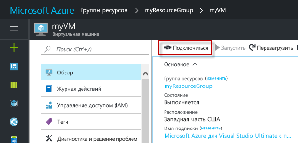

# <a name="create-a-linux-virtual-machine-with-the-azure-portal"></a>Создание виртуальной машины Linux с помощью портала Azure

Виртуальные машины Azure можно создать на портале Azure. В этом случае для создания и настройки виртуальных машин и всех связанных ресурсов Azure используется пользовательский интерфейс на основе браузера. В этом руководстве по быстрому запуску перечислены основные действия по созданию виртуальной машины с помощью портала Azure. 

Если у вас еще нет подписки Azure, [создайте бесплатную учетную запись Azure](https://azure.microsoft.com/free/) , прежде чем начинать работу.

## <a name="create-ssh-key-pair"></a>Создание пары ключей SSH

Для работы с этим руководством по быстрому запуску вам понадобится пара ключей SSH. Если у вас уже есть пара ключей SSH, этот шаг можно пропустить. Если вы используете другой компьютер Windows, следуйте инструкциям, изложенным [здесь](ssh-from-windows.md). 

Из оболочки Bash выполните следующую команду, а затем следуйте отображаемым на экране инструкциям. Выходные данные команды включают имя файла открытого ключа. Содержимое этого файла требуется при создании виртуальной машины.

```bash
ssh-keygen -t rsa -b 2048
```

## <a name="log-in-to-azure"></a>Вход в Azure 

Войдите на портал Azure по адресу http://portal.azure.com.

## <a name="create-virtual-machine"></a>Создание виртуальной машины

1. Щелкните **Создать** в верхнем левом углу портала Azure.

2. В колонке **Создание** выберите **Вычисления**, в колонке **Вычисления** выберите **Ubuntu Server 16.04 LTS**, а затем нажмите кнопку **Создать**.

3. Заполните форму **Основные сведения** виртуальной машины. Для параметра **Тип аутентификации** выберите **Единый вход**. При вставке **открытого ключа SSH** обязательно удалите из него начальные или конечные пробелы. Создайте **группу ресурсов**. Группа ресурсов — это логический контейнер, в котором происходит создание ресурсов Azure и коллективное управление ими. По завершении нажмите кнопку **ОК**.

      

4. Выберите размер виртуальной машины и нажмите кнопку **Выбрать**. 

    

5. В колонке "Параметры" в разделе **Использование управляемых дисков** выберите **Да**, для остальных параметров оставьте значения по умолчанию и нажмите кнопку **ОК**.

6. На странице сводки нажмите кнопку **OК**, чтобы начать развертывание виртуальной машины.

7. Чтобы отслеживать состояние развертывания, щелкните имя виртуальной машины. Виртуальную машину можно найти на панели мониторинга портала Azure. Можно также выбрать **Виртуальные машины** в левом меню. После создания виртуальной машины ее состояние изменится с **Развертывание** на **Выполняется**.


## <a name="open-port-80-for-web-traffic"></a>Открытие порта 80 для веб-трафика 

По умолчанию виртуальные машины Linux, развернутые в Azure, поддерживают только SSH-подключения. Если эта виртуальная машина будет использоваться в качестве веб-сервера, необходимо открыть порт 80 для приема веб-трафика. На этом шаге представлена процедура создания правила группы безопасности сети, разрешающего входящие подключения на порт 80.

1. В колонке виртуальной машины в разделе **Основное** щелкните имя **группы ресурсов**.
2. В колонке группы ресурсов выберите **группу безопасности сети** в списке ресурсов. Имя NSG — это имя виртуальной машины с приставкой -nsg в конце.
3. Чтобы открыть список правил для входящего трафика, щелкните заголовок **Входящее правило безопасности**. В этом списке должно отображаться правило для RDP-подключений.
4. Щелкните **+ Add** (+ Добавить), чтобы открыть колонку **Добавление правила безопасности для входящего трафика**.
5. В поле **Имя** введите **nginx**, задайте для параметра **Диапазон портов** значение 80, а для параметра **Действие** — **Разрешить**, а затем нажмите кнопку **ОК**.


## <a name="connect-to-virtual-machine"></a>Подключение к виртуальной машине

После завершения развертывания создайте SSH-подключение к виртуальной машине.

1. Нажмите кнопку **Подключиться** в колонке виртуальной машины. Кнопка "Подключение" отображает строку подключения по протоколу SSH, которая может использоваться для подключения к виртуальной машине.

     

2. Чтобы создать сеанс SSH, выполните следующую команду. Замените строку подключения содержимым строки подключения, скопированным на портале Azure.

```bash 
ssh <replace with IP address>
```

## <a name="install-nginx"></a>Установка nginx

Чтобы обновить источники пакетов и установить последнюю версию пакета nginx, используйте следующий bash-скрипт: 

```bash 
#!/bin/bash

# update package source
apt-get -y update

# install NGINX
apt-get -y install nginx
```

## <a name="view-the-ngix-welcome-page"></a>Просмотр страницы приветствия nginx

Установив nginx и открыв через Интернет порт 80 на виртуальной машине, вы можете просмотреть страницу приветствия nginx по умолчанию в любом браузере. Чтобы перейти на страницу по умолчанию, используйте значение `publicIpAddress`, записанное ранее. 

 
## <a name="delete-virtual-machine"></a>Удаление виртуальной машины

Ставшие ненужными группу ресурсов, виртуальную машину и все связанные ресурсы можно удалить, выполнив следующую команду. Для этого выберите группу ресурсов в колонке виртуальной машины и нажмите кнопку **Удалить**.

## <a name="next-steps"></a>Дальнейшие действия

Изучите [руководство по созданию высокодоступных виртуальных машин](create-cli-complete.md?toc=%2fazure%2fvirtual-machines%2flinux%2ftoc.json).

[Изучите примеры развертывания виртуальных машин с помощью интерфейса командной строки](../windows/cli-samples.md?toc=%2fazure%2fvirtual-machines%2flinux%2ftoc.json).

