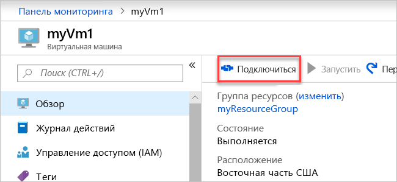

# <a name="quickstart-create-a-virtual-network-using-the-azure-portal"></a>Краткое руководство. Создание виртуальной сети с помощью портала Azure

Виртуальная сеть позволяет ресурсам Azure, таким как виртуальные машины, обмениваться данными друг с другом в частном порядке и взаимодействовать через Интернет. Из этого краткого руководства вы узнаете, как создать виртуальную сеть. Создав виртуальную сеть, разверните в ней две виртуальные машины. Затем вы подключитесь к одной виртуальной машине из Интернета и установите частную связь между двумя виртуальными машинами.

Если у вас еще нет подписки Azure, [создайте бесплатную учетную запись Azure](https://azure.microsoft.com/free/?WT.mc_id=A261C142F), прежде чем начинать работу.

## <a name="log-in-to-azure"></a>Вход в Azure 

Войдите на портал Azure по адресу https://portal.azure.com.

## <a name="create-a-virtual-network"></a>Создать виртуальную сеть

1. Выберите **+ Создать ресурс** в верхнем левом углу окна портала Azure.
2. Щелкните **Сеть** и выберите **Виртуальная сеть**.
3. Введите или выберите следующие значения, примите значения по умолчанию для остальных параметров и нажмите кнопку **Создать**:

    |Параметр|Значение|
    |---|---|
    |ИМЯ|myVirtualNetwork|
    |Подписка| Выберите свою подписку.|
    |Группа ресурсов| Выберите **Создать новую**, а затем введите *myResourceGroup*.|
    |Расположение| Выберите **Восточная часть США**.|

    

## <a name="create-virtual-machines"></a>Создание виртуальных машин

Создайте две виртуальные машины в виртуальной сети.

### <a name="create-the-first-vm"></a>Создание первой виртуальной машины

1. Выберите **+ Создать ресурс** в верхнем левом углу окна портала Azure.
2. Выберите **Вычисления**, а затем — **Windows Server 2016 Datacenter**.
3. Введите или выберите следующие значения, примите значения по умолчанию для остальных параметров и нажмите кнопку **ОК**:

    |Параметр|Значение|
    |---|---|
    |ИМЯ|myVm1|
    |Имя пользователя| Введите выбранное имя пользователя.|
    |Пароль| Введите выбранный пароль. Пароль должен включать минимум 12 символов и соответствовать [определенным требованиям к сложности](../virtual-machines/windows/faq.md?toc=%2fazure%2fvirtual-network%2ftoc.json#what-are-the-password-requirements-when-creating-a-vm).|
    |Подписка| Выберите свою подписку.|
    |Группа ресурсов| Щелкните **Использовать существующую** и выберите **myResourceGroup**.|
    |Расположение| Выберите **Восточная часть США**.|

    

4. Выберите размер виртуальной машины и щелкните **Выбрать**.
5. На странице **Параметры** примите все значения по умолчанию и нажмите кнопку **ОК**.

    

6. В разделе **создания** на странице **Сводка** выберите **Создать**, чтобы начать развертывание виртуальной машины. Развертывание виртуальной машины занимает несколько минут. 

### <a name="create-the-second-vm"></a>Создание второй виртуальной машины

Повторите шаги 1–6, но на шаге 3 присвойте виртуальной машине имя *myVm2*.

## <a name="connect-to-a-vm-from-the-internet"></a>Подключение к виртуальной машине из Интернета

1. Когда виртуальная машина *myVm1* будет создана, подключитесь к ней. В верхней части портала Azure введите *myVm1*. Когда виртуальная машина **myVm1** появится в результатах поиска, выберите ее. Нажмите кнопку **Подключиться**.

    

2. После нажатия кнопки **Подключиться** создается файл протокола удаленного рабочего стола (RDP-файл), который скачивается на ваш компьютер.  
3. Откройте этот RDP-файл. При появлении запроса выберите **Подключиться**. Введите имя пользователя и пароль, указанные при создании виртуальной машины. Возможно, потребуется выбрать **More choices** (Дополнительные варианты), а затем **Use a different account** (Использовать другую учетную запись), чтобы указать учетные данные, введенные при создании виртуальной машины. 
4. Нажмите кнопку **ОК**.
5. При входе в систему может появиться предупреждение о сертификате. Если вы получили предупреждение, выберите **Да** или **Продолжить**.

## <a name="communicate-between-vms"></a>Взаимодействие между виртуальными машинами

1. В PowerShell введите `ping myvm2`. Проверка связи завершается ошибкой, так как в ней используется протокол ICMP, который по умолчанию запрещен брандмауэром Windows.
2. Чтобы разрешить *myVm2* проверить связь с *myVm1* на дальнейшем этапе, введите в PowerShell следующую команду, которая разрешит входящий трафик ICMP через брандмауэр Windows:

    ```powershell
    New-NetFirewallRule –DisplayName “Allow ICMPv4-In” –Protocol ICMPv4
    ```

3. Закройте подключение к удаленному рабочему столу *myVm1*. 

4. Снова выполните шаги из раздела [Подключение к виртуальной машине из Интернета](#connect-to-a-vm-from-the-internet), но теперь подключитесь к *myVm2*. Из командной строки введите `ping myvm1`.

    Вы получите ответы от *myVm1*, так как на предыдущем шаге разрешили ICMP через брандмауэр Windows на виртуальной машине *myVm1*.

5. Закройте подключение к удаленному рабочему столу *myVm2*.

## <a name="clean-up-resources"></a>Очистка ресурсов

Удалите группу ресурсов и все содержащиеся в ней ресурсы, когда она станет не нужна.

1. В поле **Поиск** в верхней части портала введите *myResourceGroup*. Когда группа ресурсов **myResourceGroup** появится в результатах поиска, выберите ее.
2. Выберите **Удалить группу ресурсов**.
3. Введите *myResourceGroup* в поле **TYPE THE RESOURCE GROUP NAME:** (Введите имя группы ресурсов:) и нажмите кнопку **Удалить**.

## <a name="next-steps"></a>Дополнительная информация

Следуя инструкциям в этом кратком руководстве, вы создали виртуальную сеть по умолчанию и две виртуальные машины. Затем вы подключились к одной виртуальной машине из Интернета и установили частную связь между двумя виртуальными машинами. Дополнительные сведения о параметрах виртуальной сети см. в статье об [управлении виртуальной сетью](manage-virtual-network.md).

По умолчанию Azure не накладывает ограничения на частную связь между виртуальными машинами, но разрешает только входящие подключения к удаленному рабочему столу виртуальных машин Windows из Интернета. Чтобы узнать, как разрешить или ограничить различные типы сетевого взаимодействия с виртуальными машинами в обоих направлениях, перейдите к руководству по [фильтрации сетевого трафика](tutorial-filter-network-traffic.md).