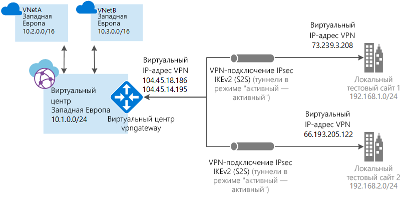

# Что такое Виртуальная глобальная сеть Azure?

Виртуальная глобальная сеть Azure — это сетевая служба, которая обеспечивает оптимизированное и автоматизированное подключение типа "ветвь — ветвь" через Azure. Виртуальная глобальная сеть позволяет подключать и настраивать устройства ветви для взаимодействия с Azure. Это можно сделать вручную или с помощью основных устройств партнеров через партнеров Виртуальной глобальной сети. См. дополнительные сведения о [предпочитаемых партнерах](https://go.microsoft.com/fwlink/p/?linkid=2019615). Применение устройств предпочитаемых партнеров упрощает использование, подключение и управление конфигурацией. Встроенная панель управления глобальной сетью Azure обеспечивает актуальные полезные сведения по устранению неполадок, что экономит время и предоставляет простой способ просмотра данных о широкомасштабных подключениях.

В этой статье представлен быстрый просмотр сетевых подключений рабочих нагрузок, которые относятся и не относятся к Azure. Виртуальная глобальна сеть обеспечивает следующие преимущества.

* **Интегрированные решения для подключения в топологии типа "звезда".** Автоматизируйте конфигурацию и подключение "сеть — сеть" между локальными сетями и концентратором Azure.
* **Автоматическая настройка и конфигурация периферийных зон**. Непрерывно подключайте виртуальные сети и рабочие нагрузки к концентратору Azure.
* **Интуитивное устранение неполадок**. Вы можете посмотреть поток "узел — узел" в Azure и использовать эту информацию для принятия необходимых действий.

## Подключения "сеть — сеть"

Чтобы создать подключение типа "сайт — сайт" используя Виртуальную глобальную сеть, можно либо перейти по ссылке [Виртуальная глобальная сеть (предварительная версия)](https://go.microsoft.com/fwlink/p/?linkid=2019615), либо создать соединение вручную.

### Работа с участниками Виртуальной глобальной сети

При работе с партнером Виртуальной глобальной сети процесс будет следующим:

1. Контроллер устройства филиала (VPN или SDWAN) проходит аутентификацию для экспорта данных о сети в Azure с помощью [субъекта-службы Azure](../azure-resource-manager/resource-group-create-service-principal-portal.md).
2. Контроллер устройства ветви (VPN/SDWAN) получает конфигурацию подключения Azure и обновляет локальное устройство. Это автоматизирует конфигурацию загрузки, редактирования и обновления локального устройства VPN.
3. Как только устройство будет иметь нужную конфигурацию Azure, устанавливается подключение "сеть — сеть" (два активных туннеля) с глобальной сетью Azure. Azure поддерживает протоколы IKEv1 и IKEv2. Узел BGP является необязательным.

Если вы не собираетесь использовать устройство предпочитаемого партнера, можно настроить подключение вручную. Это описано в руководстве по [созданию подключения "сеть — сеть" с помощью Виртуальной глобальной сети Azure](virtual-wan-site-to-site-portal.md).

## Подключение "точка — сеть" (предварительная версия)

Подключение типа "точка — сеть" позволяет создать безопасное подключение к виртуальной сети с отдельного клиентского компьютера. Подключение типа "точка — сеть" сначала устанавливается на клиентском компьютере. Это эффективное решение для сотрудников, которым нужно подключаться из удаленного расположения, например, если они находятся дома или на конференции. Такую конфигурацию также удобно использовать вместо VPN-подключения типа "сеть — сеть" при наличии небольшого числа клиентов, которым требуется подключение.

Сведения о том, создать подключение вручную, см. в руководстве по [созданию подключения "сеть — сеть" с помощью Виртуальной глобальной сети Azure (предварительная версия)](https://go.microsoft.com/fwlink/p/?linkid=2020051&clcid).

## Подключения ExpressRoute (предварительная версия)

Сведения о том, как создать подключение вручную, см. в руководстве по [созданию подключения ExpressRoute с помощью Виртуальной глобальной сети](https://go.microsoft.com/fwlink/p/?linkid=2020148&clcid).

## Ресурсы Виртуальной глобальной сети

Чтобы настроить виртуальную глобальную сеть "узел — узел", необходимо создать следующие ресурсы.

* **virtualWAN**. Ресурс virtualWAN представляет собой виртуальное наложение сети Azure и представляет собой набор из нескольких ресурсов. Он содержит ссылки на все виртуальные концентраторы, которые необходимо иметь в глобальной виртуальной сети. Ресурсы Виртуальной глобальной сети изолированы друг от друга и не могут содержать общий концентратор. В Виртуальной глобальной сети концентраторы не взаимодействуют друг с другом. Свойство "Allow branch to branch traffic" (Разрешить трафик между ветвями) позволяет разрешить трафик между сетями VPN, а также установить VPN-подключение к сетям ExpressRoute. Имейте в виду, что ExpressRoute в Виртуальной глобальной сети Azure поддерживается в режиме предварительной версии.

* **Веб-айт**. Ресурс сайта, известный как VPN сайт, представляет собой локальное устройство VPN и его настройки. При работе с участником Виртуальной глобальной сети экспорт информации в Azure осуществляется автоматически.

* **Концентратор**. Виртуальный концентратор — это виртуальная сеть, управляемая Microsoft. Концентратор содержит разные конечные точки службы, чтобы обеспечить подключения с локальной сетью (vpnsite). Концентратор является основой сети в регионе. Может существовать только один концентратор в каждом регионе Azure. При создании концентратора на портале Azure создается виртуальная сеть и VPN-шлюз для виртуального концентратора.

  Шлюз концентратора отличается от виртуального сетевого шлюза, который используется для служб ExpressRoute и VPN-шлюз. Например, при использовании Виртуальной глобальной сети, не нужно создавать подключение типа "сайт — сайт" от локального компьютера непосредственно к VNet. Вместо этого создается подключение типа "сайт-сайт" к концентратору. Трафик всегда направляется через шлюз концентратора. Это значит, что виртуальным сетям не требуется их собственные шлюзы виртуальных сетей. Использование Виртуальной глобальной сети позволяет легко использовать масштабирование виртуальных сетей через виртуальный концентратор и виртуальный шлюз концентратора. 

* **Виртуальное сетевое подключение концентратора**. Ресурс виртуального сетевого подключения концентратора используется для беспрепятственного подключения концентратора к виртуальной сети. На сегодняшний день можно подключаться только к виртуальным сетям, которые находятся в одном и том же регионе концентратора.

* **Таблица маршрутов концентратора**. Можно создать маршрут виртуального концентратора и добавить его в таблицу маршрутов виртуального концентратора. В эту таблицу можно добавить несколько маршрутов.

## Часто задаваемые вопросы

[!INCLUDE [Virtual WAN FAQ](../../includes/virtual-wan-faq-include.md)]

## Дополнительная информация

* См. дополнительные сведения о [партнерах и расположениях Виртуальной глобальной сети](https://aka.ms/virtualwan)