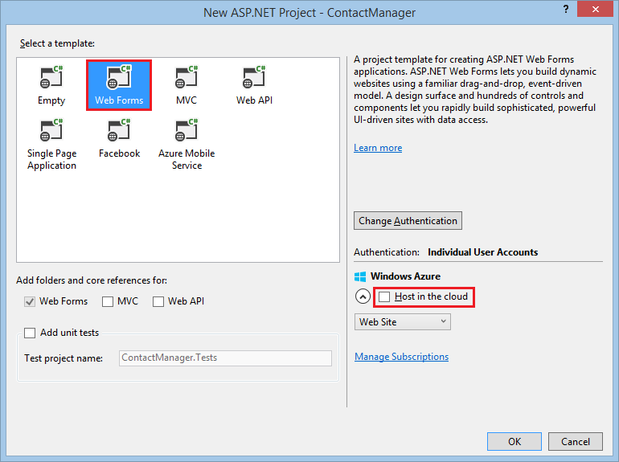
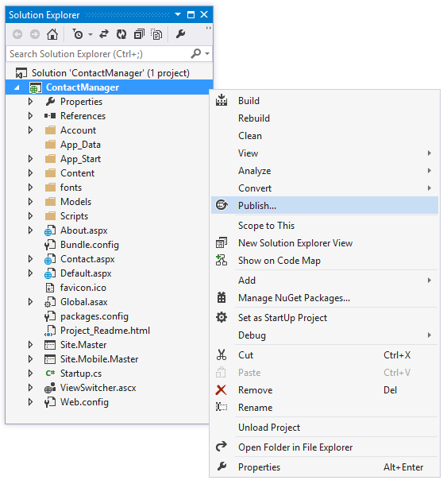
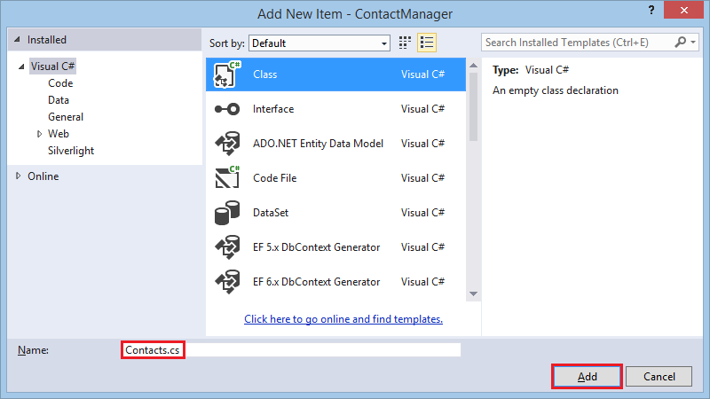
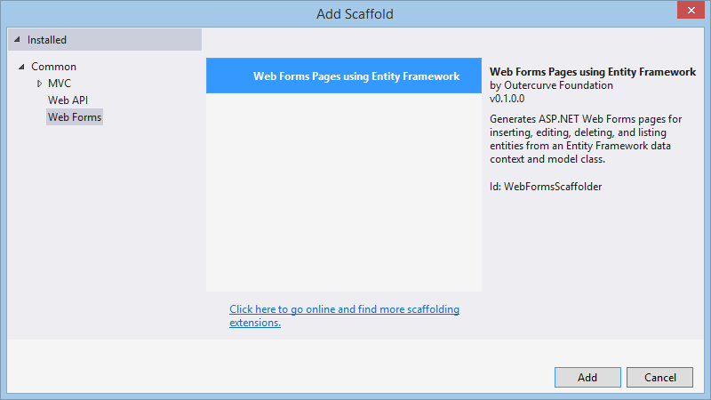
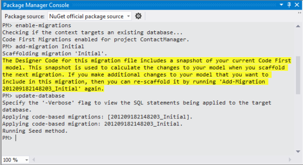
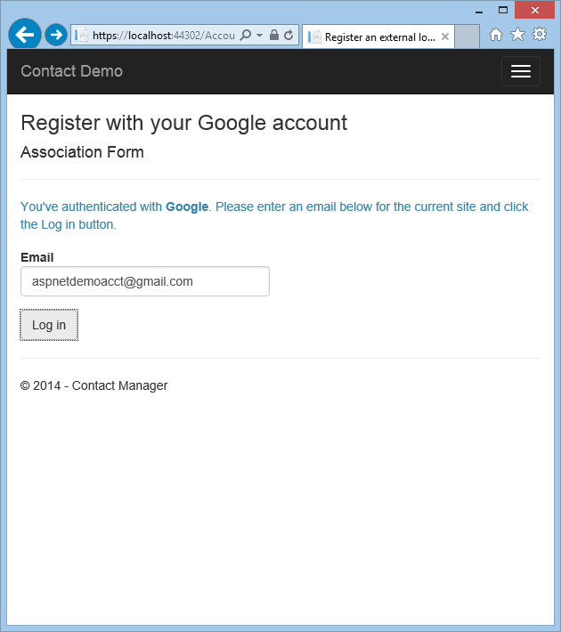
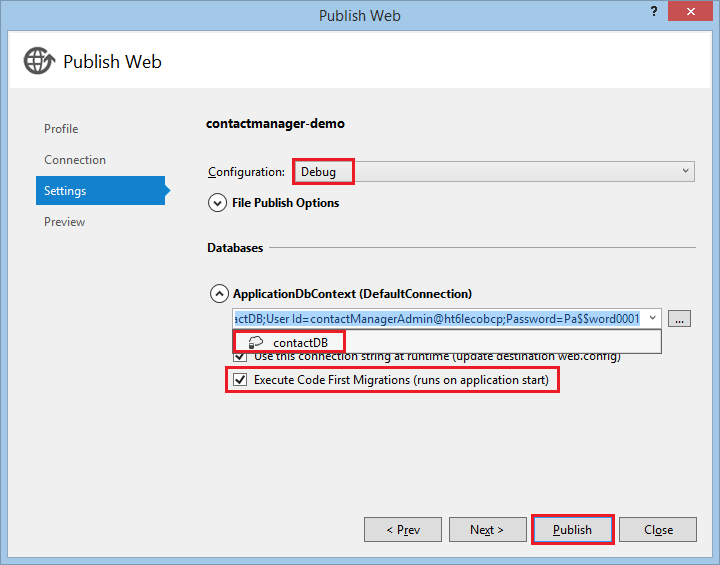
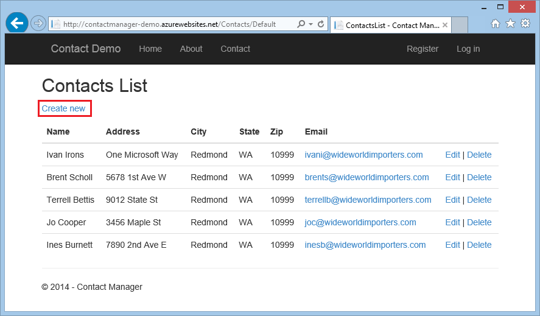
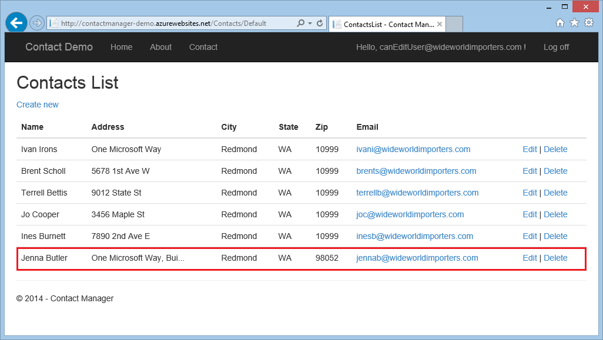
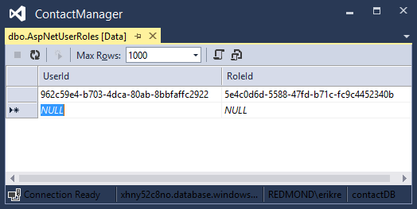

<properties 
	pageTitle="Создание безопасного приложения веб-форм ASP.NET с членством, OAuth и базой данных SQL и развертывание в службу приложений Azure" 
	description="В данном учебнике показано, как создать безопасное веб-приложение веб-форм ASP.NET 4.5, использующее базу данных SQL, и развернуть приложение в Azure." 
	services="web-sites" 
	documentationCenter=".net" 
	authors="Erikre" 
	manager="wpickett" 
	editor="mollybos"/>

<tags 
	ms.service="web-sites" 
	ms.workload="web" 
	ms.tgt_pltfrm="na" 
	ms.devlang="dotnet" 
	ms.topic="article" 
	ms.date="02/09/2015" 
	ms.author="erikre"/>

# Создание безопасного приложения веб-форм ASP.NET с членством, OAuth и базой данных SQL и развертывание в службу приложений Azure

##Обзор
В данном учебнике показано, как создать безопасное веб-приложение веб-форм ASP.NET 4.5, использующее базу данных SQL, и развернуть приложение в Azure.

>[AZURE.NOTE]Для версии MVC этого учебника см. [Создание приложения ASP.NET MVC с проверкой подлинности и базой данных SQL и развертывание в службу приложений Azure](web-sites-dotnet-deploy-aspnet-mvc-app-membership-oauth-sql-database.md).

Можно бесплатно создать учетную запись Azure, а если у вас еще нет Visual Studio 2013, то пакет SDK автоматически установит Visual Studio 2013 для Web Express. Вы можете приступить к разработке приложений для Azure совершенно бесплатно.

В данном учебнике предполагается, что у читателя нет опыта использования платформы Microsoft Azure. По завершении изучения этого учебника вы создадите веб-приложение на основе данных, выполняемое в облаке и использующее облачную базу данных.

Вы узнаете следующее:

- Создание проекта веб-форм ASP.NET 4.5 и его публикация в службе приложений Azure.
- Использование OAuth и базы данных членства ASP.NET для защиты приложения.
- Использование одной базы данных для членства и данных приложения.
- Использование формирования шаблонов веб-форм для создания веб-страниц, позволяющих изменять данные.
- Как использовать новый API членства для добавления пользователей и ролей.
- Как использовать базу данных SQL для хранения данных в Azure.

Вы создадите простое веб-приложение для списка контактов, основанное на платформе веб-форм ASP.NET 4.5 и использующее Entity Framework для доступа к базе данных. На следующее изображение приводится страница веб-форм, позволяющая выполнять операции чтения и записи с базой данных:

>[AZURE.NOTE]Для работы с этим учебником требуется учетная запись Azure. Если у вас нет учетной записи, можно <a href="/pricing/member-offers/msdn-benefits-details/?WT.mc_id=A261C142F" target="_blank">активировать преимущества для подписчиков MSDN</a> или <a href="/pricing/free-trial/?WT.mc_id=A261C142F" target="_blank">подписаться на бесплатную пробную версию</a>. Если вы хотите ознакомиться с веб-сайтами Azure до создания учетной записи, перейдите по адресу <a href="https://trywebsites.azurewebsites.net/">https://trywebsites.azurewebsites.net</a>, где вы можете быстро бесплатно создать краткосрочный сайт ASP.NET начального уровня на веб-сайтах Azure. Никаких кредитных карт и обязательств.

##Настройка среды разработки 
Для начала настройте среду разработки, установив Visual Studio 2013 и Azure SDK для платформы .NET.

1. Установите [Visual Studio 2013](http://go.microsoft.com/fwlink/?LinkId=306566), если вы еще этого не сделали.  
2. Установите [Azure SDK для Visual Studio 2013](http://go.microsoft.com/fwlink/?linkid=324322&clcid=0x409). Для этого учебника требуется Visual Studio 2013 перед установкой Azure SDK для Visual Studio 2013.  

	>[AZURE.NOTE]В зависимости от того, сколько зависимостей пакета SDK уже имеется на компьютере, установка пакета SDK может занять определенное время, от нескольких минут до получаса или более.

3. При появлении запроса на выполнение или сохранение исполняемой установки нажмите **Выполнить**.
4. Нажмите в окне **установщика веб-платформы** кнопку **Установить** и продолжайте установку.  

	>[AZURE.NOTE]Если пакет SDK уже установлен, то установке подлежит 0 компонентов. Количество компонентов для установки указывается в нижнем левом углу окна **Установщик веб-платформы**.

5. Если не установлено **Visual Studio с обновлением 2**, загрузите и установите **[Visual Studio 2013 с обновлением 2](http://www.microsoft.com/download/details.aspx?id=42666)** или выше.

	>[AZURE.NOTE]Необходимо установить Visual Studio 2013 с обновлением 2 или выше, чтобы использовать Google OAuth 2.0 и использовать SSL локально без предупреждений. Кроме того, обновление 2 необходимо, чтобы использовать формирование шаблонов веб-форм.

После завершения установки вы получите все компоненты, необходимые для разработки.

##Настройка среды Azure
В этом разделе мы настроим среду Azure, создав веб-приложение Azure и базу данных SQL в Azure.

###Создание веб-приложения и базы данных SQL в Azure 
В этом учебнике ваш веб-сайт Azure будет работать в общей среде размещения, а это означает, что он работает на виртуальных машинах (ВМ), используемых совместно с другими веб-приложениями в службе приложений Azure. Общая среда внешнего размещения – это недорогой способ начать работу в облачной среде. Если позднее ваш веб-трафик увеличится, приложение можно масштабировать по необходимости, запуская его на выделенных виртуальных машинах. Если требуется более сложная архитектура, можно перейти в облачную службу Azure. Облачные службы работают на выделенных виртуальных машинах, которые можно настроить в соответствии с конкретными потребностями.

База данных SQL в Azure — это облачная служба реляционной базы данных, построенная на основе технологий SQL Server. Средства и приложения, работающие с SQL Server, работают также и с базой данных SQL.

1. На [портале управления Azure](https://manage.windowsazure.com/) выберите на левой вкладке **Веб-приложения**, а затем нажмите кнопку **Создать**. 
2. Щелкните **Веб-приложение** и выберите **Настраиваемое создание**.  Откроется мастер **Новое веб-приложение — настраиваемое создание**.  

3. На шаге **Создать веб-приложение** в мастере введите в поле **URL-адрес** строку, которая будет использоваться как уникальный URL-адрес для приложения. Полный URL-адрес будет состоять из введенной здесь строки и суффикса, который отображается рядом с текстовым полем. На рисунке показан URL-адрес, который может быть занят, поэтому **необходимо выбрать другой URL-адрес**. 
4. В раскрывающемся списке плана расположения веб-сайтов выберите регион, который расположен к вам ближе всего. Этот параметр определяет, в каком центре обработки данных будет работать ваша виртуальная машина.
5. В раскрывающемся списке **База данных** выберите **Создать бесплатную базу данных SQL 20 МБ**.
6. В поле **Имя строки подключения к базе данных** оставьте значение по умолчанию *DefaultConnection*.
7. Щелкните стрелку в нижней части диалогового окна. Мастер перейдет к шагу **Указать параметры базы данных**.
8. В поле **Имя** введите *`ContactDB`*.   
9. В поле **Сервер** выберите **Создать сервер базы данных SQL**. Если вы уже создали ранее базу данных SQL Server, можно выбрать этот сервер в раскрывающемся списке.
10. В поле **Область** укажите ту же область, в которой вы создали веб-приложение.
11. Введите **Имя для входа в систему** и **Пароль** администратора. Если выбрано действие **Создать сервер базы данных SQL**, не используйте здесь существующие имя и пароль, введите новые, которые в дальнейшем будут использоваться при обращении к базе данных. Если выбран созданный ранее SQL Server, появится запрос на ввод пароля для ранее созданной учетной записи SQL Server. В этом учебнике флажок **Дополнительно** не устанавливается.
12. Щелкните флажок внизу справа от поля, чтобы указать завершение работы.

**Портал управления Azure** возвращается на страницу **Веб-приложения**, а в столбце **Состояние** указывается, что сайт создается. Через какое-то время (обычно меньше минуты) в столбце **Состояние** указывается, что сайт успешно создан. В строке навигации слева число сайтов вашей учетной записи отображается рядом со значком **Веб-приложения**, а число баз данных — рядом со значком **Базы данных SQL**.
##Создание приложения веб-форм ASP.NET 
Вы создали веб-приложение Azure, но в нем еще нет контента. Следующим шагом будет создание веб-приложения Visual Studio, которое будет опубликовано в Azure.
###Создание проекта 
1. В меню **Файл** в Visual Studio выберите **Создать проект**.   
2. Выберите группу шаблонов слева **Шаблоны** -> **Visual C#** -> **Интернет**. 
3. Выберите шаблон **Веб-приложения ASP.NET** в центральном столбце.
4. Присвойте проекту имя *ContactManager*, а затем нажмите кнопку **ОК**.   

	>[AZURE.NOTE]В этих учебниках используется имя проекта **ContactManager**. Рекомендуется использовать именно это имя проекта, чтобы код из учебной серии работал нормально.

5. В диалоговом окне **Новый проект ASP.NET** выберите шаблон **Веб-приложение**. Снимите флажок **Размещать в облаке**, если он установлен, а затем нажмите кнопку **ОК**.  Будет создано приложение веб-форм.
###Обновление главной страницы
В среде веб-форм ASP.NET главные страницы позволяют создавать устойчивый макет страниц приложения. Одна главная страница определяет внешний вид и стандартное поведение всех страниц (или группы страниц) приложения. Далее можно приступить к созданию отдельных страниц контента с содержимым, которое вы хотите отобразить. При поступлении запросов на страницы контента от пользователей ASP.NET объединяет их с главной страницей, чтобы получить на выходе макет главной страницы с содержимым страницы контента. Новому сайту необходимо обновить имя приложения и ссылку. Ссылка указывает на страницу, на которой будут отображаться сведения о контактах. Чтобы выполнить эти изменения, необходимо изменить HTML на главной странице.

1. В **Обозревателе решений** найдите и откройте страницу *Site.Master*.
2. Если страница находится в представлении **Конструирование**, измените его на представление **Просмотр исходного кода**.
3. Обновите главную страницу, изменив или добавив разметку, выделенную желтым цветом:

<pre class="prettyprint">
&lt;%@ Master Language="C#" AutoEventWireup="true" CodeBehind="Site.master.cs" Inherits="ContactManager.SiteMaster" %>

&lt;!DOCTYPE html>

&lt;html lang="en">
&lt;head runat="server">
    &lt;meta charset="utf-8" />
    &lt;meta name="viewport" content="width=device-width, initial-scale=1.0" />
    &lt;title>&lt;%: Page.Title %> - <mark>Contact Manager</mark>&lt;/title>

    &lt;asp:PlaceHolder runat="server">
        &lt;%: Scripts.Render("~/bundles/modernizr") %>
    &lt;/asp:PlaceHolder>
    &lt;webopt:bundlereference runat="server" path="~/Content/css" />
    &lt;link href="~/favicon.ico" rel="shortcut icon" type="image/x-icon" />

&lt;/head>
&lt;body>
    &lt;form runat="server">
        &lt;asp:ScriptManager runat="server">
            &lt;Scripts>
                &lt;%-- Для получения дополнительной информации о связывающих скриптах в ScriptManager см. http://go.microsoft.com/fwlink/?LinkID=301884 --%>
                &lt;%--Framework Scripts--%>
                &lt;asp:ScriptReference Name="MsAjaxBundle" />
                &lt;asp:ScriptReference Name="jquery" />
                &lt;asp:ScriptReference Name="bootstrap" />
                &lt;asp:ScriptReference Name="respond" />
                &lt;asp:ScriptReference Name="WebForms.js" Assembly="System.Web" Path="~/Scripts/WebForms/WebForms.js" />
                &lt;asp:ScriptReference Name="WebUIValidation.js" Assembly="System.Web" Path="~/Scripts/WebForms/WebUIValidation.js" />
                &lt;asp:ScriptReference Name="MenuStandards.js" Assembly="System.Web" Path="~/Scripts/WebForms/MenuStandards.js" />
                &lt;asp:ScriptReference Name="GridView.js" Assembly="System.Web" Path="~/Scripts/WebForms/GridView.js" />
                &lt;asp:ScriptReference Name="DetailsView.js" Assembly="System.Web" Path="~/Scripts/WebForms/DetailsView.js" />
                &lt;asp:ScriptReference Name="TreeView.js" Assembly="System.Web" Path="~/Scripts/WebForms/TreeView.js" />
                &lt;asp:ScriptReference Name="WebParts.js" Assembly="System.Web" Path="~/Scripts/WebForms/WebParts.js" />
                &lt;asp:ScriptReference Name="Focus.js" Assembly="System.Web" Path="~/Scripts/WebForms/Focus.js" />
                &lt;asp:ScriptReference Name="WebFormsBundle" />
                &lt;%--Site Scripts--%>
            &lt;/Scripts>
        &lt;/asp:ScriptManager>

        &lt;div class="navbar navbar-inverse navbar-fixed-top">
            &lt;div class="container">
                &lt;div class="navbar-header">
                    &lt;button type="button" class="navbar-toggle" data-toggle="collapse" data-target=".navbar-collapse">
                        &lt;span class="icon-bar">&lt;/span>
                        &lt;span class="icon-bar">&lt;/span>
                        &lt;span class="icon-bar">&lt;/span>
                    &lt;/button>
                    &lt;a class="navbar-brand" runat="server" <mark>id="ContactDemoLink"</mark> href="~/<mark>Contacts/Default.aspx</mark>"><mark>Contact Demo</mark>&lt;/a>
                &lt;/div>
                &lt;div class="navbar-collapse collapse">
                    &lt;ul class="nav navbar-nav">
                        &lt;li>&lt;a runat="server" href="~/">Home&lt;/a>&lt;/li>
                        &lt;li>&lt;a runat="server" href="~/About">About&lt;/a>&lt;/li>
                        &lt;li>&lt;a runat="server" href="~/Contact">Contact&lt;/a>&lt;/li>
                    &lt;/ul>
                    &lt;asp:LoginView runat="server" ViewStateMode="Disabled">
                        &lt;AnonymousTemplate>
                            &lt;ul class="nav navbar-nav navbar-right">
                                &lt;li>&lt;a runat="server" href="~/Account/Register">Register&lt;/a>&lt;/li>
                                &lt;li>&lt;a runat="server" href="~/Account/Login">Log in&lt;/a>&lt;/li>
                            &lt;/ul>
                        &lt;/AnonymousTemplate>
                        &lt;LoggedInTemplate>
                            &lt;ul class="nav navbar-nav navbar-right">
                                &lt;li>&lt;a runat="server" href="~/Account/Manage" title="Manage your account">Hello, &lt;%: Context.User.Identity.GetUserName()  %> !&lt;/a>&lt;/li>
                                &lt;li>
                                    &lt;asp:LoginStatus runat="server" LogoutAction="Redirect" LogoutText="Log off" LogoutPageUrl="~/" OnLoggingOut="Unnamed_LoggingOut" />
                                &lt;/li>
                            &lt;/ul>
                        &lt;/LoggedInTemplate>
                    &lt;/asp:LoginView>
                &lt;/div>
            &lt;/div>
        &lt;/div>
        &lt;div class="container body-content">
            &lt;asp:ContentPlaceHolder ID="MainContent" runat="server">
            &lt;/asp:ContentPlaceHolder>
            &lt;hr />
            &lt;footer>
                &lt;p>&amp;copy; &lt;%: DateTime.Now.Year %> - <mark>Contact Manager</mark>&lt;/p>
            &lt;/footer>
        &lt;/div>
    &lt;/form>
&lt;/body>
&lt;/html>
</pre>

Далее в этом учебнике будет добавлено формирование шаблонов веб-форм. При формировании шаблонов создается страница, на которую ссылается указанная выше ссылка “Contact Demo”.
###Локальный запуск приложения 
1. В **Обозревателе решений** щелкните правой кнопкой мыши страницу *Default.aspx* и выберите **Задать как начальную страницу**. 
2. Затем нажмите сочетание клавиш **CTRL+F5**, чтобы запустить приложение. Принятая по умолчанию страница приложения откроется в окне используемого по умолчанию браузера.   

Это все, что требуется для создания приложения, которое будет развернуто в Azure. Несколько позднее мы добавим функциональность базы данных, а также необходимы страницы для отображения и изменения контактных данных.
###Развертывание приложения в Azure
После создания и запуска приложения локально можно приступить к его развертыванию в Azure.

1. В Visual Studio щелкните правой кнопкой мыши проект в **обозревателе решений** и выберите **Опубликовать** в контекстном меню. Откроется диалоговое окно **Публикация веб-сайта**.  

2. На вкладке **Профиль** диалогового окна **Публикация веб-сайта** щелкните **Веб-сайты Azure**. 
3. Если вы еще не выполнили вход, нажмите кнопку **Вход** в диалоговом окне **Выбрать существующие веб-приложения**. После выполнения входа выберите веб-приложение, которое было создано в первой части учебника. Чтобы продолжить, нажмите кнопку **ОК**.  Visual Studio загрузит параметры публикации.
4. В диалоговом окне **Публикации веб-сайта** щелкните **Опубликовать**.  Вы увидите общее состояние публикации в окне **Действие веб-публикации** в среде Visual Studio:   

Созданное вами приложение теперь выполняется в облаке. При следующем развертывании приложения из Visual Studio будут развернуты только измененные (или новые) файлы. 

>[AZURE.NOTE]Если возникли ошибки при публикации на уже установленном веб-приложении, можно очистить расположение перед добавлением новых файлов. Опубликуйте приложение еще раз, однако в диалоговом окне **Публикация веб-сайта** перейдите на вкладку **Параметры**. Далее установите значение **Отладка** для конфигурации и выберите параметр **Удалить дополнительные файлы в месте назначения**. Выберите **Опубликовать**, чтобы развернуть приложение еще раз. 

##Добавление базы данных в приложение 
Теперь вы обновите приложение веб-форм, чтобы добавить возможности для отображения и обновления контактов, а также сохранения данных в базе данных по умолчанию. При создании проекта веб-форм база данных создается по умолчанию. Приложение будет использовать компонент Entity Framework для доступа к базе данных, а также чтения и обновления данных в базе данных.
###Добавление класса модели данных 
Начните с создания простой модели данных в коде. Эта модель данных будет содержаться в классе с именем `Contacts`. Имя класса `Contacts` было выбрано, чтобы избежать конфликта с именем класса `Contact`, содержащегося в файле Contact.aspx.cs, созданном шаблоном веб-форм.

1. В **обозревателе решений** щелкните правой кнопкой мыши папку *Модели* и выберите **Добавить** -> **Класс**.  Откроется диалоговое окно **Добавление нового элемента**.  

2. Назовите этот новый класс *Contacts.cs*. 
3. Замените код по умолчанию следующим кодом: <pre class="prettyprint"> using System.ComponentModel.DataAnnotations; using System.Globalization;
	
	namespace ContactManager.Models { public class Contacts { [ScaffoldColumn(false)][Key] public int ContactId { get; set; } public string Name { get; set; } public string Address { get; set; } public string City { get; set; } public string State { get; set; } public string Zip { get; set; } [DataType(DataType.EmailAddress)] public string Email { get; set; } } } </pre>

Класс **Contacts** определяет данные, которые будут храниться для каждого контакта, а также первичный ключ (`ContactID`), необходимый для базы данных. Класс **Contacts** отражает контактные данные, которые будут отображаться. Каждый экземпляр объекта Contacts будет соответствовать ряду в таблице реляционной базы данных, а каждое свойство класса Contacts — столбцу в таблице реляционной базе данных. Далее в этом учебнике вы просмотрите контактные данные, содержащиеся в базе данных.

###Формирование шаблонов веб-форм 
Выше вы создали класс модели **Contacts**. Теперь можно использовать формирование шаблонов веб-форм для создания страниц *List*, *Insert*, *Edit* и *Delete*, которые используются при работе с этими данными. При формировании шаблонов веб-форм используется среда Entity Framework, Bootstrap и динамические данные. По умолчанию компонент формирования шаблонов веб-форм устанавливается как расширение к проекту в виде части шаблона проекта при использовании Visual Studio 2013.

В последующих шагах рассматривается использование компонента формирования шаблонов веб-форм.

1. В Visual Studio в строке меню выберите **Сервис** -> **Расширения и обновления**. Откроется диалоговое окно **Расширения и обновления**.
2. В левой панели диалогового окна выберите **Онлайн** -> **Коллекция Visual Studio** -> **Средства** -> **Формирование шаблонов**.
3. Если "Формирование шаблонов веб-форм" в списке отсутствует, введите "Формирование шаблонов веб-форм" в поле поиска в правой части диалогового окна.  
4. Если компонент формирования шаблонов веб-форм еще не установлен, выберите **Загрузить**, чтобы загрузить и установить его. При необходимости перезапустите Visual Studio. Не забудьте сохранить изменения в проекте при отображении соответствующего запроса.   
5. Создайте проект (**Ctrl+Shift+B**). Проект необходимо создать перед использованием механизма скаффолдинга.  
6. В **обозревателе решений** щелкните правой кнопкой мыши папку *Проект* и выберите **Добавить** -> **Элемент формирования шаблонов**. Откроется диалоговое окно **Добавление элемента формирования шаблонов**.
7. Выберите **Веб-формы** из левой панели и выберите **Страницы веб-форм с использованием Entity Framework** из центральной панели. Нажмите кнопку **Добавить**.  Откроется диалоговое окно **Добавление страниц веб-форм**.  

8. В диалоговом окне **Добавление страниц веб-форм** установите для поля **Класс модели** значение `Contact (ContactManager.Models)`. В поле **Класс контекста данных** выберите `ApplicationDbContext (ContactManager.Models)`. Нажмите кнопку **Добавить**. 

Компонент формирования шаблонов веб-форм добавляет новую папку, которая содержит страницы *Default.aspx*, *Delete.aspx*, *Edit.aspx* и *Insert.aspx*. Кроме того, он создает папку *DynamicData*, которая содержит папки *EntityTemplates* и *FieldTemplates*. `ApplicationDbContext` будет использоваться и для базы данных членства, и для контактных данных.

###Настройка приложения для использования модели данных 
Следующая задача заключается в активации компонента Code First Migrations для создания базы данных на основе созданной модели данных. Кроме этого, вы добавите простые данные и инициализатор данных.

1. В меню **Сервис** выберите **Диспетчер пакетов NuGet**, а затем **Консоль диспетчера пакетов**.   
2. В окне консоли диспетчера пакетов введите следующую команду: <pre class="prettyprint"> enable-migrations </pre>. Эта команда создает папку *Migrations* и помещает в нее файл *Configuration.cs*, который можно изменять и использовать для заполнения базы данных, а также настройки миграций.  
3. В окне **консоли диспетчера пакетов** введите следующую команду: <pre class="prettyprint"> add-migration Initial </pre>. Команда `add-migration Initial` создает файл под именем <date_stamp>Initial в папке *Миграции*, который создает базу данных. Первый параметр (инициал) является произвольным и используется для создания имени файла. Новые файлы классов можно просмотреть в **обозревателе решений**. В классе `Initial` метод `Up` создает таблицу `Contact`, а метод `Down` (используемый при возвращении к предыдущему состоянию) удаляет эту таблицу.  
4. Откройте файл *Migrations\\Configuration.cs*. 
5. Добавьте следующее пространство имен: <pre class="prettyprint"> using ContactManager.Models; </pre>  
6. Замените метод `Seed` следующим кодом: <pre class="prettyprint"> protected override void Seed(ContactManager.Models.ApplicationDbContext context) { context.Contacts.AddOrUpdate(p => p.Name, new Contacts { ContactId = 1, Name = "Ivan Irons", Address = "One Microsoft Way", City = "Redmond", State = "WA", Zip = "10999", Email = "ivani@wideworldimporters.com", }, new Contacts { ContactId = 2, Name = "Brent Scholl", Address = "5678 1st Ave W", City = "Redmond", State = "WA", Zip = "10999", Email = "brents@wideworldimporters.com", }, new Contacts { ContactId = 3, Name = "Terrell Bettis", Address = "9012 State St", City = "Redmond", State = "WA", Zip = "10999", Email = "terrellb@wideworldimporters.com", }, new Contacts { ContactId = 4, Name = "Jo Cooper", Address = "3456 Maple St", City = "Redmond", State = "WA", Zip = "10999", Email = "joc@wideworldimporters.com", }, new Contacts { ContactId = 5, Name = "Ines Burnett", Address = "7890 2nd Ave E", City = "Redmond", State = "WA", Zip = "10999", Email = "inesb@wideworldimporters.com", } ); } </pre> Этот код инициализирует (заполняет) базу данных контактной информацией. Дополнительные сведения об инициализации базы данных см. в разделе [Инициализация и отладка баз данных Entity Framework (EF)](http://blogs.msdn.com/b/rickandy/archive/2013/02/12/seeding-and-debugging-entity-framework-ef-dbs.aspx).  
7. В **консоли диспетчера пакетов** введите команду: <pre class="prettyprint"> update-database </pre> `update-database` выполняет первую миграцию, которая создает базу данных. По умолчанию база данных создается как локальная база данных SQL Server Express LocalDB.   

###Локальный запуск приложения и отображение данных 
Запустите приложение и просмотрите, как видны контакты.

1. Сначала создайте проект (**Ctrl+Shift+B**).  
2. Для запуска приложения нажмите сочетание клавиш **Ctrl+F5**. Откроется браузер и отобразится страница *Default.aspx*.
3. Щелкните ссылку **Contact Demo** в верхней части страницы, чтобы отобразить страницу *Список контактов*.   

##Включение SSL для проекта 
Secure Sockets Layer (SSL) — это протокол, позволяющие веб-серверам и веб-клиентам более безопасно обмениваться данными с помощью шифрования. Если протокол SSL не используется, пакеты данных, передаваемые между клиентом и сервером, открыты для сканирования любому человеку с физическим доступом к сети. Кроме того, некоторые распространенные схемы проверки подлинности небезопасны при использовании простого HTTP. В частности, базовая проверка подлинности и формы проверки подлинности отправляют незашифрованные учетные данные. Чтобы обеспечить безопасность, эти схемы проверки подлинности должны использовать протокол SSL.

1. В **Обозревателе решений** щелкните проект **ContactManager**, затем нажмите **F4**, чтобы отобразить окно **Свойства**. 
2. Для параметра **SSL включен** измените значение на `true`. 
3. Скопируйте **URL-адрес SSL** для дальнейшего использования. Если веб-приложение SSL не было создано ранее (как показано ниже), URL-адресом SSL будет `https://localhost:44300/`.   
4. В **Обозревателе решений** щелкните правой кнопкой мыши проект **Contact Manager** и щелкните **Свойства**.
5. На левой вкладке щелкните **Интернет**.
6. Измените **URL-адрес проекта**, чтобы использовать **URL-адрес SSL**, сохраненный ранее.   
7. Сохраните страницу, нажав **CTRL+S**.
8. Для запуска приложения нажмите сочетание клавиш **Ctrl+F5**. В Visual Studio будет отображаться параметр, который позволяет отключить предупреждающие сообщения SSL.  
9. Нажмите **Да**, чтобы начать доверять сертификату IIS Express SSL и продолжить работу.  Отобразится предупреждение системы безопасности.  

10. Нажмите **Да**, чтобы установить сертификат для вашего localhost.  Откроется окно браузера.

Теперь можно просто протестировать веб-приложение локально с использованием SSL.

##Добавление поставщика OAuth 2.0 
Веб-формы ASP.NET предлагают расширенные параметры для членства и проверки подлинности. К этим расширениям относится OAuth. OAuth — это открытый протокол, обеспечивающий безопасную авторизацию простым и стандартным методом из веб-приложений, мобильных и настольных приложений. В интернет-шаблоне ASP.NET MVC используется OAuth для предоставления Facebook, Twitter, Google и Microsoft в качестве поставщиков проверки подлинности. В этом учебнике в качестве поставщика проверки подлинности используется только Google, но вы легко можете изменить код, чтобы использовать любой другой поставщик. Шаги по реализации других поставщиков очень похожи на шаги, представленные в этом учебнике.

Помимо проверки подлинности в учебнике будут использоваться роли для реализации авторизации. Только пользователи, добавленные в роль `canEdit`, смогут изменять данные (создавать, изменять и удалять контакты).

В последующих шагах вы сможете добавить поставщика проверки подлинности Google.

1. Откройте файл *App_Start\\Startup.Auth.cs*. 
2. Удалите символы комментариев из метода `app.UseGoogleAuthentication()`, чтобы он имел следующий вид: <pre class="prettyprint"> app.UseGoogleAuthentication(new GoogleOAuth2AuthenticationOptions() { ClientId = "", ClientSecret = "" }); </pre>
3. Перейдите к [Консоли разработчиков Google](https://console.developers.google.com/). Вам также потребуется выполнить вход со своей учетной записью электронной почты разработчика Google (gmail.com). Если отсутствует учетная запись Google, выберите ссылку **Создать учетную запись**. Далее вы ознакомитесь с **консолью разработчиков Google**.   

4. Нажмите кнопку **Создать проект** и введите имя и идентификатор проекта (можно использовать значения по умолчанию). Установите **флажок соглашения** и нажмите кнопку **Создать**.  Через несколько секунд будет создан новый проект, а в браузере будет отображаться новая страница проектов.
5. На левой вкладке щелкните **APIs & auth**, а затем щелкните **Учетные данные**.
6. Нажмите **Создать идентификатор нового клиента** в разделе **OAuth**. Откроется диалоговое окно **Создание идентификатора клиента**.   
7. В диалоговом окне **Создание идентификатора клиента** для типа приложения сохраните значение по умолчанию **Веб-приложение**.  
8. Установите в поле **Авторизованные источники JavaScript** URL-адрес SSL, который использовался ранее в этом учебнике (**https://localhost:44300/**, если только не создавались другие проекты SSL). Этот URL-адрес является источником вашего приложения. В нашем примере вводится только тестовый URL-адрес localhost. Тем не менее, можно ввести несколько URL-адресов учетной записи для localhost и производства.  

9. Установите в поле **Авторизованный URI перенаправления** следующее значение: <pre class="prettyprint"> https://localhost:44300/signin-google </pre>. Это значение представляет собой URI, который пользователи ASP.NET OAuth используют для обмена данными с сервером Google OAuth. Не забудьте URL-адрес SSL, который вы использовали выше (**https://localhost:44300/**, если только не создавались другие проекты SSL).
10. Нажмите кнопку **Создать идентификатор клиента**.
11. В Visual Studio обновите метод `UseGoogleAuthentication` страницы *Startup.Auth.cs* путем копирования и вставки **AppId** и **App Secret** в метод. Приведенные ниже значения **AppId** и **App Secret** являются примером и не будут работать.<pre class="prettyprint"> using System; using Microsoft.AspNet.Identity; using Microsoft.AspNet.Identity.EntityFramework; using Microsoft.AspNet.Identity.Owin; using Microsoft.Owin; using Microsoft.Owin.Security.Cookies; using Microsoft.Owin.Security.DataProtection; using Microsoft.Owin.Security.Google; using Owin; using ContactManager.Models;
	
	namespace ContactManager { public partial class Startup {
	
	        // For more information on configuring authentication, please visit http://go.microsoft.com/fwlink/?LinkId=301883
	        public void ConfigureAuth(IAppBuilder app)
	        {
	            // Configure the db context and user manager to use a single instance per request
	            app.CreatePerOwinContext(ApplicationDbContext.Create);
	            app.CreatePerOwinContext<ApplicationUserManager>(ApplicationUserManager.Create);
	
	            // Enable the application to use a cookie to store information for the signed in user
	            // and to use a cookie to temporarily store information about a user logging in with a third party login provider
	            // Configure the sign in cookie
	            app.UseCookieAuthentication(new CookieAuthenticationOptions
	            {
	                AuthenticationType = DefaultAuthenticationTypes.ApplicationCookie,
	                LoginPath = new PathString("/Account/Login"),
	                Provider = new CookieAuthenticationProvider
	                {
	                    OnValidateIdentity = SecurityStampValidator.OnValidateIdentity<ApplicationUserManager, ApplicationUser>(
	                        validateInterval: TimeSpan.FromMinutes(20),
	                        regenerateIdentity: (manager, user) => user.GenerateUserIdentityAsync(manager))
	                }
	            });
	            // Use a cookie to temporarily store information about a user logging in with a third party login provider
	            app.UseExternalSignInCookie(DefaultAuthenticationTypes.ExternalCookie);
	
	            // Uncomment the following lines to enable logging in with third party login providers
	            //app.UseMicrosoftAccountAuthentication(
	            //    clientId: "",
	            //    clientSecret: "");
	
	            //app.UseTwitterAuthentication(
	            //   consumerKey: "",
	            //   consumerSecret: "");
	
	            //app.UseFacebookAuthentication(
	            //   appId: "",
	            //   appSecret: "");
	
	            app.UseGoogleAuthentication(new GoogleOAuth2AuthenticationOptions()
	            {
	                ClientId = "<mark>000000000000.apps.googleusercontent.com</mark>",
	                ClientSecret = "<mark>00000000000</mark>"
	            });
	        }
	    }
	} </pre>  
12. Нажмите **CTRL+F5**, чтобы построить и запустить приложение. Щелкните ссылку **Войти в систему**.
13. В разделе **Использовать другую службу для входа** нажмите **Google**.   
14. Если будет необходимо ввести учетные данные, произойдет перенаправление на сайт Google, где можно будет ввести свои учетные данные.   
15. После ввода учетных данных появится запрос на получение разрешений для веб-приложения, которое было только что создано:   
16. Нажмите кнопку **Принимаю**. Теперь снова произойдет перенаправление на страницу **Регистрация** приложения **ContactManager**, на которой можно зарегистрировать учетную запись Google.   
17. Имеется возможность изменить локальное имя регистрации электронной почты, использованного для учетной записи Gmail. Однако, как правило, рекомендуется сохранять псевдоним электронной почты по умолчанию (то есть тот, который использовался для проверки подлинности). Щелкните **Вход**.

##Использование API членства для ограничения доступа 
ASP.NET Identity — система членства, используемая для проверки подлинности при построении веб-приложения ASP.NET. Она позволяет упростить интеграцию данных профиля пользователя с данными приложения. Кроме того, ASP.NET Identity позволяет выбирать модель сохраняемости для профилей пользователей в приложении. Данные можно сохранять в базе данных SQL Server или другом хранилище, в том числе хранилищах данных *NoSQL*, таких как таблица хранилища Azure.

При использовании шаблона веб-форм ASP.NET по умолчанию, вы получает встроенную функциональность членства, которую можно немедленно использовать при работе приложения. ASP.NET Identity будет использоваться для добавления роли администратора и назначения пользователя на эту роль. Далее вы узнаете, как ограничивать доступ к папке администрирования и страницам в этой папке, которые используются для изменения контактных данных.

###Добавление администратора 
Используя ASP.NET Identity, можно добавить роль администратора и назначить пользователя на эту роль с помощью кода.

1. В **Обозревателе решений** откройте файл *Configuration.cs* в папке *Migrations*.
2. Добавьте следующие операторы `using` в пространство имен `ContactManger.Migrations`: <pre class="prettyprint"> using Microsoft.AspNet.Identity; using Microsoft.AspNet.Identity.EntityFramework; </pre>
3. Добавьте следующий метод `AddUserAndRole` в класс `Configuration` после метода `Seed`: <pre class="prettyprint"> public void AddUserAndRole(ContactManager.Models.ApplicationDbContext context) { IdentityResult IdRoleResult; IdentityResult IdUserResult;

            var roleStore = new RoleStore&lt;IdentityRole&gt;(context);
            var roleMgr = new RoleManager&lt;IdentityRole&gt;(roleStore);

            if (!roleMgr.RoleExists(&quot;canEdit&quot;))
            {
                IdRoleResult = roleMgr.Create(new IdentityRole { Name = &quot;canEdit&quot; });
            }

            //var userStore = new UserStore&lt;ApplicationUser&gt;(context);
            //var userMgr = new UserManager&lt;ApplicationUser&gt;(userStore);
            var userMgr = new UserManager&lt;ApplicationUser&gt;(new UserStore&lt;ApplicationUser&gt;(context));

            var appUser = new ApplicationUser
            {
                UserName = &quot;canEditUser@wideworldimporters.com&quot;,
                Email = &quot;canEditUser@wideworldimporters.com&quot;
            };
            IdUserResult = userMgr.Create(appUser, &quot;Pa$$word1&quot;);

            if (!userMgr.IsInRole(userMgr.FindByEmail(&quot;canEditUser@wideworldimporters.com&quot;).Id, &quot;canEdit&quot;))
            {
              //  IdUserResult = userMgr.AddToRole(appUser.Id, &quot;canEdit&quot;);
                IdUserResult = userMgr.AddToRole(userMgr.FindByEmail(&quot;canEditUser@wideworldimporters.com&quot;).Id, &quot;canEdit&quot;);
            }
        }
	</pre>
4. Добавьте вызов метода `AddUserAndRole` в начале метода `Seed`. Обратите внимание, что отобразится только начало метода `Seed`. <pre class="prettyprint"> protected override void Seed(ContactManager.Models.ApplicationDbContext context) { <mark>AddUserAndRole(context);</mark> </pre>  
5. После сохранения всех изменений в **консоли диспетчера пакетов** выполните следующую команду: <pre class="prettyprint"> Update-Database </pre>. Этот код создает новую роль с именем `canEdit` и нового локального пользователя с адресом электронной почты canEditUser@wideworldimporters.com. Затем код добавляет canEditUser@wideworldimporters.com для роли `canEdit`. Дополнительные сведения см. на [странице ресурсов ASP.NET Identity](http://www.asp.net/identity).  

###Ограничение доступа в папку администрирования 
Примерное приложение **ContactManager** позволяет видеть контакты как анонимным, так и выполнившим вход пользователям. Однако после завершения этого раздела только пользователи, выполнившие вход и назначенные на роль "canEdit", смогут изменять контакты.

Вы создадите папку с именем *Admin*, доступ к которой смогут получить только пользователи назначенные на роль "canEdit".

1. В **Обозревателе решений** добавьте в папке *Contacts* подпапку и присвойте ей имя *Admin*.
2. Переместите следующие файлы из папки *Contacts* в папку *Contacts/Admin*:  
	- *Delete.aspx *и* Delete.aspx.cs*
	- *Edit.aspx *и* Edit.aspx.cs*
	- *Insert.aspx *и* Insert.aspx.cs*
3. Измените ссылки в файле *Contacts/Default.aspx*, добавив "Admin/" перед ссылками на страницы *Insert.aspx*, *Edit.aspx* и *Delete.aspx*: <pre class="prettyprint"> &lt;%@ Page Title=&quot;ContactsList&quot; Language=&quot;C#&quot; MasterPageFile=&quot;\~/Site.Master&quot; CodeBehind=&quot;Default.aspx.cs&quot; Inherits=&quot;ContactManager.Contacts.Default&quot; ViewStateMode=&quot;Disabled&quot; %&gt; &lt;%@ Register TagPrefix=&quot;FriendlyUrls&quot; Namespace=&quot;Microsoft.AspNet.FriendlyUrls&quot; %&gt;
	
	&lt;asp:Content runat=&quot;server&quot; ContentPlaceHolderID=&quot;MainContent&quot;&gt; &lt;h2&gt;Contacts List&lt;/h2&gt; &lt;p&gt; &lt;asp:HyperLink runat=&quot;server&quot; NavigateUrl=&quot;<mark>Admin/</mark>Insert.aspx&quot; Text=&quot;Create new&quot; /&gt; &lt;/p&gt; &lt;div&gt; &lt;asp:ListView runat=&quot;server&quot; DataKeyNames=&quot;ContactId&quot; ItemType=&quot;ContactManager.Models.Contacts&quot; AutoGenerateColumns=&quot;false&quot; AllowPaging=&quot;true&quot; AllowSorting=&quot;true&quot; SelectMethod=&quot;GetData&quot;&gt; &lt;EmptyDataTemplate&gt; There are no entries found for Contacts &lt;/EmptyDataTemplate&gt; &lt;LayoutTemplate&gt; &lt;table class=&quot;table&quot;&gt; &lt;thead&gt; &lt;tr&gt; &lt;th&gt;Name&lt;/th&gt; &lt;th&gt;Address&lt;/th&gt; &lt;th&gt;City&lt;/th&gt; &lt;th&gt;State&lt;/th&gt; &lt;th&gt;Zip&lt;/th&gt; &lt;th&gt;Email&lt;/th&gt; &lt;th&gt;&amp;nbsp;&lt;/th&gt; &lt;/tr&gt; &lt;/thead&gt; &lt;tbody&gt; &lt;tr runat=&quot;server&quot; id=&quot;itemPlaceholder&quot; /&gt; &lt;/tbody&gt; &lt;/table&gt; &lt;/LayoutTemplate&gt; &lt;ItemTemplate&gt; &lt;tr&gt; &lt;td&gt; &lt;asp:DynamicControl runat=&quot;server&quot; DataField=&quot;Name&quot; ID=&quot;Name&quot; Mode=&quot;ReadOnly&quot; /&gt; &lt;/td&gt; &lt;td&gt; &lt;asp:DynamicControl runat=&quot;server&quot; DataField=&quot;Address&quot; ID=&quot;Address&quot; Mode=&quot;ReadOnly&quot; /&gt; &lt;/td&gt; &lt;td&gt; &lt;asp:DynamicControl runat=&quot;server&quot; DataField=&quot;City&quot; ID=&quot;City&quot; Mode=&quot;ReadOnly&quot; /&gt; &lt;/td&gt; &lt;td&gt; &lt;asp:DynamicControl runat=&quot;server&quot; DataField=&quot;State&quot; ID=&quot;State&quot; Mode=&quot;ReadOnly&quot; /&gt; &lt;/td&gt; &lt;td&gt; &lt;asp:DynamicControl runat=&quot;server&quot; DataField=&quot;Zip&quot; ID=&quot;Zip&quot; Mode=&quot;ReadOnly&quot; /&gt; &lt;/td&gt; &lt;td&gt; &lt;asp:DynamicControl runat=&quot;server&quot; DataField=&quot;Email&quot; ID=&quot;Email&quot; Mode=&quot;ReadOnly&quot; /&gt; &lt;/td&gt; &lt;td&gt; &lt;a href=&quot;<mark>Admin/</mark>Edit.aspx?ContactId=&lt;%#: Item.ContactId%&gt;&quot;&gt;Edit&lt;/a&gt; | &lt;a href=&quot;<mark>Admin/</mark>Delete.aspx?ContactId=&lt;%#: Item.ContactId%&gt;&quot;&gt;Delete&lt;/a&gt; &lt;/td&gt; &lt;/tr&gt; &lt;/ItemTemplate&gt; &lt;/asp:ListView&gt; &lt;/div&gt; &lt;/asp:Content&gt; </pre>
4. Измените шесть ссылок кода `Response.Redirect("Default.aspx")` на `Response.Redirect("~/Contacts/Default.aspx")` для следующих трех файлов:  
	- *Delete.aspx.cs*
	- *Edit.aspx.cs*
	- *Insert.aspx.cs*  

	Теперь все ссылки будут работать правильно при отображении и обновлении контактных данных.
5. Чтобы ограничить доступ к папке *Admin*, в **Обозревателе решений** щелкните правой кнопкой мыши папку *Admin* м выберите **Добавить новый элемент**.
6. Из списка веб-шаблонов Visual C# выберите **Файл веб-конфигурации** из среднего списка, примите имя по умолчанию *Web.config*, а затем выберите **Добавить**.
7. Замените существующее содержимое XML в файле *Web.config* следующим кодом: <pre class="prettyprint"> &lt;?xml version=&quot;1.0&quot;?&gt; &lt;configuration&gt; &lt;system.web&gt; &lt;authorization&gt; &lt;allow roles=&quot;canEdit&quot;/&gt; &lt;deny users=&quot;*&quot;/&gt; &lt;/authorization&gt; &lt;/system.web&gt; &lt;/configuration&gt; </pre>
8. Сохраните файл *Web.config*. Файл *Web.config* указывает, что только пользователи, которым назначена роль "canEdit", могут получить доступ к страницам в папке *Admin*. 

Когда пользователи, не являющиеся частью роли "canEdit", пытаются изменить данные, они перенаправляются на страницу *Вход*.

##Развертывание приложения с базой данных в Azure 
После создания веб-приложения можно его опубликовать в Azure.

###Публикация приложения 
1. В Visual Studio создайте проект (**Ctrl+Shift+B**).
2. Щелкните правой кнопкой мыши проект в **обозревателе решений** и выберите **Опубликовать**.  Откроется диалоговое окно **Публикация веб-сайта**.   
3. На вкладке **Профиль** выберите **Веб-приложения Azure** как назначение публикации (если еще не выбрано).   
4. Щелкните **Вход**, если вы еще не вошли в систему.
5. Выберите существующее веб-приложение, созданное ранее в этом учебнике, из раскрывающегося списка **Существующие веб-приложения** и нажмите кнопку **ОК**.  Если вам будет предложено сохранить сделанные изменения в профиле, выберите **Да**.
6. Перейдите на вкладку **Параметры**.   
7. Установите в раскрывающемся списке **Конфигурация** значение **Отладка**.
8. Щелкните значок **стрелка вниз** рядом с **ApplicationDbContext** и установите в этом поле значение **ContactDB**.
9. Установите флажок **Выполнить Code First Migrations**.  

	>[AZURE.NOTE]В данном примере этот флажок нужно устанавливать только при первой публикации приложения. Благодаря этому метод *Seed* в файле *Configuration.cs* будет вызываться только один раз.

10. Затем щелкните **Опубликовать**. Приложение будет опубликовано в Azure.

>[AZURE.NOTE]Если закрыть и снова открыть Visual Studio после создания профиля публикации, вы можете не увидеть строку подключения в раскрывающемся списке. В этом случае не изменяйте ранее созданный профиль публикации, а точно таким же способом создайте новый, а затем выполните следующие шаги на вкладке **Параметры**.)

###Просмотр приложения в Azure 
1. В браузере щелкните ссылку **Contact Demo**. Отобразится список контактов.   

2. Выберите **Создать новый** на странице **Список контактов**.  Вы будете перенаправлены на страницу **Вход**, поскольку учетная запись, в которую вы вошли ранее, не позволяет изменять контакты.
3. После ввода указанного ниже адреса электронной почты и пароля нажмите кнопку **Вход**. **Адрес электронной почты**: `canEditUser@wideworldimporters.com` **Пароль**: `Pa$$word1`   

4. Введите новые данные в каждое поле, а затем нажмите кнопку **Вставить**.  На странице *EditContactList.aspx* отобразится новая запись. 

5. Щелкните ссылку **Выход**.

###Остановка приложения 
Остановка веб-приложения выполняется для предотвращения регистрации других пользователей и использования ими образца приложения.

1. В Visual Studio в меню **Просмотр** выберите **Обозреватель сервера**. 
2. В **обозревателе сервера** перейдите к элементу **Веб-приложение**.
3. Щелкните правой кнопкой мыши каждый экземпляр веб-приложения и выберите **Остановить веб-приложение**.   

	Можно также выбрать веб-приложение на портале управления Microsoft Azure, а затем щелкнуть значок **остановки** в нижней части страницы. 

##Просмотр базы данных 
Важно знать, просматривать и изменять базу данных напрямую. Умение работать с базой данных напрямую позволяет подтверждать данные в базе данных, а также иметь представление о том, как хранятся данные в каждой таблице.

###Проверка базы данных SQL Azure 
1. В Visual Studio откройте **Обозреватель сервера** и перейдите к **ContactDB**.
2. Щелкните правой кнопкой мыши **ContactDB** и выберите **Открыть в обозревателе объектов SQL Server**.   
3. В диалоговом окне **Добавление правила брандмауэра** выберите **Добавить правило брандмауэра**.  

	>[AZURE.NOTE]Если не удается развернуть **SQL Databases** и не отображается **ContactDB** из Visual Studio, необходимо выполнить приведенные ниже инструкции, чтобы открыть порт или диапазон портов межсетевого экрана. Чтобы это сделать, выполните инструкции в разделе **Настройка правил брандмауэра Azure** в конце [Учебника МVC](web-sites-dotnet-deploy-aspnet-mvc-app-membership-oauth-sql-database.md). В качестве альтернативы можно также просмотреть данные локальной базы данных путем построения, запуска и добавления данных к приложению локально (**CTRL+F5** из Visual Studio).

4. Если отображается диалоговое окно **Подключение к серверу** введите **пароль**, созданный в начале этого учебника, и нажмите кнопку **Подключиться**.

	>[AZURE.NOTE]**Обозреватель решений***Свойства**PublishProfiles**ContactManager.pubxml*
5. Разверните базу данных **contactDB**, а затем разверните **Таблицы**.
6. Щелкните правой кнопкой мыши таблицу **dbo.AspNetUsers** и выберите **Просмотр данных**.  Можно просмотреть данные, связанные с пользователем canEditUser@contoso.com.   

###Добавление пользователя к роли Admin путем изменения базы данных 
Ранее в этом учебнике вы использовали код для добавления пользователей к роли canEdit. Альтернативой является непосредственное изменение данных в таблицах членства. В следующих шагах показано, как использовать этот альтернативный метод для добавления пользователя к роли.

1. В **обозревателе объектов SQL Server** щелкните правой кнопкой мыши элемент **dbo.AspNetUserRoles** и выберите **Просмотр данных**.   
2. Скопируйте идентификатор *RoleId* и вставьте его в пустую (новую) строку.   
3. В таблице **dbo.AspNetUsers** найдите пользователя, которого вы хотите добавить к роли, и скопируйте его *идентификатор*.
4. Вставьте скопированный *идентификатор* в поле **UserId** нового ряда таблицы **AspNetUserRoles**.  

>[AZURE.NOTE]Мы работаем над средством, которое позволит значительно упростить управление пользователями и ролями.

##Дальнейшие действия
Дополнительную информацию о веб-формах ASP.NET см. в разделе [Знакомьтесь с веб-формами ASP.NET](http://www.asp.net/web-forms) в веб-приложении ASP.NET и в [Microsoft Azure: учебники и руководства](http://azure.microsoft.com/documentation/services/web-sites/#net).

Этот учебник построен на основе учебника MVC [Создание и развертывание приложения ASP.NET MVC с проверкой подлинности и базой данных SQL в службе приложений Azure](web-sites-dotnet-deploy-aspnet-mvc-app-membership-oauth-sql-database.md), написанного Риком Андерсоном (Rick Anderson) (Twitter [@RickAndMSFT](https://twitter.com/RickAndMSFT)) при помощи Тома Дейкстры (Tom Dykstra) и Бэрри Дорранса (Barry Dorrans) (Twitter [@blowdart](https://twitter.com/blowdart)).

Пожалуйста, оставьте отзыв о том, что вам понравилось или что вы хотели бы улучшить, не только о самом учебнике, но и о продуктах, которые он демонстрирует. Ваши отзывы помогут нам определить, какие улучшения наиболее приоритетные. Вы также можете запросить и проголосовать за новые темы на странице [Покажите, как это сделать в коде](http://aspnet.uservoice.com/forums/228522-show-me-how-with-code).

<!--HONumber=54-->