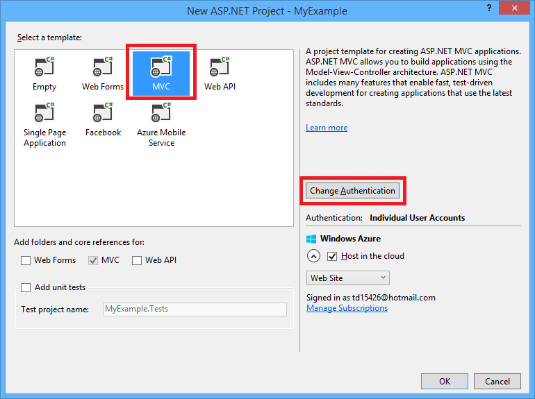
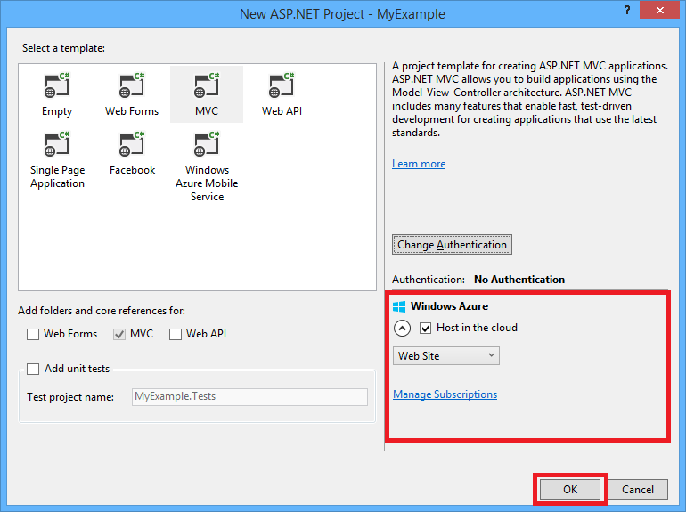
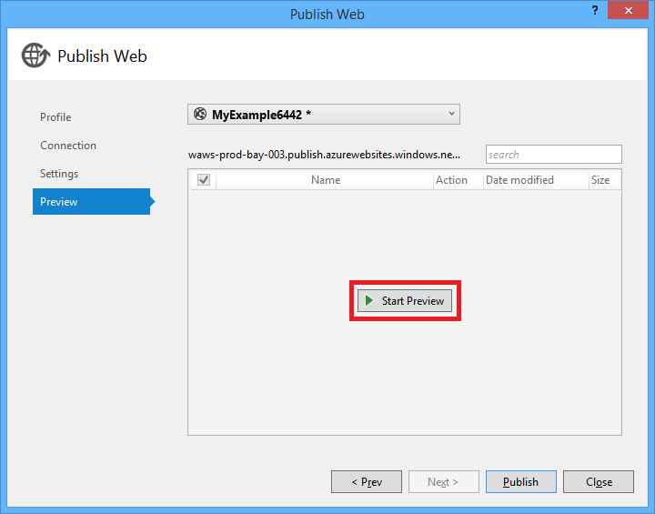

<properties linkid="develop-net-tutorials-get-started-vs2013" urlDisplayName="Начало работы с Windows Azure" pageTitle="Начало работы с Windows Azure для .NET" metaKeywords="" description="В этом учебнике показано, как развернуть веб-сайт ASP.NET для Windows Azure с использованием Visual Studio 2013. Вам потребуется не более 15 минут, чтобы получить новое приложение, работающее в облаке." metaCanonical="" services="web-sites" documentationCenter=".NET" title="Начало работы с Windows Azure и ASP.NET" authors=""  solutions="" writer="tdykstra" manager="wpickett" editor="mollybos"  />

# Начало работы с Windows Azure и ASP.NET

<a href="/ru-ru/develop/net/tutorials/get-started/" title="Visual Studio 2013" class="current">Visual Studio 2013</a><a href="/ru-ru/develop/net/tutorials/get-started-vs2012/" title="Visual Studio 2012">Visual Studio 2012</a>

В этом учебнике показано, как развернуть веб-приложение ASP.NET на веб-сайте Windows Azure с помощью мастера "Публикация веб-сайта" в Visual Studio 2013 или Visual Studio 2013 for Web Express. (Если вы предпочитаете использовать Visual Studio 2012, см. [предыдущую версию этого учебника](/ru-ru/develop/net/tutorials/get-started-vs2012/).)

Можно бесплатно создать учетную запись Windows Azure, а если у вас еще нет Visual Studio 2013, пакет SDK автоматически установит Visual Studio 2013 for Web Express. Так что вы можете приступить к разработке приложений для Windows Azure совершенно бесплатно.

Этот учебник разработан для читателей, не имеющих опыта использования платформы Windows Azure. По завершении изучения этого учебника вы получите простое веб-приложение, работающее в облаке.
 
Вы узнаете:

* Как подготовить компьютер к разработке для Windows Azure с помощью пакета Windows Azure SDK.
* Как создать проект Visual Studio ASP.NET MVC 5 и опубликовать его на веб-сайте Windows Azure.

На следующем рисунке показано завершенное приложение:

<strong>Примечание.</strong>
Для работы с этим учебником необходима учетная запись Windows Azure. Если у вас нет учетной записи, можно <a href="/ru-ru/pricing/member-offers/msdn-benefits-details/?WT.mc_id=A261C142F" target="_blank">активировать преимущества для подписчиков MSDN</a> или <a href="/ru-ru/pricing/free-trial/?WT.mc_id=A261C142F" target="_blank">подписаться на бесплатную пробную версию</a>.

 
### Сегменты учебника

1. [Настройка среды разработки](#setupdevenv)
3. [Создание приложения ASP.NET MVC 5](#createapp)
4. [Развертывание приложения в Windows Azure](#deploytowindowsazure)
5. [Следующие шаги](#nextsteps)

[WACOM.INCLUDE [install-sdk-2013-only](../includes/install-sdk-2013-only.md)]

<h2>Создание приложенияСоздание приложения ASP.NET MVC 5</h2>

Первым шагом является создание проекта веб-приложения Visual Studio, который будет опубликован в Windows Azure.

### Создание проекта

1. Откройте Visual Studio 2013 или Visual Studio 2013 Express for Web.

2. В меню **Файл** выберите **Новый проект**.

	

3. В диалоговом окне **Новый проект** разверните узел **C#** и выберите **Интернет** в разделе **Установленные шаблоны**, а затем выберите **Веб-приложение ASP.NET**.

3. Убедитесь, что в качестве целевой платформы выбрана **.NET Framework 4.5**.

4. Присвойте приложению имя **MyExample** и нажмите кнопку **ОК**

	

5. В диалоговом окне **Новый проект ASP.NET** выберите шаблон **MVC**, а затем щелкните **Изменить аутентификацию**.

	

6. В диалоговом окне **Изменить аутентификацию** щелкните **Без аутентификации** и нажмите кнопку **ОК**.

	

	В создаваемом образце приложения не будет функций, требующих от пользователей входа в систему. Дополнительные сведения о способах реализации функций аутентификации и авторизации см. в разделе [Дальнейшие действия](#nextsteps) в конце этого учебника. 

5. В диалоговом окне **Новый проект ASP.NET** нажмите кнопку **ОК**.

	

### Локальный запуск приложения

1. Для запуска приложения нажмите сочетание клавиш CTRL+F5.

	Главная страница приложения откроется в браузере, используемом по умолчанию.

	

	URL-адрес http://localhost указывает, что веб-сайт работает на локальном компьютере. По умолчанию он работает в IIS Express — упрощенной версии IIS, используемой на этапе разработки веб-приложений.

	Это все, что необходимо для создания простого приложения, которое можно развернуть в Windows Azure.

<h2>Развертывание приложенияРазвертывание приложения в Windows Azure</h2>

1. Закройте браузер.

5. В **Обозревателе решений** Visual Studio щелкните правой кнопкой мыши проект и выберите **Опубликовать** в контекстном меню.

	

	Откроется мастер **Публикация веб-сайта**.

6. На вкладке **Профиль** мастера **Публикация веб-сайта** щелкните **Импорт**.

	

	Появится диалоговое окно **Импорт профиля публикации**.

5. С помощью одного из перечисленных ниже способов разрешите Visual Studio подключаться к вашей учетной записи Windows Azure.

	* Щелкните **Вход**, а затем введите учетные данные для учетной записи Windows Azure.

		Этот способ самый быстрый и простой, но при его использовании вы не сможете увидеть базу данных SQL Windows Azure или мобильные службы в окне **Обозревателя сервера**.

	* Щелкните **Управление подписками**, чтобы установить сертификат управления, обеспечивающий доступ к вашей учетной записи.

		В диалоговом окне **Управление подписками Windows Azure** откройте вкладку **Сертификаты**, а затем щелкните **Импорт**. Следуя указаниям, загрузите и импортируйте файл подписки (файл *.publishsettings*) для вашей учетной записи Windows Azure.

		> [WACOM.NOTE] Загрузите файл подписки в папку, не входящую в структуру каталогов с исходным кодом (например, в папку "Загрузки"), а после завершения импорта удалите его. Злоумышленник, получивший доступ к файлу подписки, сможет изменять, создавать и удалять ваши службы Windows Azure.

		Дополнительные сведения см. в статье [Управление учетными записями, подписками и административными ролями](http://go.microsoft.com/fwlink/?LinkId=324796#BKMK_AccountVCert)

2. В диалоговом окне **Импорт параметров публикации** выберите переключатель **Импорт с веб-сайта Windows Azure** и щелкните **Создать**.

	

3. В диалоговом окне **Создать сайт в Windows Azure** введите в поле **Имя сайта** строку, которая будет использоваться в качестве уникального URL-адреса вашего приложения.

	Полный URL-адрес будет состоять из введенной здесь строки и суффикса, который отображается рядом с текстовым полем. Если кто-то уже использует введенный вами URL-адрес, справа появится красный восклицательный знак вместо зеленой галочки и потребуется ввести другое значение.

4. В раскрывающемся списке **Расположение** выберите ближайшее к вам расположение.

	Этот параметр определяет, в каком центре обработки данных будет работать ваш веб-сайт. 

5. Оставьте поле базы данных без изменений.

	В этом учебнике база данных не используется. В разделе [Дальнейшие действия](#nextsteps) в конце данного учебника приводится ссылка на учебник, в котором показано, как использовать базу данных.

6. Щелкните **Создать**. 

	

	Через несколько секунд веб-сайт будет создан. При возвращении в диалоговое окно **Импорт параметров публикации** этот новый сайт будет выбран в раскрывающемся списке.

6. Нажмите кнопку **ОК**.

	

8. На вкладке **Подключение** мастера **Публикация веб-сайта** щелкните **Проверить подключение** и убедитесь, что параметры заданы правильно.

	

	После проверки подключения рядом с кнопкой **Проверить подключение** отображается зеленая галочка. 

9. Нажмите кнопку **Далее**.

	

10. На вкладке **Параметры** нажмите кнопку **Далее**.

	

	Можно принять заданные по умолчанию параметры, представленные на этой вкладке.  Вы развертываете конфигурацию сборки для выпуска, и вам не требуется удалять файлы на целевом сервере, выполнять предварительную компиляцию приложения или исключать файлы из папки App_Data.

11. На вкладке **Предварительный просмотр** нажмите кнопку **Начало предварительного просмотра**.

	

	На вкладке отображается список файлов, которые будут копироваться на сервер. Предварительный просмотр не является обязательным для публикации приложения, но это полезная функция, о которой нужно знать.

12. Щелкните **Опубликовать**.

	

	Visual Studio начинает процесс копирования файлов на сервер Windows Azure.

13. В окне **Вывод** указывается, какие действия по развертыванию были выполнены, а также сообщается об успешном завершении развертывания.

	

14. После успешного развертывания URL-адрес развернутого веб-сайта автоматически открывается в используемом по умолчанию браузере.

	Созданное вами приложение теперь выполняется в облаке.

	

<h2>Дальнейшие действияДальнейшие действия</h2>

Из этого учебника вы узнали, как развернуть простое веб-приложение на веб-сайте Windows Azure. Из других доступных ресурсов вы можете узнать, как осуществлять управление сайтом, его масштабирование и устранение неполадок, как добавить функции доступа к базе данных, аутентификации и авторизации, как решить, должно ли приложение работать в облачной службе Windows Azure, а не на веб-сайте Windows Azure.

<h3>Как управлять веб-сайтом</h3>
[Портал управления Windows Azure][Portal] — это веб-интерфейс, с помощью которого вы можете отслеживать все ваши службы Windows Azure и управлять ими.

Можно создавать новые веб-сайты, облачные службы, виртуальные машины, базы данных и многое другое. Можно создавать приложения с открытым исходным кодом из коллекции, а также управлять службами, которые вы создали. Например, на следующем снимке экрана показаны кнопки **Остановить**, **Перезагрузить** и **Удалить** для веб-сайта Windows Azure, расположенные на вкладке **Панель мониторинга** портала управления. На вкладке **Панель мониторинга** отображается также статистика производительности, например используемое время ЦП, число запросов, объем входящих и исходящих данных, а также все произошедшие ошибки.

Многие другие параметры сайта можно изменить на вкладке **Настройка**. Дополнительные сведения см. в статье [Как управлять веб-сайтами](/ru-ru/manage/services/web-sites/how-to-manage-websites/).

Некоторые функции управления веб-сайтом можно выполнять непосредственно из **Обозревателя сервера** в Visual Studio. Дополнительные сведения о возможных действиях в **Обозревателе сервера** см. в статье [Устранение неполадок веб-сайтов Windows Azure в Visual Studio](/ru-ru/develop/net/tutorials/troubleshoot-web-sites-in-visual-studio/)

<h3>Как масштабировать веб-сайт</h3>
Если сайт является общедоступным и на нем начинает увеличиваться трафик, время ответа может возрасти, замедляя работу. Чтобы исправить это, можно легко добавить ресурсы сервера на вкладке **Масштаб** портала управления. Дополнительные сведения см. в статье [Как масштабировать веб-сайт](/ru-ru/manage/services/web-sites/how-to-scale-websites/). (Добавление ресурсов сервера для масштабирования веб-сайта не является бесплатным.)

<h3>Как устранить неполадки веб-сайта</h3>
Просмотр выходных данных трассировки или журналов поможет выявить и устранить неполадки. Visual Studio предоставляет встроенные инструменты, упрощающие просмотр журналов Windows Azure по мере их создания в режиме реального времени. Можно также работать в Windows Azure удаленно в режиме отладки. Дополнительные сведения см. в статье [Устранение неполадок веб-сайтов Windows Azure в Visual Studio](/ru-ru/develop/net/tutorials/troubleshoot-web-sites-in-visual-studio/).

<h3>Как добавить функции доступа к базе данных и авторизации</h3>
На большинстве веб-сайтов используется база данных и некоторые функции сайта доступны только для определенных авторизованных пользователей. Сведения о том, как начать работу с функциями доступа к базе данных, аутентификации и авторизации, см. в учебнике [Развертывание безопасного приложения ASP.NET MVC с членством, OAuth и базой данных SQL на веб-сайте Windows Azure](/ru-ru/develop/net/tutorials/web-site-with-sql-database/).

<h3>Как решить, должно ли приложение работать в облачной службе</h3>
В некоторых ситуациях может потребоваться, чтобы приложение работало не на веб-сайте Windows Azure, а в облачной службе Windows Azure. Дополнительные сведения см. в статьях [Модели выполнения Windows Azure](/ru-ru/develop/net/fundamentals/compute/) и [Веб-сайты Windows Azure, облачные службы и виртуальные машины: когда они используются?](http://www.windowsazure.com/ru-ru/manage/services/web-sites/choose-web-app-service/). Серию учебников, показывающих, как создать многоуровневое веб-приложение ASP.NET и развернуть его в облачной службе, см. в статье [Многоуровневое приложение .NET, использующее таблицы хранилища, очереди и BLOB-объекты](/ru-ru/develop/net/tutorials/multi-tier-web-site/1-overview/)

[Портал]: http://manage.windowsazure.com

