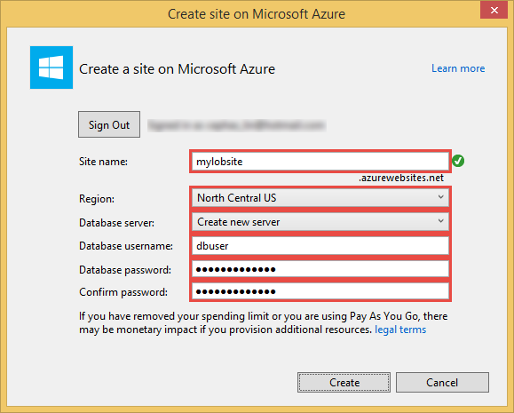
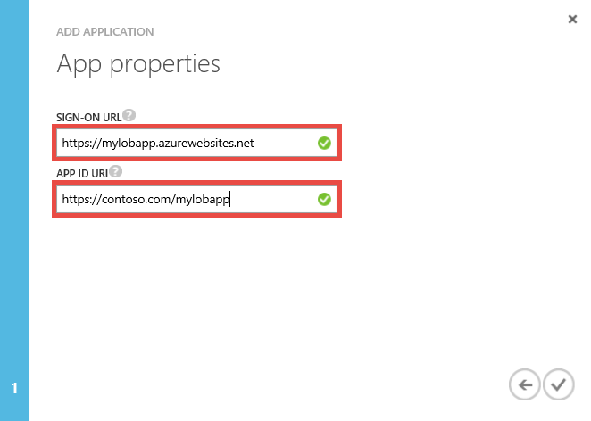
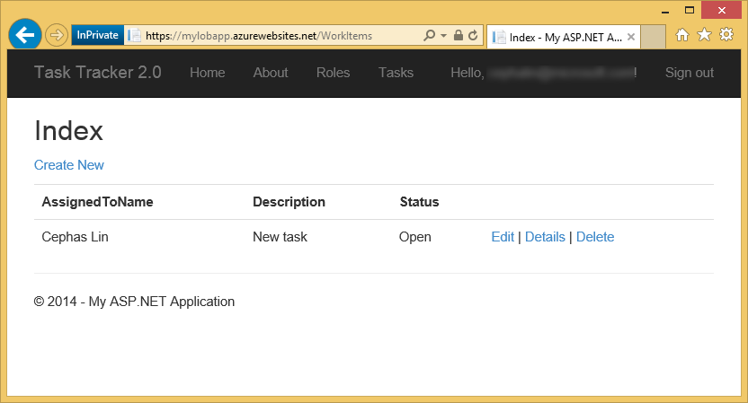

<properties 
	pageTitle="Бизнес-приложения на веб-сайтах Azure с Azure AD" 
	description="Узнайте, как создать бизнес-приложение ASP.NET на веб-сайтах Azure с выполнением проверки подлинности с помощью Azure Active Directory" 
	services="web-sites, active-directory" 
	documentationCenter=".net" 
	authors="cephalin" 
	manager="wpickett" 
	editor=""/>

<tags 
	ms.service="web-sites" 
	ms.devlang="dotnet" 
	ms.topic="article" 
	ms.tgt_pltfrm="na" 
	ms.workload="web" 
	ms.date="02/12/2015" 
	ms.author="cephalin"/>

# Создание бизнес-приложения ASP.NET MVC на веб-сайтах Azure, выполняющего проверку подлинности с помощью Azure Active Directory #

В этой статье вы познакомитесь с простым методом создания бизнес-приложения ASP.NET MVC на [веб-сайтах Azure](http://azure.microsoft.com/services/websites/) с использованием [Azure Active Directory](http://azure.microsoft.com/services/active-directory/) (AAD) в качестве поставщика удостоверений. Вы также узнаете, как использовать [клиентскую библиотеку Azure AD Graph](http://blogs.msdn.com/b/aadgraphteam/archive/2014/06/02/azure-active-directory-graph-client-library-1-0-publish.aspx) для запроса данных каталога в приложении.

Используемый клиент AAD может иметь только каталог Azure или может быть синхронизирован с локальным Active Directory (AD) для создания единого входа для локальных или удаленных сотрудников.

Обзор различных вариантов проверки подлинности и авторизации для предприятий на веб-сайтах Azure см. в разделе [Проверка подлинности и авторизация пользователей в бизнес-приложениях на веб-сайтах Azur](web-sites-authentication-authorization.md).

## Что будет строиться ##

Вы создадите простое бизнес-приложение с шаблоном создать-прочитать-обновить-удалить (CRUD) на веб-сайтах Azure, которое отслеживает рабочие элементы с помощью следующих компонентов:

- проверка подлинности пользователей в AAD
- функции входа и выхода
- использование `[авторизации]` для авторизации пользователей для различных действий CRUD
- запросы данных AAD с помощью [API Azure AD Graph](http://msdn.microsoft.com/library/azure/hh974476.aspx)
- использование [Microsoft.Owin](http://www.asp.net/aspnet/overview/owin-and-katana/an-overview-of-project-katana) вместо Windows Identity Foundation, т.е. WIF). Этот интерфейс определяет будущее ASP.NET, он гораздо проще в настройке для проверки подлинности и авторизации, чем WIF

## Необходимые условия ##

[AZURE.INCLUDE [free-trial-note](../includes/free-trial-note.md)]

Чтобы выполнить этот учебник, необходимо следующее:

- Клиент AAD с пользователями в различных группах
- Разрешения на создание приложений на клиенте AAD
- Visual Studio 2013 

## Использование учебного приложения в качестве шаблона бизнес-приложения ##

Учебное приложение в этом учебнике, [WebApp-GroupClaims-DotNet](https://github.com/AzureADSamples/WebApp-GroupClaims-DotNet), создано рабочей группой AAD и может использоваться в качестве шаблона для простого создания новых бизнес-приложений. Оно имеет следующие встроенные функции:

- использует [OpenID Connect](http://openid.net/connect/) для проверки подлинности с помощью AAD
- контроллер `ролей`, который содержит фильтр поиска AAD и позволяет легко сопоставлять пользователей или группы AAD с ролями приложения.
- учебный контроллер `TaskTracker` для демонстрации авторизации различных ролей для определенных действий в приложении, в том числе стандартного использования действия `[авторизовать]`. 

<a name="bkmk_run" />
## Запуск учебного приложения ##

1.	Создайте клон или загрузите учебное решение с сайта [WebApp-GroupClaims-DotNet](https://github.com/AzureADSamples/WebApp-GroupClaims-DotNet) в локальный каталог.
2.	Следуйте инструкциям в [README.md](https://github.com/AzureADSamples/WebApp-GroupClaims-DotNet/blob/GroupClaims/README.md), чтобы настроить приложение AAD и проект.

	> [AZURE.NOTE] Разрешения, настроенные в приложении AAD, требуют наличия только роли <strong>пользователя</strong>, а не **глобального администратора**.
	
3.	После завершения настройки приложения введите `F5` и запустите его.
4.	После загрузки приложения щелкните **Вход**. 
5.	Если приложение AAD настроено правильно и заданы соответствующие параметры в файле Web.config, должно произойти перенаправление на страницу входа. Просто выполните вход с учетной записью, которая использовалась для создания приложения AAD на портале Azure, так как это владелец приложения AAD по умолчанию. 
	
	> [AZURE.NOTE] В Startup.Auth.cs учебного проекта обратите внимание на то, что в приложении есть метод с именем <code>AddOwnerAdminClaim</code>, который используется для добавления владельца приложения в роль администратора. Это дает возможность немедленно начать управление ролями приложения в контроллере <code>ролей</code>.
	
4.	После входа щелкните **Роли**, чтобы начать управление ролями приложения.
5.	В поле **Поиск пользователей или групп** начните вводить нужное имя пользователя или группы и обратите внимание на то, что в раскрывающемся списке отображается отфильтрованный список пользователей и (или) групп из клиента AAD.

	 

	> [AZURE.NOTE] В Views\Roles\Index.cshtml видно, что представление использует объект JavaScript с именем <code>AadPicker</code> (определенный в Scripts\AadPickerLibrary.js) для доступа к действию <code>Поиск</code> в контроллере <code>ролей</code>.
		<pre class="prettyprint">var searchUrl = window.location.protocol + "//" + window.location.host + "<mark>/Roles/Search</mark>";
	...
    var picker = new <mark>AadPicker(searchUrl, maxResultsPerPage, input, token, tenant)</mark>;</pre>
		В Controllers\RolesController.cs можно увидеть <code>действие</code> поиска, которое отправляет фактический запрос на API AAD Graph и возвращает ответ обратно на страницу.
		Позднее вы будете использовать этот же метод для создания простой функциональности в приложении.

6.	Выберите пользователя или группу из раскрывающегося списка, выберите роль и нажмите кнопку **Назначить роль**.

## Развертывание учебного приложения на веб-сайтах Azure

Здесь мы займемся публикацией приложения на веб-сайте Azure. В разделе [README.md](https://github.com/AzureADSamples/WebApp-GroupClaims-DotNet/blob/GroupClaims/README.md) уже имеются инструкции по развертыванию веб-сайтов Azure, но выполнение этих действий также приводит к уничтожению конфигурации локальной среды отладки. Я покажу вам, как выполнить развертывание с сохранением конфигурации отладки.

1. Щелкните правой кнопкой мыши свой проект и выберите **Опубликовать**.

	

2. Выберите **Веб-сайты Microsoft Azure**.
3. Если еще не выполнен вход в Azure, щелкните  **Вход** и используйте учетную запись Майкрософт для вашей подписки Azure, чтобы войти.
4. После входа щелкните **Создать** для создания нового веб-сайта.
5. Заполните все обязательные поля. Для этого приложения необходимо подключение к базе данных, чтобы хранить сопоставления ролей, кэшированные токены и любые данные приложения.

	

6. Щелкните **Создать**. После создания веб-сайта открывается диалоговое окно Публикация веб-сайта.
7. В поле **URL-адрес назначения** измените **http** на **https**. Скопируйте весь URL-адрес в текстовый редактор. Он вам понадобится позднее. Затем нажмите кнопку **Далее**.

	

8. Снимите флажок **Включить проверку подлинности в организации**.

	

9. Вместо того, чтобы нажать кнопку **Опубликовать** для выполнения операции веб-публикации, щелкните **Закрыть**. Щелкните **Да** для сохранения изменений в профиле публикации.
2. В [портале управления Azure](https://manage.windowsazure.com) перейдите к клиенту AAD и щелкните вкладку **Приложения**.
2. В нижней части страницы нажмите кнопку **Добавить**.
3. Выберите **Добавить приложение, разрабатываемой моей организацией**.
4. Присвойте приложению имя и щелкните **Далее**.
5. В окне Свойства приложения укажите в поле **URL-адрес входа** URL-адрес веб-сайта, который был ранее сохранен (например, `https://<site-name>.azurewebsites.net`), а в поле **URI идентификатора приложения** укажите `https://<aad-tenanet-name>/<app-name>`. Затем нажмите кнопку **Завершить**.

	

6. После создания приложения щелкните **Настройка**.
7. В разделе **Ключи** создайте новый ключ, выбрав **1 год** в раскрывающемся списке.
8. В разделе **Разрешения для других приложений** для записи **Windows Azure Active Directory** выберите **Доступ к каталогу вашей организации** в раскрывающемся списке **Делегированные разрешения**.

	> [AZURE.NOTE] Необходимые разрешения зависят от желаемой функциональности приложения. Для задания некоторых разрешений требуется роль **глобального администратора**, но разрешения, необходимые для этого учебника, требуют использования только роли **пользователя**.

9.  Нажмите кнопку **Сохранить**.  
10.  Прежде чем покинуть страницу сохраненной конфигурации, скопируйте следующую информацию в текстовый редактор.

	-	Идентификатор клиента
	-	Ключ (если покинуть страницу, ключ нельзя будет увидеть снова)

11. В Visual Studio откройте файл **Web.Release.config** в проекте. Вставьте следующий XML-код в тег `<configuration>` и замените значение каждого ключа на информацию, которая была сохранения для нового приложения AAD.  
	<pre class="prettyprint">
&lt;appSettings&gt;
   &lt;add key="ida:ClientId" value="<mark>[e.g. 82692da5-a86f-44c9-9d53-2f88d52b478b]</mark>" xdt:Transform="SetAttributes" xdt:Locator="Match(key)" /&gt;
   &lt;add key="ida:AppKey" value="<mark>[e.g. rZJJ9bHSi/cYnYwmQFxLYDn/6EfnrnIfKoNzv9NKgbo=]</mark>" xdt:Transform="SetAttributes" xdt:Locator="Match(key)" /&gt;
   &lt;add key="ida:PostLogoutRedirectUri" value="<mark>[e.g. https://mylobapp.azurewebsites.net/]</mark>" xdt:Transform="SetAttributes" xdt:Locator="Match(key)" /&gt;
&lt;/appSettings&gt;</pre>

	Убедитесь, что значение ida:PostLogoutRedirectUri заканчивается косой чертой "/".

1. Щелкните правой кнопкой мыши свой проект еще раз и выберите **Опубликовать**.
2. Щелкните **Опубликовать** для публикации на веб-сайтах Azure.

После завершения операции у вас будут два приложения AAD, настроенные на портале управления Azure. Одно из них используется для среды отладки в Visual Studio, а второе - для опубликованного веб-сайта в Azure. Во время отладки параметры приложения в файле Web.config используются для того, чтобы конфигурация **Отладка** работала с AAD. После его публикации (по умолчанию публикуется конфигурация **Выпуск**) отправляется измененный файл Web.config, в котором содержатся изменения параметров приложения в файле Web.Release.config.

При необходимости подключить опубликованный веб-сайт к отладчику (т.е. когда нужно отправить символы отладки кода в опубликованный веб-сайт) можно создать клон конфигурации отладки для отладки в Azure, но со своим собственным настраиваемым преобразованием файла Web.config (например, Web.AzureDebug.config), в котором используются параметры AAD из файла Web.Release.config. Это дает возможность поддерживать статическую конфигурацию в различных средах.

## Добавление функциональности бизнес-приложения к учебному приложению

В этой части учебника вы научитесь создавать необходимую функциональность бизнес-приложения на основе учебного приложения. Вы займетесь созданием простого приложения CRUD для отслеживания рабочих элементов, аналогичного контроллеру TaskTracker, но с использованием формирования стандартного шаблона CRUD и шаблона разработки. Кроме этого, будут использоваться приведенные скрипты Scripts\AadPickerLibrary.js для обогащения приложения данными из API AAD Graph.  

5.	В папке Models создайте новую модель с именем WorkItem.cs и замените код следующим кодом:

		using System.ComponentModel.DataAnnotations;
		
		namespace WebAppGroupClaimsDotNet.Models
		{
		    public class WorkItem
		    {
		        [Key]
		        public int ItemID { get; set; }
		        public string AssignedToID { get; set; }
		        public string AssignedToName { get; set; }
		        public string Description { get; set; }
		        public WorkItemStatus Status { get; set; }
		    }
		
		    public enum WorkItemStatus
		    {
		        Open, 
		        Investigating, 
		        Resolved, 
		        Closed
		    }
		}

6.	Откройте DAL\GroupClaimContext.cs и добавьте выделенный код:  
	<pre class="prettyprint">
    public class GroupClaimContext : DbContext
    {
        public GroupClaimContext() : base("GroupClaimContext") { }

        public DbSet&lt;RoleMapping&gt; RoleMappings { get; set; }
        public DbSet&lt;Task&gt; Tasks { get; set; }
        <mark>public DbSet&lt;WorkItem&gt; WorkItems { get; set; }</mark>
        public DbSet&lt;TokenCacheEntry&gt; TokenCacheEntries { get; set; }
    }</pre>

7.	Постройте проект, чтобы сделать новую модель доступной для логики формирования шаблона в Visual Studio.
8.	Добавьте новый сформированный элемент шаблона `WorkItemsController` в папку Контроллеры. Чтобы это сделать, щелкните правой кнопкой мыши **Контроллеры**,  выберите **Добавить**, а затем выберите **Новый сформированный элемент шаблона**. 
9.	Выберите **Контроллер MVC 5 с представлениями, использующий Entity Framework**, и щелкните **Добавить**.
10.	Выберите только что созданную модель и щелкните **Добавить**.

	

9.	Откройте Controllers\WorkItemsController.cs

11. Добавьте выделенные оформления [Авторизовать] к соответствующим действиям ниже.
	<pre class="prettyprint">
	...

    <mark>[Authorize(Roles = "Admin, Observer, Writer, Approver")]</mark>
    public class WorkItemsController : Controller
    {
		...

        <mark>[Authorize(Roles = "Admin, Writer")]</mark>
        public ActionResult Create()
        ...

        <mark>[Authorize(Roles = "Admin, Writer")]</mark>
        public async Task&lt;ActionResult&gt; Create([Bind(Include = "ItemID,AssignedToID,AssignedToName,Description,Status")] WorkItem workItem)
        ...

        <mark>[Authorize(Roles = "Admin, Writer")]</mark>
        public async Task&lt;ActionResult&gt; Edit(int? id)
        ...

        <mark>[Authorize(Roles = "Admin, Writer")]</mark>
        public async Task&lt;ActionResult&gt; Edit([Bind(Include = "ItemID,AssignedToID,AssignedToName,Description,Status")] WorkItem workItem)
        ...

        <mark>[Authorize(Roles = "Admin, Writer, Approver")]</mark>
        public async Task&lt;ActionResult&gt; Delete(int? id)
        ...

        <mark>[Authorize(Roles = "Admin, Writer, Approver")]</mark>
        public async Task&lt;ActionResult&gt; DeleteConfirmed(int id)
        ...
	}</pre>

	Поскольку нас интересует сопоставление ролей к контроллере ролей, достаточно просто убедиться, что каждое действие авторизует соответствующую роль.

	> [AZURE.NOTE] Возможно, вы обратили внимание на оформление <code>[ValidateAntiForgeryToken]</code> на некоторых действиях. Из-за поведения, описанного [Алленом Броком](https://twitter.com/BrockLAllen) в статье [MVC 4, AntiForgeryToken и утверждения](http://brockallen.com/2012/07/08/mvc-4-antiforgerytoken-and-claims/), команда HTTP POST может завершиться ошибкой при проверке маркеров защиты от подделки по следующей причине:
	> + AAD не отправляет http://schemas.microsoft.com/accesscontrolservice/2010/07/claims/identityprovider, то требуется по умолчанию для маркера защиты от подделки.
	> + Если AAD является каталогом, синхронизированным с AD FS, то средство доверия AD FS по умолчанию также не отправляет утверждение http://schemas.microsoft.com/accesscontrolservice/2010/07/claims/identityprovider, хотя можно настроить вручную AD FS для отправки такого утверждения.
	> Мы займемся этим на следующем шаге.

12.  В App_Start\Startup.Auth.cs добавьте следующую строку кода в метод `ConfigureAuth`:

		AntiForgeryConfig.UniqueClaimTypeIdentifier = ClaimTypes.NameIdentifier;
	
	`ClaimTypes.NameIdentifies` указывает утверждение `http://schemas.xmlsoap.org/ws/2005/05/identity/claims/nameidentifier`, которое AAD не предоставляет. Теперь после того, как решен вопрос с авторизацией (честно говоря, на это ушло немного времени), можно посвятить свое время фактической функциональности действий. 

13.	В Create() и Edit() добавьте следующий код, чтобы позднее сделать некоторые переменные доступными для JavaScript:
            ViewData["token"] = GraphHelper.AcquireToken(ClaimsPrincipal.Current.FindFirst(Globals.ObjectIdClaimType).Value);
            ViewData["tenant"] = ConfigHelper.Tenant;
14.	В Views\WorkItems\Create.cshtml (автоматически сформированный элемент шаблона) найдите вспомогательный метод `Html.BeginForm` и измените его следующим образом:  
	<pre class="prettyprint">@using (Html.BeginForm(<mark>"Create", "WorkItems", FormMethod.Post, new { id = "main-form" }</mark>))
	{
	    @Html.AntiForgeryToken()
	    
	    &lt;div class="form-horizontal"&gt;
	        &lt;h4&gt;WorkItem&lt;/h4&gt;
	        &lt;hr /&gt;
	        @Html.ValidationSummary(true, "", new { @class = "text-danger" })
	
	        &lt;div class="form-group"&gt;
	            &lt;div class="col-md-10"&gt;
	                @Html.EditorFor(model =&gt; model.AssignedToID, new { htmlAttributes = new { @class = "form-control"<mark>, @type=&quot;hidden&quot;</mark> } })
	                @Html.ValidationMessageFor(model =&gt; model.AssignedToID, "", new { @class = "text-danger" })
	            &lt;/div&gt;
	        &lt;/div&gt;
	
	        &lt;div class="form-group"&gt;
	            @Html.LabelFor(model =&gt; model.AssignedToName, htmlAttributes: new { @class = "control-label col-md-2" })
	            &lt;div class="col-md-10"&gt;
	                @Html.EditorFor(model =&gt; model.AssignedToName, new { htmlAttributes = new { @class = "form-control" } })
	                @Html.ValidationMessageFor(model =&gt; model.AssignedToName, "", new { @class = "text-danger" })
	            &lt;/div&gt;
	        &lt;/div&gt;
	
	        &lt;div class="form-group"&gt;
	            @Html.LabelFor(model =&gt; model.Description, htmlAttributes: new { @class = "control-label col-md-2" })
	            &lt;div class="col-md-10"&gt;
	                @Html.EditorFor(model =&gt; model.Description, new { htmlAttributes = new { @class = "form-control" } })
	                @Html.ValidationMessageFor(model =&gt; model.Description, "", new { @class = "text-danger" })
	            &lt;/div&gt;
	        &lt;/div&gt;
	
	        &lt;div class="form-group"&gt;
	            @Html.LabelFor(model =&gt; model.Status, htmlAttributes: new { @class = "control-label col-md-2" })
	            &lt;div class="col-md-10"&gt;
	                @Html.EnumDropDownListFor(model =&gt; model.Status, htmlAttributes: new { @class = "form-control" })
	                @Html.ValidationMessageFor(model =&gt; model.Status, "", new { @class = "text-danger" })
	            &lt;/div&gt;
	        &lt;/div&gt;
	
	        &lt;div class="form-group"&gt;
	            &lt;div class="col-md-offset-2 col-md-10"&gt;
	                &lt;input type="submit" value="Create" class="btn btn-default" <mark>id="submit-button"</mark> /&gt;
	            &lt;/div&gt;
	        &lt;/div&gt;
	    &lt;/div&gt;
	
	    <mark>&lt;script&gt;
	            // People/Group Picker Code
	            var maxResultsPerPage = 14;
	            var searchUrl = window.location.protocol + "//" + window.location.host + "/Roles/Search";
	            var input = document.getElementById("AssignedToName");
	            var token = "@ViewData["token"]";
	            var tenant = "@ViewData["tenant"]";
	
	            var picker = new AadPicker(searchUrl, maxResultsPerPage, input, token, tenant);
	
	            // Submit the selected user/group to be asssigned.
	            $("#submit-button").click({ picker: picker }, function () {
	                if (!picker.Selected())
	                    return;
	                $("#main-form").get()[0].elements["AssignedToID"].value = picker.Selected().objectId;
	            });
	    &lt;/script&gt;</mark>
	
	}</pre>

	В скрипте объект выбора AAD выполняет поиск действия `~/Roles/Search` для пользователей и групп AAD, которое соответствует входным данным. Затем при нажатии кнопки "Отправить" объект выбора AAD сохраняет идентификатор пользователя в скрытом поле `AssignedToID`.  

15. Теперь можно либо запустить приложение в отладчике Visual, либо опубликовать его на веб-сайтах Azure. Войдите в систему как владелец приложения и перейдите к `~/WorkItems/Create`. Для своего опубликованного бизнес-приложения я перехожу к `https://mylobapp.azurewebsites.net/WorkItems/Create`. Теперь вы увидите, что можно использовать тот же фильтр поиска выбора AAD для выбора пользователя AAD.

	

16. Заполните оставшуюся часть формы и щелкните **Создать**. На странице ~/WorkItems/Index теперь отображается вновь созданный элемент. На приведенном ниже снимке экрана вы увидите, что я удалил столбец `AssignedToID` в Views\WorkItems\Index.cshtml. 

	

11.	Сейчас необходимо сделать аналогичные изменения в представлении **Изменить**. В Views\WorkItems\Edit.cshtml сделайте изменения во вспомогательном методе `Html.BeginForm`, аналогичные тем, которые были сделаны на предыдущем шаге в Views\WorkItems\Create.cshtml(замените "Create" на "Edit" в выделенном коде выше).

Вот и все!

Теперь после настройки авторизаций и функциональности бизнес-приложения для различных действия в контроллере WorkItems можно попробовать выполнить вход в качестве пользователей с различными ролями приложения.

## Дополнительные ресурсы

- [Защита приложения с помощью SSL и атрибута Authorize](../web-sites-dotnet-deploy-aspnet-mvc-app-membership-oauth-sql-database/#protect-the-application-with-ssl-and-the-authorize-attribute)
- [Проверка подлинности и авторизация пользователей в бизнес-приложениях на веб-сайтах Azure ](web-sites-authentication-authorization.md)
- [Создание бизнес-приложения ASP.NET MVC на веб-сайтах Azure, которое выполняет проверку подлинности с помощью AD FS](web-sites-dotnet-lob-application-adfs.md)
- [Примеры Microsoft Azure Active Directory и документация](https://github.com/AzureADSamples)
- [Блог Витторио Берточчи](http://blogs.msdn.com/b/vbertocci/)
- [Миграция веб-проекта VS2013 из WIF в Katana](http://www.cloudidentity.com/blog/2014/09/15/MIGRATE-A-VS2013-WEB-PROJECT-FROM-WIF-TO-KATANA/)
- [Новые гибридные подключения Azure, а не старый элемент #hybridCloud](http://azure.microsoft.com/documentation/videos/new-hybrid-connections-not-your-fathers-hybridcloud/)
- [Сходства между Active Directory и Azure AD](http://technet.microsoft.com/ library/dn518177.aspx)
- [Синхронизация каталога с помощью сценария единого входа](http://technet.microsoft.com/ library/dn441213.aspx)
- [Токены и типы утверждений, поддерживаемый Azure AD](http://msdn.microsoft.com/library/azure/dn195587.aspx)

<!--HONumber=45--> 
