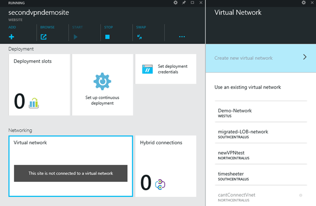

<properties 
	pageTitle="Интеграция веб-сайта Azure с виртуальной сетью Azure" 
	description="Показывает, как подключить веб-сайт Azure к новой или существующей виртуальной сети Azure" 
	services="web-sites, virtual-network" 
	documentationCenter="" 
	authors="cephalin" 
	manager="wpickett" 
	editor=""/>

<tags 
	ms.service="web-sites" 
	ms.workload="web" 
	ms.tgt_pltfrm="na" 
	ms.devlang="na" 
	ms.topic="article" 
	ms.date="09/24/2014" 
	ms.author="cephalin"/>

# Интеграция веб-сайта Azure с виртуальной сетью Azure #
В этом документе описана предварительная версия функции интеграции с виртуальной сетью и показано, как настроить эту функцию для вашего веб-сайта Azure.  Если вы не знакомы с виртуальными сетями Azure, примите во внимание, что эта функция позволяет создавать гибридные решения с использованием ресурсов в Azure и локальных средах.  

Такая интеграция позволяет предоставить веб-сайту доступ к ресурсам в виртуальной сети, причем сам он останется для нее недоступным.  Это может быть удобно, например, если веб-сайту нужен доступ к базе данных или веб-службам, работающим на виртуальных машинах в виртуальной сети или даже в вашем собственном центре обработки данных.  Эта функция не позволяет подключать диски.  Кроме того, на сегодняшний день невозможна интеграция с системами проверки подлинности в виртуальной сети.  Сейчас эта функция доступна только в предварительной версии и будет усовершенствована к моменту выпуска окончательной версии.

Дополнительные сведения о сценариях использования и преимуществах виртуальных сетей Azure см. в разделе "Обзор виртуальной сети".

## Начало работы ##
Перед подключением сайта к виртуальной сети вы должны обратить внимание на некоторые моменты.

1.	К виртуальной сети можно подключить только те сайты, которые работают в плане размещения веб-сайтов, относящемся к ценовой категории "Стандартный".  Сайты ценовых категорий "Бесплатный", "Общедоступный" и "Базовый" невозможно подключить к виртуальной сети.
2.	Если необходимая виртуальная сеть уже существует, то в ней необходимо активировать подключение типа "точка-сайт" с использованием шлюза с динамической маршрутизацией. Только после этого к ней можно будет подключить веб-сайт.  Подключение VPN типа "точка-сеть" невозможно активировать, если для шлюза настроена статическая маршрутизация.
3.	В плане размещения веб-сайтов можно настроить до пяти сетей.  В каждый момент времени веб-сайт может быть подключен только к одной сети.  Эти пять сетей могут использоваться любым количеством веб-сайтов из одного плана размещения веб-сайтов.  

Можно как подключиться к существующей виртуальной сети, так и создать новую.  Если выбран второй вариант, шлюз будет заранее настроен.  Учтите, что создание и настройка новой виртуальной сети занимают несколько минут.  

Если веб-сайт не относится к ценовой категории "Стандартный", система сообщит вам об этом и вы сможете перейти на страницы со сведениями о нужных категориях.

 

## Принципы работы системы ##
Работа этой функции основана на технологии VPN типа "точка-сайт", позволяющей веб-сайту Azure подключаться к виртуальной сети.  Системная архитектура службы "Веб-сайты Microsoft Azure" рассчитана на работу с многими клиентами, что препятствует подготовке веб-сайтов непосредственно в виртуальной сети, как это происходит с виртуальными машинами.  Технология "точка-сайт" позволяет предоставить доступ к сети только той виртуальной машине, на которой размещен веб-сайт.  Кроме того, доступ к сети дополнительно ограничен на этих узлах веб-сайтов, так что сайты могут обращаться только к разрешенным сетям.  

Предоставление доступа к сетям только определенным веб-сайтам предотвращает создание SMB-подключений.  При наличии доступа к удаленным ресурсам подключить удаленный диск невозможно.

 
Если в виртуальной сети не настроен DNS-сервер, то придется использовать IP-адреса.  Не забудьте открыть в брандмауэре порты для подключения к нужным конечным точкам.  На сегодняшний день протестировать подключение можно только одним способом: с помощью веб-сайта или веб-задания, вызывающего нужную конечную точку.  Такие инструменты, как ping или nslookup, пока не работают в консоли Kudu.  Однако их поддержка будет добавлена в ближайшем будущем.  

## Подключение к уже существующей сети ##
Чтобы подключить сайт к виртуальной сети, откройте его колонку и в разделе Networking (Работа в сети) щелкните плитку Virtual network (Виртуальная сеть), а затем выберите одну из уже существующих виртуальных сетей.

 
Если это первый веб-сайт в вашей подписке, который подключается к данной сети, то система создаст сертификат для проверки подлинности в ней.  Чтобы просмотреть сертификат, на текущем портале перейдите в раздел Virtual Networks (Виртуальные сети), выберите сеть и откройте вкладку Certificates (Сертификаты).  

На рисунке выше показана сеть cantConnectVnet, которая выделена серым и недоступна для выбора.  Такое состояние сети возможно только в двух случаях:  в сети не активировано подключение VPN типа "точка-сайт" или для шлюза в виртуальной сети не настроена динамическая маршрутизация.  Выполнив оба условия, можно выбрать эту виртуальную сеть для интеграции со своим веб-сайтом.

## Создание виртуальной сети и подключение к ней ##
Можно не только подключиться к существующей виртуальной сети, но и создать новую сеть через интерфейс веб-сайтов, а затем автоматически подключиться к ней.  Для этого перейдите к раздел Virtual Network (Виртуальная сеть), следуя описанным выше инструкциям, и выберите пункт Create new virtual network (Создать виртуальную сеть).  В открывшемся окне можно присвоить новой сети имя, указать адресное пространство, а также задать адреса для DNS-серверов, которые будут использоваться виртуальной сетью.

 
Создание виртуальной сети и настройка шлюзов могут занять до 30 минут.  В это время будет отображаться сообщение о том, что идет подготовка сети.

Как только произойдет подключение веб-сайта к виртуальной сети, у него появится доступ к ее ресурсам по протоколу TCP или UDP.  Если нужно обращаться к ресурсам в своей локальной системе, доступной через подключение VPN типа "сайт-сайт" к виртуальной сети, то необходимо добавить маршруты в свою корпоративную сеть. Они будут перенаправлять трафик из вашей сети на адреса типа "точка-сайт", настроенные в виртуальной сети.

После успешной настройки интеграции на портале будут отображены базовые сведения о подключении. Кроме того, появятся такие возможности, как отключение веб-сайта от сети и синхронизация сертификатов, используемых для проверки подлинности подключения.  Синхронизация может потребоваться, если сертификат просрочен или отозван.  

Управление подключением к виртуальной сети
Чтобы просмотреть список всех виртуальных сетей, связанных в настоящее время с веб-сайтами в плане размещения, откройте панель этого плана.  С планом размещения веб-сайтов ценовой категории "Стандартный" можно связать до пяти сетей.

При переходе на план размещения веб-сайтов более низкого уровня, например "Бесплатный", "Общедоступный" или "Базовый", подключения веб-сайтов к виртуальным сетям отключаются.  При возврате к плану "Стандартный" эти подключения к сети возобновляют свою работу.

На данный момент в Azure невозможно переместить уже существующую виртуальную машину в виртуальную сеть.  Виртуальная машина должна быть изначально подготовлена в виртуальной сети в ходе ее создания.  

## Доступ к локальным ресурсам ##
При работе с виртуальной сетью, в которой настроено подключение VPN типа "сайт-сайт", необходимо выполнить дополнительное действие, чтобы предоставить веб-сайту Azure доступ к локальным ресурсам.  В локальную сеть нужно добавить маршруты, которые будут перенаправлять трафик из нее на адреса типа "точка-сайт", настроенные в виртуальной сети.  Чтобы просмотреть диапазон IP-адресов для подключения типа "точка-сайт", перейдите в раздел "Сеть" на текущем портале, как показано ниже.

## Сертификаты ##
Чтобы установить безопасное подключение к виртуальной сети, требуется обмен сертификатами.  На текущем портале сети можно просмотреть отпечаток общего сертификата, генерируемого веб-сайтами Azure:  

Если сертификаты не синхронизированы (например, из-за их случайного удаления с портала сети), подключение разрывается.  Чтобы устранить эту проблему и восстановить подключение, можно выполнить действие "Синхронизировать подключение" в интерфейсе виртуальной сети веб-сайтов.

Это действие необходимо выполнить и после добавления DNS-сервера в виртуальную сеть или настройки подключения к ней через VPN типа "сайт-сайт".  

## Сравнение с гибридными подключениями ##
Веб-сайты Azure также поддерживают гибридные подключения - эта функция отчасти похожа на интеграцию виртуальной сети.  Эти возможности иногда используются в сходных случаях, однако они не заменяют друг друга.  Гибридные подключения позволяют взаимодействовать с несколькими конечными точками приложений в различных сетях.  В свою очередь, функция виртуальных сетей дает возможность подключить веб-сайт к виртуальной сети, которая может быть подключена к локальной сети.  Это удобно, если все ресурсы находятся в области действия данной сети.  

Еще одно различие состоит в том, что для работы гибридных подключений необходимо установить агент ретрансляции.  Он должен работать в экземпляре сервера Windows Server.  Для функции виртуальных сетей не нужно ничего устанавливать. При этом она обеспечивает доступ к удаленным ресурсам независимо от того, какие операционные системы установлены на физических компьютерах.  

Кроме того, на сегодняшний день эти функции доступны в разных ценовых категориях.  Это связано с тем, что гибридные подключения, доступные на уровнях с самыми низкими ценами, особенно полезны при разработке и тестировании и предоставляют доступ только к небольшому числу конечных точек.  Функция виртуальных сетей предоставляет доступ ко всем ресурсам, содержащимся в виртуальной сети или подключенным к ней.  

<!--HONumber=42-->
