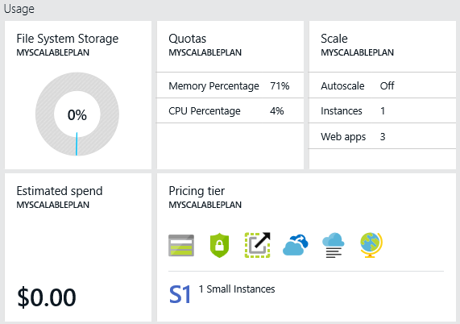
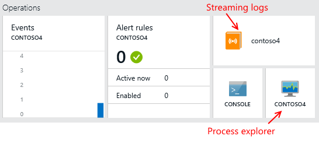

<properties 
	pageTitle="Управление веб-приложениями с помощью портала Azure" 
	description="Общие сведения о задачах управления веб-приложениями в Microsoft Azure с помощью портала Azure." 
	services="app-service\web" 
	documentationCenter="" 
	authors="MikeWasson" 
	writer="mwasson" 
	manager="wpickett" 
	editor=""/>

<tags 
	ms.service="app-service-web" 
	ms.workload="web" 
	ms.tgt_pltfrm="na" 
	ms.devlang="na" 
	ms.topic="article" 
	ms.date="03/24/2015" 
	ms.author="mwasson"/>

# Управление веб-приложениями с помощью портала Azure

На [портале Azure](https://portal.azure.com) вы можете управлять веб-приложениями с помощью ряда *blades*, в которых содержатся различные компоненты. (Общие сведения о портале Azure см. в руководстве по изменениях [портала](http://go.microsoft.com/fwlink/?LinkId=529715)). 

Чтобы просмотреть колонку своего веб-приложения, щелкните **Главная** и выберите имя веб-приложения или нажмите кнопку **Обзор** для просмотра всех своих ресурсов Azure.

В верхней части колонки расположены элементы управления для некоторых типовых действий:

- **Параметры** для просмотра списка всех параметров управления.

- **Обзор** для открытия веб-приложения в окне браузера.

- Другие кнопки для запуска или остановки приложения, переключения слотов развернутого приложения, удаления приложения и т.д.

**Основные компоненты** - перечислены основные сведения о приложении, включая URL-адрес, расположение, план [службы приложений](http://go.microsoft.com/fwlink/?LinkId=529714) и текущее состояние (запущено, остановлено и т.п.).

Ниже кнопки **Основные компоненты** размещены различные части, которые можно использовать для мониторинга и развертывания вашего приложения, а также управления им. Чтобы настроить макет колонки, щелкните правой кнопкой мыши и выберите **Настройка** или **Добавить части**. В остальной части этого раздела описываются части макета по умолчанию.

## Мониторинг

В разделе **Мониторинг** расположена диаграмма, отображающая показатели веб-приложения. Чтобы настроить диаграмму, щелкните **Изменить**. Вы можете выбрать диапазон времени и показатели для отображения. Среди доступных показателей - число запросов, среднее время отклика, ошибки сервера и время ЦП.   

Чтобы добавить правило оповещения, щелкните диаграмму, а затем - **Добавить оповещение**. Правило оповещения уведомляет о достижении определенным показателем некоторого порогового значения. Например, можно получать оповещения, когда количество ошибок сервера превышает некоторое значение в течение 5 минут. 

**Мониторинг** также включает элементы для настройки аналитики, мониторинга приложений и создания проверок доступности. Дополнительные сведения см. в разделе [Основы мониторинга для веб-приложений в службе приложений Azure](web-sites-monitor.md).

## Использование

- **Хранилище файловой системы** отображает, какой объем хранилища файлов использует ваше приложение.
- **Квоты** отображает, как приложение использует свою квоту на использование ресурсов. Щелкните эту часть, чтобы просмотреть подробные сведения.
- **Масштаб** позволяет масштабировать число экземпляров и настраивать автоматическое масштабирование. См. раздел [Масштабирование веб-приложений в службе приложений Azure](how-to-scale-websites.md).  
- **Оценка затрат** показывает оценку затрат для приложения.
- **Ценовая категория** позволяет изменить ценовую категорию.

## Операции

- **События**. Щелкните, чтобы просмотреть журналы событий.  
- **Правила оповещения**. Щелкните, чтобы просмотреть правила оповещений и добавить новые.
- **Журналы потоковой передачи** (A). Щелкните, чтобы просмотреть журналы приложений. Чтобы включить журналы, щелкните **Параметры** и откройте колонку **Журналы диагностики**. 
- **Консоль**. Щелкните, чтобы открыть командную строку, выполняющуюся на портале. Ее можно использовать для выполнения таких команд, как `mkdir` и `dir`.  
- **Обозреватель процессов** (Б). Щелкните, чтобы просмотреть процессы, запущенные в приложении, включая рабочий набор и число потоков.

## Развертывание
 

- Настройка непрерывного развертывания. См. статью [Использование Git для развертывания веб-приложений в службе приложений Azure](web-sites-publish-source-control.md).
- Слоты развертывания. См. статью [Развертывание в промежуточную среду для веб-приложений в службе приложений Azure](web-sites-staged-publishing.md).
- Задайте учетные данные развертывания для Git или FTP. 

## Сеть

- Подключение приложения к виртуальной сети
- Добавление гибридных подключений

>[AZURE.NOTE] Если вы хотите начать работу со службой приложений Azure еще до создания учетной записи Azure, перейдите на страницу [ознакомительной версии службы приложений](http://go.microsoft.com/fwlink/?LinkId=523751). Там вы сможете сразу создать свое первое веб-приложение, правда срок его службы будет ограничен. Никаких кредитных карт и обязательств.

## Дальнейшие действия

- [Масштабирование веб-приложения в службе приложений Azure](how-to-scale-websites.md)
- [Выполнение фоновых задач с веб-заданиями](web-sites-create-web-jobs.md)
- [Резервное копирование веб-приложений Azure](web-sites-backup.md) и их [восстановление](web-sites-restore.md)
- [Основы мониторинга для веб-приложений в службе приложений Azure](web-sites-monitor.md)

## Изменения
* Сведения об изменении веб-сайтов на службу приложений см. в статье [Служба приложений Azure и ее влияние на существующие службы Azure](http://go.microsoft.com/fwlink/?LinkId=529714)
* Сведения о переходе со старого портала на новый см. в статье [Справочная информация о навигации по предварительной версии портала](http://go.microsoft.com/fwlink/?LinkId=529715).

<!--HONumber=49-->