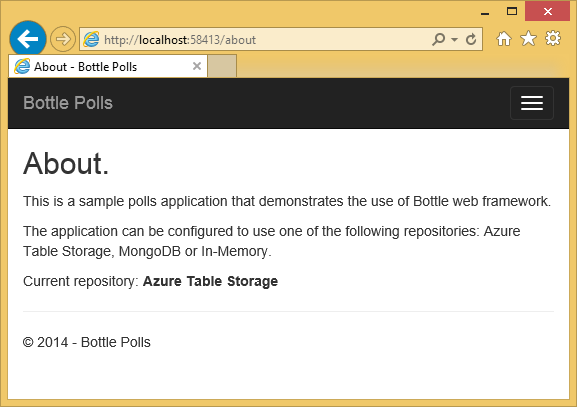
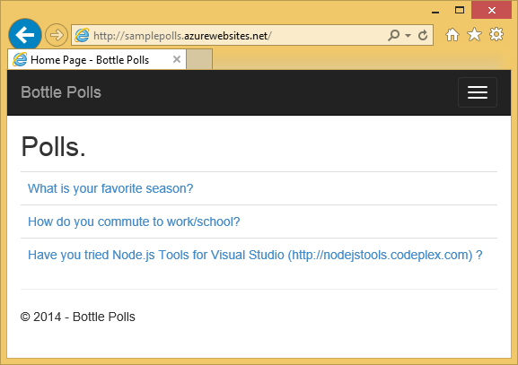

<properties 
	pageTitle="Использование Bottle и табличного хранилища Azure в Azure с помощью инструментов Python 2.1 для Visual Studio" 
	description="Информация об использовании инструментов Python для Visual Studio для создания приложения Bottle, которое хранит данные в табличном хранилище Azure и может быть развернуто на веб-сайте." 
	services="web-sites" 
	documentationCenter="python" 
	authors="huguesv" 
	manager="wpickett" 
	editor=""/>

<tags 
	ms.service="web-sites" 
	ms.workload="web" 
	ms.tgt_pltfrm="na" 
	ms.devlang="python" 
	ms.topic="article" 
	ms.date="10/10/2014" 
	ms.author="huvalo"/>

# Использование Bottle и табличного хранилища Azure в Azure с помощью инструментов Python 2.1 для Visual Studio 

В этом учебнике мы создадим простое приложение опросника с помощью шаблонов PTVS. Также доступна [видеоверсия](https://www.youtube.com/watch?v=GJXDGaEPy94) данного учебника

Приложение опросника реализует абстракцию для своего репозитория, что позволяет вам легко переключаться между разными типами репозиториев (размещенный в памяти, табличное хранилище Azure, MongoDB).

Мы узнаем, как создать учетную запись хранения Azure и настроить приложение для использования табличного хранилища Azure, а также как опубликовать приложение на веб-сайте Azure.

Перейдите в [Центр по разработке для Python][], чтобы узнать больше о разработке веб-сайтов Azure с PTVS при помощи веб-платформ Bottle, Flask и Django, с использованием MongoDB, табличного хранилища Azure, MySQL и служб Базы данных SQL.  Несмотря на то, что эта статья сфокусирована на веб-сайтах Azure, для разработки [облачных служб Azure][] шаги останутся теми же.

+ [Необходимые условия](#prerequisites)
+ [Создание проекта](#create-the-project)
+ [Создание учетной записи хранения Azure](#create-an-azure-storage-account)
+ [Настройка проекта](#configure-the-project)
+ [Знакомство с табличным хранилищем Azure](#explore-the-azure-table-storage)
+ [Публикация на веб-сайте Azure](#publish-to-an-azure-website)
+ [Настройка веб-сайта Azure](#configure-the-azure-website)
+ [Дальнейшие действия](#next-steps)

##Предварительные требования

 - Visual Studio 2012 или 2013
 - [Средства Python 2.1 для Visual Studio][]
 - [Образцы VSIX средств Python 2.1 для Visual Studio][]
 - [Пакет инструментов SDK Azure для VS 2013][] или [Пакет инструментов SDK Azure для VS 2012][]
 - [Python 2.7 (32-разрядный)][] или [Python 3.4 (32-разрядный)][]

[AZURE.INCLUDE [create-account-and-websites-note](../includes/create-account-and-websites-note.md)]

##Создание проекта

В этом разделе мы создадим проект Visual Studio с помощью шаблона.  Мы создадим виртуальную среду и установим необходимые пакеты.  Затем мы запустим приложение локально в размещенном в памяти репозитории.

1.  В Visual Studio выберите **Файл**, **Создать проект**.

1.  В шаблонах проекта PTVS Samples VSIX в секции **Python** выберите **Примеры**.  Выберите **Веб-проект опросов Bottle** и нажмите кнопку "ОК", чтобы создать проект.

  	

1.  Вам будет предложено установить внешние пакеты.  Нажмите кнопку **Установить в виртуальной среде**.

  	

1.  Выберите **Python 2.7** или **Python 3.4** в качестве базового интерпретатора.

  	

1.  Убедитесь, что приложение работает, нажав клавишу <kbd>F5</kbd>.  По умолчанию приложение использует размещенный в памяти репозиторий, который не требует настройки.  При остановке веб-сервера все данные будут утеряны.

1.  Щелкните **Создать примеры опросов**, а затем щелкните опросник, чтобы проголосовать.

  	

##Создание учетной записи хранения Azure

Для выполнения операций хранилища необходимо использовать учетную запись хранения Azure. Выполнив следующие шаги, вы создадите учетную запись хранения.

1.  Выполните вход на [портал управления Azure][].

1.  В нижней части области навигации щелкните **СОЗДАТЬ**.

  	

1.  Последовательно выберите **СЛУЖБЫ ДАННЫХ**, **ХРАНИЛИЩЕ** И **БЫСТРО СОЗДАТЬ**.

  	

1.  В URL-адрес введите имя поддомена, который будет использоваться в универсальном коде ресурса (URI) для учетной записи хранения.  Записи могут содержать от 3 до 24 строчных букв и цифр. Это значение станет именем узла в URI, который используется для адресации ресурсов большого двоичного объекта, очереди и таблицы в подписке.

1.  Выберите регион или территориальную группу, где требуется расположить хранилище. При использовании хранилища в приложении Azure выберите тот же самый регион, в котором будет развернуто приложение.

1.  При необходимости можно включить георепликацию.  С помощью функции георепликации служба хранилища Azure теперь надежно хранит ваши данные в двух расположениях. В обоих расположениях служба хранилища Azure постоянно поддерживает несколько работоспособных реплик ваших данных.

1.  Щелкните **СОЗДАТЬ УЧЕТНУЮ ЗАПИСЬ ХРАНЕНИЯ**.

##Настройка проекта

В этом разделе мы настроим приложение для использования только что созданной учетной записи хранения.  Мы узнаем, как получить настройки соединения с портала Azure.  После этого мы запустим приложение локально.

1.  На [портале управления Azure][] щелкните учетную запись хранения, созданную в предыдущем разделе.

1.  Щелкните **УПРАВЛЕНИЕ КЛЮЧАМИ ДОСТУПА**.

  	

1.  В Visual Studio щелкните правой кнопкой мыши узел проекта в обозревателе решений и выберите **Свойства**.  Откройте вкладку **Отладка**.

  	

1.  Установите необходимые для приложения значения переменных среды с помощью **Отладка команды сервера**, **Среда**.

        REPOSITORY_NAME=azuretablestorage
        STORAGE_NAME=<storage account name>
        STORAGE_KEY=<primary access key>

    Это позволит настроить переменные среды при **запуске с отладкой**.  Если вы хотите настроить переменные при **запуске без отладки**, установите необходимые значения с помощью **Выполнение команды сервера**.

    Также можно определить значения переменных среды с помощью панели управления Windows.  Это будет наилучшим решением, если вы не желаете хранить учетные данные в исходном коде или файле проекта.  Чтобы новые значения переменных стали доступными для приложения, будет необходимо перезапустить Visual Studio.

1.  Код с реализацией репозитория табличного хранилища Azure находится в файле **models/azuretablestorage.py**.  Дополнительную информацию о том, как использовать службу табличного хранилища в Python, см. в [документации].

1.  Запустите приложение, нажав клавишу <kbd>F5</kbd>.  Опросы, созданные с помощью **Создать примеры опросов** и отправленных данных голосования, будут сериализованы в табличном хранилище Azure.

1.  Перейдите на страницу **О**, чтобы убедиться в том, что приложение использует репозиторий **табличного хранилища Azure**.

  	

##Знакомство с табличным хранилищем Azure

Таблицы хранилища легко просматривать и редактировать с помощью обозревателя сервера в Visual Studio.  В этом разделе мы будем использовать обозреватель сервера для просмотра содержимого таблиц приложения опросника.

> [AZURE.NOTE] Для этого требуется установить инструменты Microsoft Azure, которые доступны в составе [пакета SDK для Azure для .NET][].

1.  Откройте **обозреватель сервера**.  Разверните **Azure**, **Хранилище**, учетную запись хранения, а затем **Таблицы**.

  	

1.  Дважды щелкните таблицу **опросов** или **вариантов**, чтобы просмотреть содержимое таблицы в окне документа, а также добавить, удалить или редактировать записи.

  	

##Публикация на веб-сайте Azure

PTVS предоставляет простой способ развертывания веб-приложения на веб-сайт Azure.

1.  В **обозревателе решений** щелкните правой кнопкой мыши узел проекта и выберите **Опубликовать**.

  	

1.  Щелкните **Веб-сайты Microsoft Azure**.

1.  Щелкните **Создать**, чтобы создать новый сайт.

1.  Укажите **Имя сайта** и **Регион**, после чего нажмите кнопку **Создать**.

  	

1.  Примите значения по умолчанию и щелкните **Опубликовать**.

1.  Ваш браузер автоматически откроет опубликованный сайт.  Если перейти на страницу "О программе", вы увидите, что используется **размещенный в памяти** репозиторий, а не репозиторий **табличного хранилища Azure**.

    Это объясняется тем, что переменные среды не устанавливаются на веб-сайте Azure, поэтому используются значения по умолчанию, указанные в файле **settings.py**.

##Настройка веб-сайта Azure

В этом разделе мы произведем настройку переменных среды для сайта.

1.  На [портале управления Azure][] щелкните сайт, созданный в предыдущем разделе.

1.  Выберите в меню вверху **НАСТРОИТЬ**.

  	

1.  Прокрутите список вниз до раздела **Параметры приложений** и присвойте переменным **REPOSITORY\_NAME**, **STORAGE\_NAME** и **STORAGE\_KEY** значения, описанные выше.

  	

1. Щелкните в нижнем меню **СОХРАНИТЬ**, затем **ПЕРЕЗАПУСТИТЬ** и, наконец, **ОБЗОР**.

  	

1.  Вы должны увидеть, что приложение, как и ожидалось, работает с репозиторием **табличного хранилища Azure**.

    Поздравляем!

  	

##Дальнейшие действия

Используйте следующие ссылки, чтобы узнать больше об инструментах Python для Visual Studio, Bottle и табличном хранилище Azure.

- [Документация по средствам Python для Visual Studio][]
  - [Веб-проекты][]
  - [Проекты для облачной службы][]
  - [Удаленная отладка в Microsoft Azure][]
- [Документация по работе с Bottle][]
- [Служба хранилища Azure][]
- [Пакет SDK Azure для Python][]
- [Как использовать службу табличного хранилища в Python][]

<!--Link references-->
[Центр по разработке для Python]: /ru-ru/develop/python/
[Облачные службы Azure]: ../cloud-services-python-ptvs/
[документация]: ../storage-python-how-to-use-table-storage/
[Как использовать службу табличного хранилища в Python]: ../storage-python-how-to-use-table-storage/

<!--External Link references-->
[Портал управления Azure]: https://manage.windowsazure.com
[Пакет SDK для Azure для .NET]: http://azure.microsoft.com/downloads/
[Средства Python 2.1 для Visual Studio]: http://go.microsoft.com/fwlink/?LinkId=517189
[Образцы VSIX средств Python 2.1 для Visual Studio]: http://go.microsoft.com/fwlink/?LinkId=517189
[Средства пакета SDK для Azure для VS 2013]: http://go.microsoft.com/fwlink/?LinkId=323510
[Средства пакета SDK для Azure для VS 2012]: http://go.microsoft.com/fwlink/?LinkId=323511
[Python 2.7 (32-разрядная версия)]: http://go.microsoft.com/fwlink/?LinkId=517190 
[Python 3.4 (32-разрядная версия)]: http://go.microsoft.com/fwlink/?LinkId=517191
[Документация по средствам Python для Visual Studio]: http://pytools.codeplex.com/documentation
[Документация по работе с Bottle]: http://bottlepy.org/docs/dev/index.html
[Удаленная отладка в Microsoft Azure]: http://pytools.codeplex.com/wikipage?title=Features%20Azure%20Remote%20Debugging
[Веб-проекты]: http://pytools.codeplex.com/wikipage?title=Features%20Web%20Project
[Проекты для облачной службы]: http://pytools.codeplex.com/wikipage?title=Features%20Cloud%20Project
[Служба хранилища Azure]: http://azure.microsoft.com/documentation/services/storage/
[Пакет SDK Azure для Python]: https://github.com/Azure/azure-sdk-for-python

<!--HONumber=42-->
