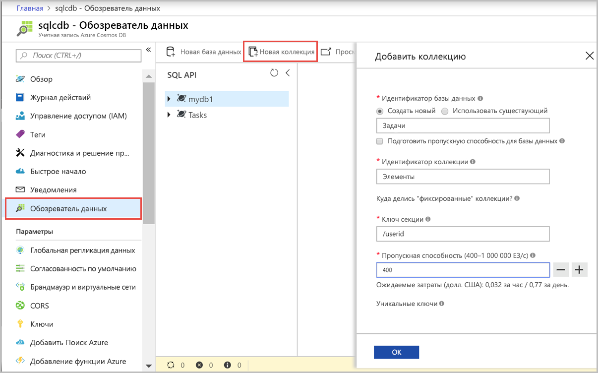

Теперь можно использовать обозреватель данных для создания коллекции и добавления данных в базу данных. 

1. На портале Azure в меню навигации слева щелкните **Обозреватель данных (предварительная версия)**. 

2. В колонке **обозревателя данных (предварительная версия)** щелкните **Новая коллекция**, а затем укажите следующие сведения.

    

    Настройка|Рекомендуемое значение|Описание
    ---|---|---
    Идентификатор базы данных|Задачи|Идентификатор новой базы данных. Имена баз данных должны быть длиной от 1 до 255 символов и не могут содержать символы /, \\, #, ? или пробел.
    Идентификатор коллекции|Items|Идентификатор новой коллекции. Для имен коллекций предусмотрены те же требования к символам, что и для идентификаторов баз данных.
    Емкость хранилища| Фиксированный (10 ГБ)|Используйте значение по умолчанию. Это емкость хранилища базы данных.
    Пропускная способность|400 ЕЗ|Используйте значение по умолчанию. Чтобы сократить задержку, позже вы можете увеличить масштаб пропускной способности.
    Единиц запроса в минуту|Отключить|Оставьте значение по умолчанию. Если вам нужно обработать рабочие нагрузки с высоким уровнем колебания, вы можете включить компонент [Единиц запроса в минуту](../articles/cosmos-db/request-units-per-minute.md) позже.
    Ключ секции|/category|Ключ секции, который равномерно распределяет данные в каждой секции. Для создания высокопроизводительной коллекции важно выбрать правильный ключ раздела. См. дополнительные сведения о [проектировании для секционирования](../articles/cosmos-db/partition-data.md#designing-for-partitioning).    
3. Заполнив форму, щелкните **ОК**.