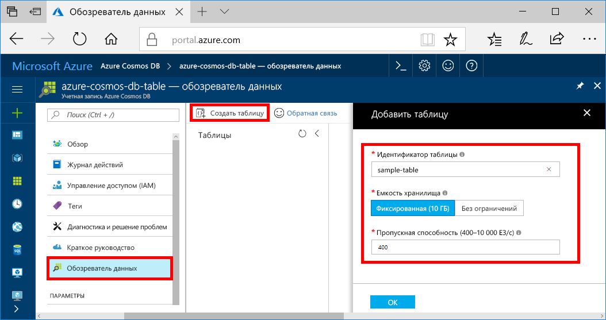

Теперь с помощью обозревателя данных создайте таблицу и добавьте данные в базу данных. 

1. На портале Azure в меню навигации щелкните **Обозреватель данных (предварительная версия)**. 
2. В колонке обозревателя данных щелкните **New Table** (Создать таблицу), а затем заполните страницу, используя следующие сведения.

    

    Настройка|Рекомендуемое значение|Описание
    ---|---|---
    Идентификатор таблицы|Пример таблицы|Идентификатор новой таблицы. Для имен таблиц предусмотрены те же требования к знакам, что и для идентификаторов баз данных. Имя базы данных может иметь длину от 1 до 255 символов и не может содержать `/ \ # ?` или пробел.
    Емкость хранилища| 10 ГБ|Оставьте значение по умолчанию. Это емкость хранилища базы данных.
    Пропускная способность|400 ЕЗ|Оставьте значение по умолчанию. Вы можете увеличить [пропускную способность](../articles/cosmos-db/request-units.md) позже, если необходимо уменьшить задержку.
    Единиц запроса в минуту|Отключить|Используйте значение по умолчанию. Вы можете включить компонент [Единиц запроса в минуту](../articles/cosmos-db/request-units-per-minute.md) позже, если вам понадобится обработать рабочие нагрузки с высоким уровнем колебания.

3. После заполнения формы нажмите кнопку **ОК**.