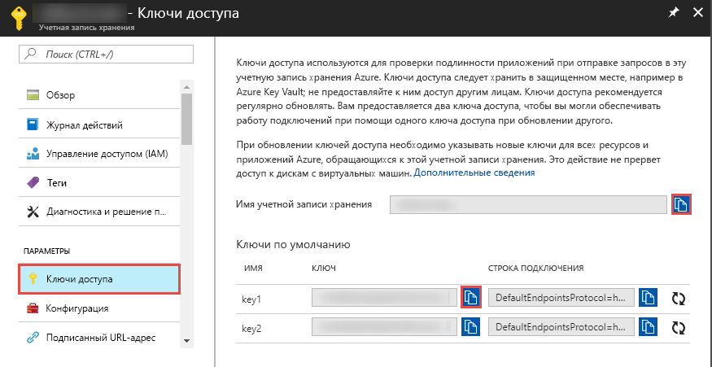

## <a name="prerequisites"></a>Предварительные требования

### <a name="azure-subscription"></a>Подписка Azure.
Если у вас еще нет подписки Azure, создайте [бесплатную](https://azure.microsoft.com/free/) учетную запись Azure, прежде чем начинать работу.

### <a name="azure-roles"></a>Роли Azure
Чтобы создать экземпляры фабрики данных, нужно назначить учетной записи пользователя, используемой для входа в Azure, роль **участника**, **владельца** либо **администратора** подписки Azure. На портале Azure щелкните **имя пользователя** в правом верхнем углу и выберите **Разрешения**, чтобы просмотреть существующие разрешения в подписке. Если у вас есть доступ к нескольким подпискам, выберите соответствующую подписку. Примеры инструкций по назначению пользователю роли см. в статье [о добавлении ролей](../articles/billing/billing-add-change-azure-subscription-administrator.md).

### <a name="azure-storage-account"></a>Учетная запись хранения Azure
В этом кратком руководстве в качестве **исходного** и **целевого** хранилища данных используется учетная запись хранения Azure общего назначения (в частности, хранилища BLOB-объектов). Если у вас нет учетной записи хранения Azure общего назначения, см. инструкции по [созданию учетной записи хранения](../articles/storage/common/storage-create-storage-account.md#create-a-storage-account). 

#### <a name="get-storage-account-name-and-account-key"></a>Получение имени и ключа учетной записи хранения
В этом кратком руководстве вы будете использовать имя и ключ своей учетной записи хранения Azure. Далее описана процедура получения имени и ключа учетной записи хранения. 

1. Откройте браузер и перейдите на [портал Azure](https://portal.azure.com). Войдите, используя имя пользователя и пароль Azure. 
2. Щелкните **Больше служб >** в меню слева, отфильтруйте содержимое по ключевому слову **хранение**, затем выберите пункт **Учетные записи хранения**.

    
3. В списке учетных записей хранения найдите с помощью фильтра свою учетную запись хранения (при необходимости), а затем выберите **эту учетную запись**. 
4. На странице **учетной записи хранения** выберите в меню параметр **Ключи доступа**.

    
5. Скопируйте значения полей **Имя учетной записи хранения** и **key1** в буфер обмена. Вставьте их в Блокнот или другой редактор и сохраните файл. Они потребуются вам далее в этом кратком руководстве.   

#### <a name="create-input-folder-and-files"></a>Создание входной папки и файлов
В этом разделе вы создадите контейнер больших двоичных объектов с именем **adftutorial** в хранилище BLOB-объектов Azure. Затем вы создадите папку с именем **input** в контейнере и отправите в нее пример файла. 

1. На странице **Учетная запись хранения** перейдите на вкладку **Обзор** и щелкните **BLOB-объекты**. 

    
2. На странице **Служба BLOB-объектов** щелкните **+ Контейнер** на панели инструментов. 

        
3. В диалоговом окне **Создание контейнера** введите **adftutorial** в поле имени и нажмите кнопку **ОК**. 

    
4. Щелкните **adftutorial** в списке контейнеров. 

    
1. На странице **Контейнер** щелкните **Отправить** на панели инструментов.  

    
6. На странице **Отправить BLOB-объект** щелкните **Дополнительно**.

    
7. Откройте **Блокнот** и создайте файл **emp.txt** с содержимым, приведенным ниже. Сохраните файл в папке **c:\ADFv2QuickStartPSH**. Если папка **ADFv2QuickStartPSH** отсутствует, создайте ее.
    
    ```
    John, Doe
    Jane, Doe
    ```    
8. На странице **Отправить BLOB-объект** на портале Azure найдите и выберите файл **emp.txt** в поле **Файлы**. 
9. Введите в поле **Отправить в папку** значение **input**. 

        
10. Убедитесь, что указана папка **input** и файл **emp.txt**, а затем щелкните **Отправить**.
11. В списке должен отобразиться файл **emp.txt** с состоянием отправки. 
12. Закройте страницу **Отправить BLOB-объект**, нажав значок **X** в углу. 

    
1. Не закрывайте страницу **контейнера**. Она понадобится для проверки выходных данных в конце этого руководства.