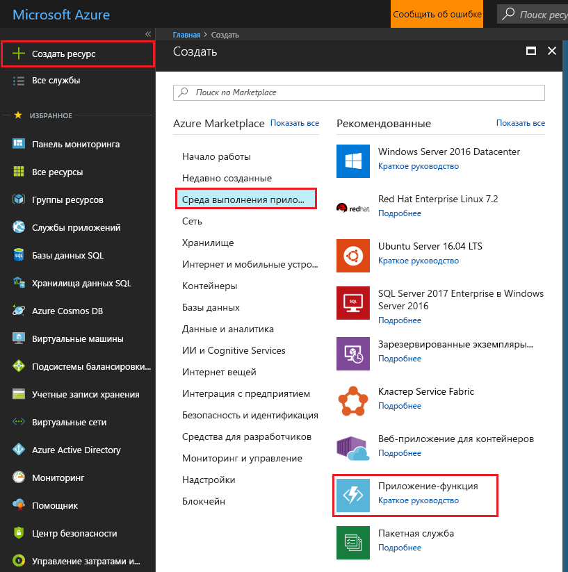

1. Перейдите на [портал Azure](https://portal.azure.com) и войдите, используя свою учетную запись Azure.

2. Щелкните **+Создать** > **Вычисления** > **Приложение-функция**, выберите свою **подписку** и введите уникальное **имя приложения**, с помощью которого можно будет идентифицировать приложение-функцию. Затем укажите следующие параметры.
   
   * **[Группа ресурсов](../articles/azure-resource-manager/resource-group-overview.md)**: щелкните **Создать новую** и введите имя группы ресурсов. 
   * **[План размещения](../articles/app-service/azure-web-sites-web-hosting-plans-in-depth-overview.md)** — может иметь одно из следующих значений: 
     * **План потребления** — план по умолчанию для Функций Azure. Если выбран план потребления, необходимо также задать параметры **Расположение** и **Memory Allocation** (Выделение памяти) (МБ). Сведения о влиянии выделения памяти на затраты см. на странице с [ценами на функции Azure](https://azure.microsoft.com/pricing/details/functions/). 
     * **План службы приложений** — чтобы использовать план службы приложений, необходимо создать **расположение или план службы приложений** или выбрать существующие. Эти параметры определяют [расположение, функции, стоимость и вычислительные ресурсы](https://azure.microsoft.com/pricing/details/app-service/), связанные с вашим приложением.  
   * **Учетная запись хранения**— для каждого приложения-функции нужна учетная запись хранения. Вы можете выбрать существующую учетную запись хранения или [создать новую](../articles/storage/storage-create-storage-account.md#create-a-storage-account). 
     
    

3. Щелкните **Создать** , чтобы подготовить и развернуть новое приложение-функцию.  