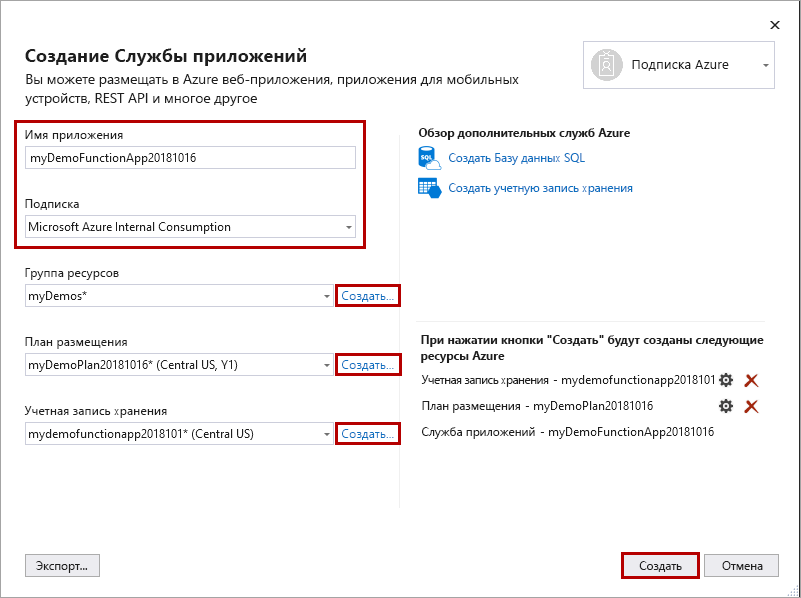
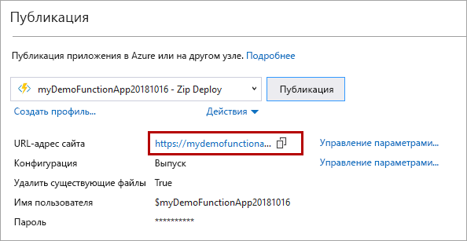

1. Щелкните правой кнопкой мыши проект в **обозревателе решений** и выберите пункт **Опубликовать**.

2. Выберите **Приложение-функция Azure**, **Создать** и **Опубликовать**.

    

    При включении параметра **Запуск из ZIP-файла** приложение-функция Azure переходит в режим только для чтения и запускается непосредственно из пакета развертывания. Дополнительные сведения см. в руководстве по [запуску Функций Azure из файла пакета](../articles/azure-functions/run-functions-from-deployment-package.md).
     
    >[!CAUTION]
    >Если выбрать параметр **Выбрать существующее**, все файлы в существующем приложении-функции в Azure будут перезаписаны файлами из локального проекта. Используйте этот параметр только при повторной публикации обновлений для существующего приложения-функции.

3. Если вы еще не подключили Visual Studio к учетной записи Azure, нажмите кнопку **Добавить учетную запись**.

4. В диалоговом окне **Создание службы приложений** укажите параметры **размещения**, которые приведены в таблице ниже:

    

    | Параметр      | Рекомендуемое значение  | ОПИСАНИЕ                                |
    | ------------ |  ------- | -------------------------------------------------- |
    | **Имя приложения** | Глобально уникальное имя | Имя, которое однозначно идентифицирует новое приложение-функцию. |
    | **Подписка** | Выберите свою подписку | Подписка Azure, которую нужно использовать. |
    | **[Группа ресурсов](../articles/azure-resource-manager/resource-group-overview.md)** | myResourceGroup |  Имя группы ресурсов, в которой создается приложение-функция. Чтобы создать группу ресурсов, выберите **Создать**.|
    | **[План службы приложений](../articles/azure-functions/functions-scale.md)** | План потребления | Для создания бессерверного плана щелкните **Создать**, а затем выберите **Потребление** в разделе **Размер**. Также нужно выбрать **расположение** в ближайшем [регионе](https://azure.microsoft.com/regions/) или в регионе, расположенном рядом с другими службами, к которым обращаются ваши функции. Когда выполняется план, отличный от **Потребление**, необходимо будет управлять [масштабированием приложения-функции](../articles/azure-functions/functions-scale.md).  |
    | **[Учетная запись хранения](../articles/storage/common/storage-quickstart-create-account.md)** | Учетная запись хранения общего назначения | Учетная запись хранения Azure — обязательный ресурс для среды выполнения Функций. Щелкните **Создать**, чтобы создать новую учетную запись хранилища общего назначения. Можно также использовать существующую учетную запись при условии, что она соответствует [требованиям учетной записи хранилища](../articles/azure-functions/functions-scale.md#storage-account-requirements).  |

5. Нажмите кнопку **Создать**, чтобы создать приложение-функцию и связанные с ним ресурсы в Azure с заданными параметрами, а также развернуть код проекта функции. 

6. По окончании развертывания запомните или запишите **URL-адрес сайта**, который является адресом приложения-функции в Azure.

    
