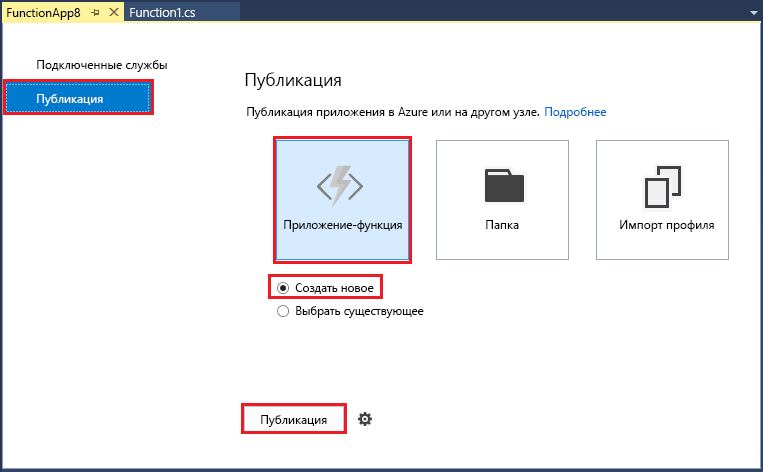

1. Щелкните правой кнопкой мыши проект в **обозревателе решений** и выберите пункт **Опубликовать**. Выберите **Создать** и нажмите кнопку **Опубликовать**. 

    

2. Если вы еще не подключили Visual Studio к учетной записи Azure, нажмите кнопку **Добавить учетную запись**.  

3. В диалоговом окне **Создать службу приложений** задайте параметры **размещения**, которые указаны в следующей таблице: 

    

    | Настройка      | Рекомендуемое значение  | Описание                                |
    | ------------ |  ------- | -------------------------------------------------- |
    | **Имя приложения** | Глобально уникальное имя | Имя, которое однозначно идентифицирует новое приложение-функцию. |
    | **Подписка** | Выберите свою подписку | Подписка Azure, которую нужно использовать. |
    | **[Группа ресурсов](../articles/azure-resource-manager/resource-group-overview.md)** | myResourceGroup |  Имя группы ресурсов, в которой создается приложение-функция. |
    | **[План службы приложений](../articles/azure-functions/functions-scale.md)** | План потребления | При создании нового плана выберите **Потребление** в разделе **Размер**.  |
    | **[Учетная запись хранения](../articles/storage/storage-create-storage-account.md#create-a-storage-account)** | Глобально уникальное имя | Используйте существующую учетную запись хранения или создайте новую.   |

4. Чтобы создать приложение-функцию с этими параметрами в Azure, нажмите кнопку **Создать**. По окончании подготовки запомните или запишите **URL-адрес сайта**, который является адресом приложения-функции в Azure. 

    
