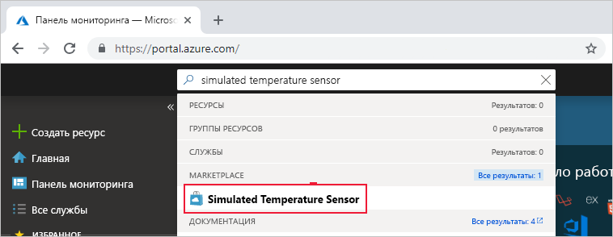
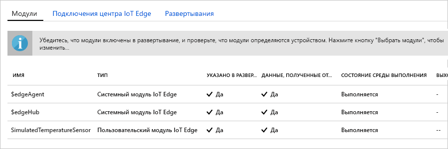

Одной из ключевых возможностей Azure IoT Edge является развертывание модулей на устройствах IoT Edge из облака. Модуль IoT Edge — это исполняемый пакет, который реализован как контейнер. В этом разделе мы развернем предварительно созданный модуль из [раздела модулей IoT Edge в Azure Marketplace](https://azuremarketplace.microsoft.com/marketplace/apps/category/internet-of-things?page=1&subcategories=iot-edge-modules). Этот модуль генерирует смоделированные данные телеметрии для устройства IoT Edge.

1. На [портале Azure](https://portal.azure.com) в строку поиска введите **Имитированный датчик температуры** и откройте результат поиска в Marketplace.

   

2. Выберите устройство IoT Edge, чтобы получить этот модуль. На странице **Целевые устройства для модуля IoT Edge** укажите следующие сведения:

   1. **Подписка**: выберите подписку, которая содержит используемый центр Интернета вещей.

   2. **Центр Интернета вещей**: выберите имя используемого центра Интернета вещей.

   3. **Имя устройства IoT Edge**: если ранее в этом руководстве вы использовали рекомендуемое имя устройства, введите **myEdgeDevice**. Кроме того, вы можете щелкнуть **Найти устройство**, чтобы выбрать его из списка устройств в центре Интернета вещей. 
   
   4. Нажмите кнопку **Создать**.

3. После выбора модуля IoT Edge из Azure Marketplace и устройства IoT Edge для получения модуля откроется мастер, который состоит из трех шагов. Он поможет точно определить, как будет развернут модуль. На этапе **Добавить модули** мастера обратите внимание, что модуль **SimulatedTemperatureSensor** заполняется автоматически. В руководствах вы будете использовать эту страницу, чтобы добавить в развертывание дополнительные модули. Для этого руководства необходимо просто развернуть этот модуль. Выберите **Далее**, чтобы перейти к следующему шагу мастера.

4. На этапе **Укажите маршруты** мастера вы определите способ передачи сообщений между модулями и в Центр Интернета вещей. Для руководства необходимо, чтобы все сообщения со всех модулей отправлялись в Центр Интернета вещей (`$upstream`). Добавьте приведенный ниже код, если он не заполняется автоматически, а затем щелкните **Далее**.

   ```json
    {
    "routes": {
        "route": "FROM /messages/* INTO $upstream"
        }
    }
   ```

5. На этапе **Проверка развертывания** мастера можно просмотреть файл JSON, определяющий все модули, которые развернуты на устройстве IoT Edge. Обратите внимание, что модуль **SimulatedTemperatureSensor** включен, как и два дополнительных системных модуля **edgeAgent** и **edgeHub**. После просмотра выберите **Отправка**.

   После отправки нового развертывания на устройство IoT Edge на ваше устройство ничего оправляться не будет. Вместо этого устройство регулярно выполняет запрос к Центру Интернета вещей для получения новых сведений. Когда устройство обнаруживает новые сведения о развертывании, оно использует их, чтобы получить образы модулей из облака и локально запустить модуль. Это может занять несколько минут. 

6. После отправки сведений о развертывании модуля мастер вернет вас на страницу **IoT Edge** центра Интернета вещей. Чтобы просмотреть сведения об устройстве, выберите его из списка устройств IoT Edge. 

7. На странице сведений об устройстве прокрутите вниз до раздела **Модули**. В этом разделе должны быть указаны три модуля: $edgeAgent, $edgeHub и SimulatedTemperatureSensor. Если один или несколько модулей указаны в списке, как указано при развертывании, но они не указаны устройством, это означает, что ваше устройство IoT Edge все еще запускает их. Подождите несколько секунд, а затем в верхней части страницы выберите **Обновить**. 

   
