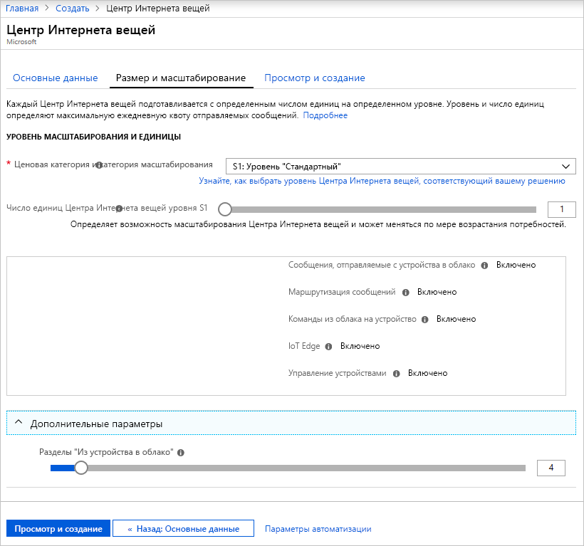

В этом разделе описывается создание центра Интернета вещей с помощью [портала Azure](https://portal.azure.com).

1. Войдите на [портал Azure](https://portal.azure.com). 

2. Выберите **+ Создать ресурс**, а затем — **Интернет вещей**.

3. Нажмите кнопку **Центр Интернета вещей** в списке справа. Появится первый экран для создания Центра Интернета вещей.

   

   Заполните поля.

   **Подписка**. Выберите нужную подписку для Центра Интернета вещей.

   **Группа ресурсов**. Вы можете создать новую группу ресурсов или использовать существующую. Чтобы создать новую, выберите **Создать** и введите нужное имя. Чтобы использовать существующую группу, щелкните **Использовать существующий** и выберите группу ресурсов из раскрывающегося списка. Дополнительные сведения см. в статье [Управление ресурсами Azure через портал](../articles/azure-resource-manager/resource-group-portal.md).

   **Регион**. Выберите регион, в котором будет расположен центр Интернета вещей. Выберите ближайшее к вам расположение из раскрывающегося списка.

   **Имя Центра Интернета вещей**. Введите Имя Центра Интернета вещей. Оно должно быть глобально уникальным. Если введенное имя доступно, появится зеленая галочка.

   [!INCLUDE [iot-hub-pii-note-naming-hub](iot-hub-pii-note-naming-hub.md)]

4. Выберите **Next: Size and scale** (Далее: размер и масштаб), чтобы продолжить создание центра Интернета вещей.

   

   На этом экране можно оставить значения по умолчанию и просто выбрать **Review + create** (Просмотреть и создать) внизу. 

   **Ценовая категория и категория масштабирования**. В зависимости от количества необходимых функций и ежедневно отправляемых сообщений с помощью решения можно выбрать несколько уровней. Для тестирования и оценки можно использовать уровень "Бесплатный". Он позволяет подключить к Центру Интернета вещей 500 устройств и отправлять до 8000 сообщений в день. Для каждой подписки Azure можно создать один Центр Интернета вещей на уровне "Бесплатный". 

   **Единицы центра IoT Hub**. Допустимое число сообщений за единицу в сутки зависит от ценовой категории концентратора. Например, если требуется, чтобы Центр Интернета вещей поддерживал 700 000 входящих сообщений, то следует выбрать две единицы уровня S1.

   Дополнительные сведения о других параметрах уровня см. в статье [Масштабирование решения для Центра Интернета вещей](../articles/iot-hub/iot-hub-scaling.md).

   **Дополнительные параметры / Разделы "Из устройства в облако"**. Это свойство привязывает сообщения, отправляемые с устройства в облако, к числу одновременно работающих модулей чтения этих сообщений. Для большинства центров Интернета вещей достаточно четырех секций. 

5. Нажмите кнопку **Review + create** (Просмотреть и создать), чтобы просмотреть выбранные параметры. Отобразится примерно следующий экран.

   

6. Нажмите кнопку **Создать**, чтобы создать центр Интернета вещей. Создание центра занимает несколько минут.
