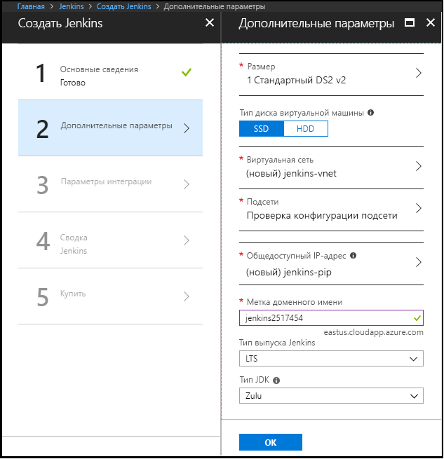

1. В браузере откройте [образ Azure Marketplace для Jenkins](https://azuremarketplace.microsoft.com/marketplace/apps/azure-oss.jenkins?tab=Overview).

1. Выберите **Загрузить сейчас**.

    

1. Просмотрев информацию о ценах и условиях, выберите **Продолжить**.

    

1. Чтобы настроить сервер Jenkins на портале Azure, выберите **Создать**. 

    

1. На вкладке **Основные сведения** укажите следующие значения:

    - **Name** (Имя). Введите `Jenkins`.
    - **Пользователь**. Введите имя пользователя, используемое во время входа на виртуальную машину, на которой запущен сервер Jenkins.
    - **Тип проверки подлинности**. Выберите **пароль**.
    - **Пароль**. Введите пароль, используемый во время входа на виртуальную машину, на которой запущен сервер Jenkins.
    - **Подтверждение пароля**. Повторно введите пароль, используемый во время входа на виртуальную машину, на которой запущен сервер Jenkins.
    - **Тип выпуска Jenkins**. Выберите **LTS**.
    - **Подписка**. Выберите подписку Azure, в которой необходимо установить Jenkins.
    - **Группа ресурсов**. Выберите **Создать новый** и введите имя для группы ресурсов, которая используется как логический контейнер для коллекции ресурсов, которые составляют установку Jenkins.
    - **Расположение**. Выберите **Восточная часть США**.

    

1. Нажмите кнопку **ОК**, чтобы перейти на вкладку **Параметры**. 

1. На вкладке **Параметры** укажите следующие значения:

    - **Размер**. Выберите соответствующий вариант для виртуальной машины Jenkins.
    - **Тип диска виртуальной машины**. Выберите тип диска, HDD (жесткий диск) или SSD (твердотельный накопитель), чтобы указать тип диска хранилища, разрешенный для виртуальных машин Jenkins.
    - **Общедоступный IP-адрес**. Для имени IP-адреса по умолчанию присваивается имя Jenkins, указанное на предыдущей странице с суффиксом IP. Вы можете изменить это значение по умолчанию.
    - **Метка доменного имени**. Укажите значение полного URL-адреса для виртуальной машины Jenkins.

    

1. Нажмите кнопку **ОК**, чтобы перейти на вкладку **Сводка**.

1. Когда отобразится вкладка **Сводка**, проверьте введенные данные. При появлении сообщения **Проверка пройдена** нажмите кнопку **ОК**. 

    

1. Когда отобразится вкладка **Создание**, выберите **Создать**, чтобы создать виртуальную машину Jenkins. Когда сервер будет готов, отобразится уведомление на портале Azure.

    