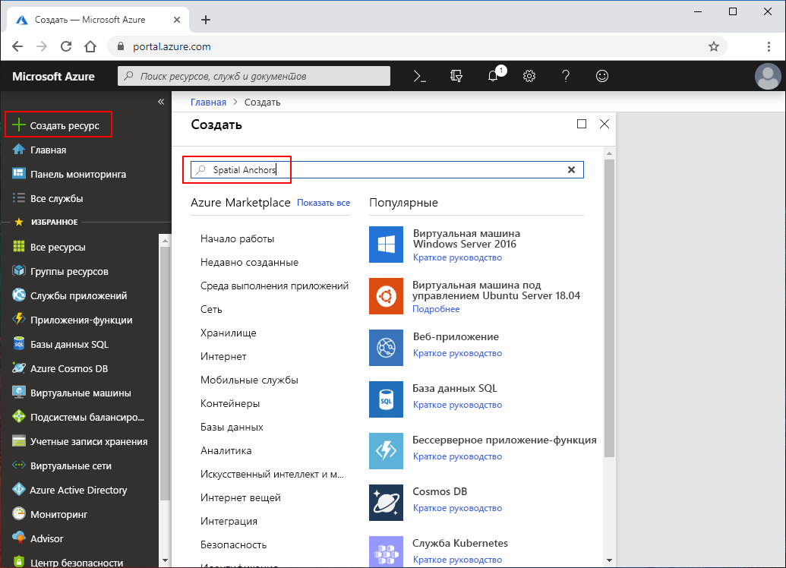
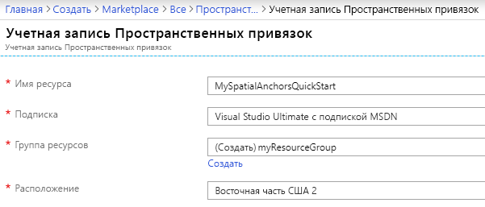
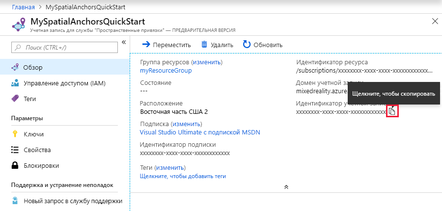
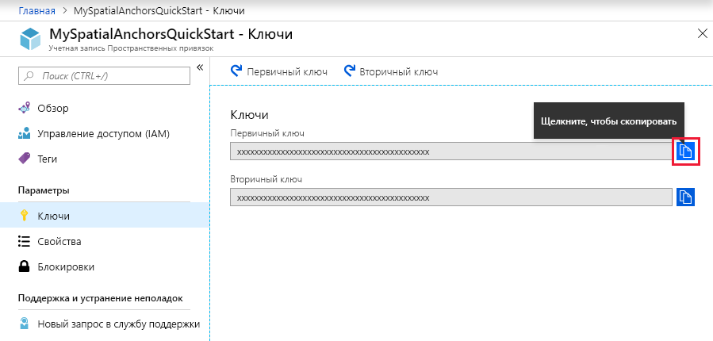

## Создание ресурса Пространственных привязок

1. Перейдите на <a href="https://portal.azure.com" target="_blank">портал Azure</a>.

2. На портале Azure в меню слева выберите **Создать ресурс**.

3. Выполните поиск по запросу "Пространственные привязки" в строке поиска.

   

4. Выберите пункт **Spatial Anchors (preview)** (Пространственные привязки (предварительная версия)), чтобы открыть диалоговое окно, а затем щелкните **Создать**.

5. В форме **Учетная запись Пространственных привязок**:

   1. Укажите уникальное имя ресурса.
   2. Выберите подписку, к которой нужно присоединить ресурс.
   3. Создайте группу ресурсов, выбрав **Создать**, и назовите ее **myResourceGroup**, а затем нажмите кнопку **ОК**.
      [!INCLUDE [resource group intro text](resource-group.md)]
   4. Выберите расположение (регион), где будет размещаться ресурс.
   5. Выберите **Создать**, чтобы начать создание ресурса.

   

6. После успешного создания ресурса можно просмотреть его свойства. Запишите значение **идентификатора учетной записи** ресурса, так как оно понадобится позже.

   

7. В разделе **Параметры** выберите **Ключ** и запишите значение параметра **Первичный ключ**. Это ключ учетной записи (`Account Key`). Он будет использоваться позже.

   
