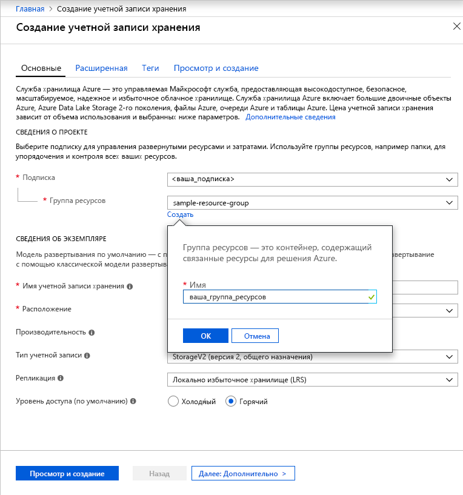

Чтобы создать учетную запись хранения общего назначения версии 2 на портале Azure, сделайте следующее:

1. На портале Azure разверните меню слева, чтобы открыть меню служб, и выберите **Все службы**. Прокрутите вниз до пункта **Хранилище** и выберите **Учетные записи хранения**. В появившемся окне **Учетные записи хранения** выберите **добавить**.
1. Выберите подписку, в которой будет создана учетная запись хранения.
1. В поле **Группа ресурсов** щелкните **Создать**. Введите имя для новой группы ресурсов, как показано на следующем рисунке.

    

1. Далее введите имя своей учетной записи хранения. Имя должно быть уникальным для Azure, содержать от 3 до 24 символов и состоять только из цифр и строчных букв.
1. Выберите расположение учетной записи хранения или используйте расположение по умолчанию.
1. Оставьте в следующих полях значения по умолчанию.
    - Для поля **Модель развертывания** по умолчанию задается значение **Resource manager**.
    - Для поля **Производительность** по умолчанию задается значение **Стандартная**.
    - Для поля **Тип учетной записи** по умолчанию задается значение **StorageV2 (общего назначения версии 2)**.
    - Для поля **Репликация** по умолчанию задается значение **Локально избыточное хранилище (LRS)**.
    - Для поля **Уровень доступа** по умолчанию задается значение **Горячий**.

1. Нажмите **Просмотр и создание**, чтобы просмотреть настройки учетной записи хранения и создать учетную запись.

Дополнительные сведения о типах учетных записей хранения см. в статье [Общие сведения об учетной записи хранения](https://docs.microsoft.com/azure/storage/common/storage-account-overview). Дополнительные сведения о группах ресурсов см. в статье [Общие сведения об Azure Resource Manager](https://docs.microsoft.com/azure/azure-resource-manager/resource-group-overview). 
